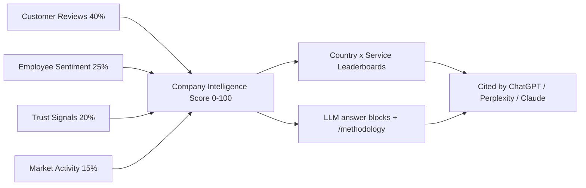
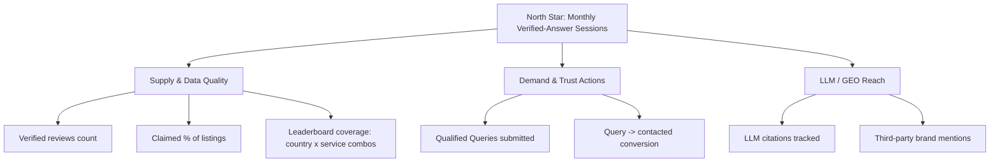

# Product Overview & Vision

> Status: Draft v1 · Last updated 2026-07-07

**Purpose.** This is the north-star document for TechFirms — the one-page (long-page) statement of what we are building, for whom, why now, and how we will know it is working. It fixes the elevator pitch, the wedge, the target markets, the user segments, the value propositions, the north-star metric and KPI tree, our guiding principles, and a shared glossary. Every other doc in `docs/` inherits its vocabulary and decisions from here and from [_canon.md](research/_canon.md) (the LOCKED source of truth). Where this doc names a competitor, market number, or GTM sequence in passing, the deep versions live in [01-market-and-competitor-analysis.md](01-market-and-competitor-analysis.md) and [18-roadmap-and-build-plan.md](18-roadmap-and-build-plan.md) — cross-link, do not duplicate.

---

## 1. Elevator pitch & the "reputation layer" thesis

TechFirms is an **AI-first reputation layer and directory for technology companies**. For every tech firm we combine four trust signals into one profile — **Customer Reviews, Employee Sentiment, Trust Signals, and Market Activity** — and fuse them into a single, deterministically computed **Company Intelligence Score (CIS)** on a 0–100 scale. Those scores power **country-scoped, Gartner-style leaderboards** ("Top AI Development Companies in Saudi Arabia — July 2026"), rendered server-side and structured so that ChatGPT, Perplexity, Claude, and Google AI Mode cite TechFirms as the source of truth when a buyer asks "who are the best cloud companies in the UAE?"

The **thesis**: buying decisions for software services are already migrating from Google's ten blue links to a single AI-generated answer, and no one owns the citable, trustworthy substrate underneath that answer for *service providers* in *emerging markets*. A "reputation layer" means we do not merely list companies — we **aggregate every public trust signal about a firm into one auditable verdict** and expose it in the exact format machines and buyers both want. Positioning in one line: **Clutch's UX + techreviewer.co's directory/monetization model + Gartner's visual-quadrant credibility, rebuilt AI-first for the LLM-citation era.**

---

## 2. The problem

Existing directories have a structural credibility crisis, documented in [user-sentiment.md](research/user-sentiment.md): **the platform sells visibility to the same companies it claims to rank objectively.** The result is a two-sided distrust:

- **Buyers can't trust the rankings.** Clutch "verified" reviews are alleged to be "nearly all fake and bought"; G2 Grid placement is widely believed to track vendor spend; the same firms repeat "over and over in different orders on different pages." Buyers can't tell a genuine leader from a big spender.
- **Agencies distrust pay-to-play.** Owners describe Clutch as "completely pay to play," report "super low quality leads," annual lock-in with no support, and — worst — that defamatory reviews "can't be deleted without purchasing the subscription." Gartner has been sued for a model a vendor called "extortionate by its very nature."

Two blind spots compound this: incumbents are **US/EU-centric** (Saudi Arabia, UAE, and Pakistan are thinly served), and **none layers employee sentiment** — every platform judges a company only from the buyer's side. The opportunity is not to claim the model is broken; it is to make the **trust mechanics transparent** in a category where opacity is the norm.

---

## 3. The wedge and the moat

**The wedge = combining four signals no incumbent combines.** Reviews alone are gameable; the fix is to blend them with signals that are hard to fake.

| # | Trust signal | What it captures | Why it resists gaming |
|---|---|---|---|
| 1 | **Customer Reviews** | Verified client project reviews (quality, schedule, cost, willingness-to-refer) | Verification-gated; Bayesian-shrunk; recency-decayed |
| 2 | **Employee Sentiment** | Aggregate culture/comp/leadership/%-recommend | Sourced independently of the firm's marketing |
| 3 | **Trust Signals** | Domain age, SSL, GitHub org activity, funding, certifications | Externally verifiable public facts |
| 4 | **Market Activity** | Hiring, funding events, project cadence | Behavioral, not self-reported |

**The moat = the CIS + country leaderboards.** The **Company Intelligence Score** weights these signals **40 / 25 / 20 / 15** (Reviews / Employee Sentiment / Trust Signals / Market Activity), is **computed deterministically** (Claude only *narrates* a 3-sentence justification — it never emits the number), recomputed weekly, and published as **monthly frozen snapshots** with month-over-month movement. Its formula and weights are public at `/methodology`; only fraud-detection signals stay secret. That transparency is exactly what makes an LLM comfortable quoting us — and what defuses the #1 grievance. The **leaderboards** are country × service, ranked within **country × service-category cohorts** using median splits so US giants never flatten Pakistan/KSA boards, mapped to fixed quadrants — **Leaders, Challengers, Rising Stars, Niche Players** — on axes **X = Market Presence, Y = Client Satisfaction**. A firm can buy a labeled Sponsored slot *around* a board; it can **never buy a position in the ranked score.**

---

## 4. Target markets & why

Priority order is **locked**: **1) Saudi Arabia (KSA) → 2) United Arab Emirates (UAE) → 3) Pakistan → then global.** The rationale is a three-way overlap:

- **Less-saturated.** Clutch/G2/DesignRush skew US/EU; there are **no KSA/Pakistan-dedicated leaderboards** among incumbents — an open SEO/GEO lane.
- **High-intent.** These are active outsourcing and digital-transformation markets (Gulf mega-projects; Pakistan as a top-3 techreviewer.co traffic geography) where buyers are actively searching for partners.
- **LLM-answer land-grab.** AI-first discovery is a green field here; being the cited answer for "best [service] in [country]" is a channel incumbents optimized for Google, not LLMs. First 3 leaderboards to seed: **AI Development in KSA · Custom Software in UAE · Web/Custom Software in Pakistan.**

---

## 5. Primary user segments

**The Buyer (visitor).** A CTO, founder, procurement lead, or project owner in the Gulf or South Asia looking for a trustworthy tech partner. They arrive from an LLM answer, a leaderboard, or a `/best-[service]-companies-in-[country]` page. They want a shortlist they can trust *without* suspecting it was bought, and a fast path to contact 1–5 firms. They rarely create an account; they submit a **Query**. Full persona in [05-personas-and-jobs-to-be-done.md](05-personas-and-jobs-to-be-done.md).

**The Agency / Business Owner (`business_owner`).** The owner or marketing lead of a listed tech company. They discover an *unclaimed* profile, **claim** it (work-email domain match **or** DNS TXT record → admin approval), then edit it, respond to reviews, invite clients to leave verified reviews, and receive qualified Queries in their dashboard. Their pain with incumbents is pay-to-play and thin leads; our promise is a **free credible baseline profile** and transparent, no-lock-in economics.

**The Admin (`admin` / `super_admin`).** Our internal operator. They run the Query pipeline (`New → Forwarded → Contacted → Closed`), approve/reject claims with verification evidence shown, moderate reviews with AI-assisted fake-detection, CRUD/merge companies, trigger re-scrape/re-score, and freeze/publish monthly leaderboard snapshots. Every action is written to an `AuditLog`.

---

## 6. Value proposition per segment & "why now"

| Segment | Core value proposition |
|---|---|
| **Buyer** | A ranking you can actually trust — public methodology, no bought positions, four signals not one, and a same-day path to contact vetted firms in your country. |
| **Agency** | A free, enriched, credible profile in an under-served market; real qualified leads; respond-to-reviews and a transparent dispute path; pay only for labeled *visibility*, never for rank. |
| **Admin / TechFirms** | A defensible, LLM-citable content asset (leaderboards + reports) that compounds, monetized via sponsorship without ever touching rank integrity. |

**Why now.** Discovery is being rebuilt around **AI answer engines** — a majority of software-category buyers now start research with an AI chatbot, and LLM-referred traffic converts far above organic (directional, per GEO-vendor data). The firm that becomes the *cited source* for "best tech companies in [country]" during this transition captures a channel incumbents built for a Google-shaped world. That window is open now and closing.

---

## 7. North-star metric & KPI tree

**North-star metric: Monthly Verified-Answer Sessions** — sessions where a user reaches a leaderboard, profile, or pSEO page that is backed by a live, verified-data CIS *and* takes a trust action (submits a Query, clicks through to a firm, or the session originated from an LLM citation). It captures our whole thesis: real data → trust → action → citation.

Supporting KPIs, with launch intent: **verified reviews** (volume + %-of-listings ≥ leaderboard eligibility gate of ≥5 verified / ≥3 recent); **claimed %** (share of the seeded ~1,000 firms that convert `unclaimed → claimed → verified`); **qualified Queries** (count + `New→Contacted` conversion); **leaderboard coverage** (published country × service boards meeting the data-density gate); **LLM citations** (instrumented count of AI answers naming TechFirms — the real GEO lever, measured not assumed).

---

## 8. Guiding principles

1. **Trust > monetization.** "Sponsored" is always labeled and **never influences the CIS or organic rank.** We sell visibility, not position. This protects both LLM citability and buyer trust.
2. **SSR / GEO-first.** Every public page is server-rendered (AI crawlers don't run JS), carries schema.org structured data, and ships a dated 40–60 word **answer block** near the top. Zero client-only content on public routes.
3. **Transparency of methodology.** The CIS formula and weights are public at `/methodology`; only fraud-detection signals are secret. A number no one can audit is a number no one — human or LLM — should cite.
4. **Determinism.** The score is math, computed weekly and frozen monthly. Claude narrates; it never invents the number or a fact.
5. **Freshness as a feature.** Visible "last verified" dates, rolling year-tokens, re-score cadence — the antidote to incumbents' stale, repetitive profiles.

---

## 9. Glossary of core terms

| Term | Definition |
|---|---|
| **Company** | A technology firm profiled on TechFirms (`Company` model). Lifecycle: `unclaimed → claimed → verified`. |
| **Claim** | A `business_owner`'s request to control a Company profile, verified via work-email domain match **or** DNS TXT record, then admin-approved (`Claim` model, `ClaimStatus`). |
| **Query** | A buyer's lead-gen submission (project type, budget, timeline, contact) — direct to one firm or AI-matched to 3–5 (`Query` / `QueryMatch`). Pipeline: `New → Forwarded → Contacted → Closed`. |
| **Company Intelligence Score (CIS)** | The deterministic 0–100 composite: Reviews 40% / Employee Sentiment 25% / Trust Signals 20% / Market Activity 15%. Recomputed weekly, snapshotted monthly (`IntelligenceScore`, `ScoreSnapshot`). |
| **Leaderboard** | A country × service-category ranking mapped to a quadrant (Leaders / Challengers / Rising Stars / Niche Players) on X = Market Presence, Y = Client Satisfaction (`Leaderboard`, `LeaderboardSnapshot`). |
| **Trust signal** | One of the four inputs to the CIS. Also refers narrowly to signal #3 (domain age, SSL, GitHub, funding, certifications — `TrustSignal` model). |
| **Employee Sentiment** | Aggregate workplace ratings (culture, comp, work-life, leadership, % recommend) — aggregates + attribution + link-out at launch; native anonymous reviews in v2 (`EmployeeSentiment`). |
| **Verified review** | A `CustomerReview` (`source: native \| imported`) confirmed via reviewer identity + project evidence. Counts toward the leaderboard eligibility gate. |
| **GEO** | Generative Engine Optimization — engineering pages so LLMs cite TechFirms: SSR, structured data, answer blocks, `/llms.txt`, freshness, and earned third-party mentions. |

---

## Open questions / decisions needed

- **North-star naming:** confirm "Monthly Verified-Answer Sessions" vs. a simpler public-facing metric (e.g. "qualified Queries") for the founder dashboard.
- **Employee-sentiment sourcing for launch markets:** which licensed/aggregate source covers KSA/UAE/Pakistan firms adequately, given Glassdoor's thin regional coverage? (Feeds the v2 native-reviews decision.)
- **Leaderboard eligibility in cold-start markets:** if too few Pakistani/KSA firms clear the ≥5-verified gate at launch, do we publish a provisional "emerging" board with a visible caveat, or hold until the gate is met?
