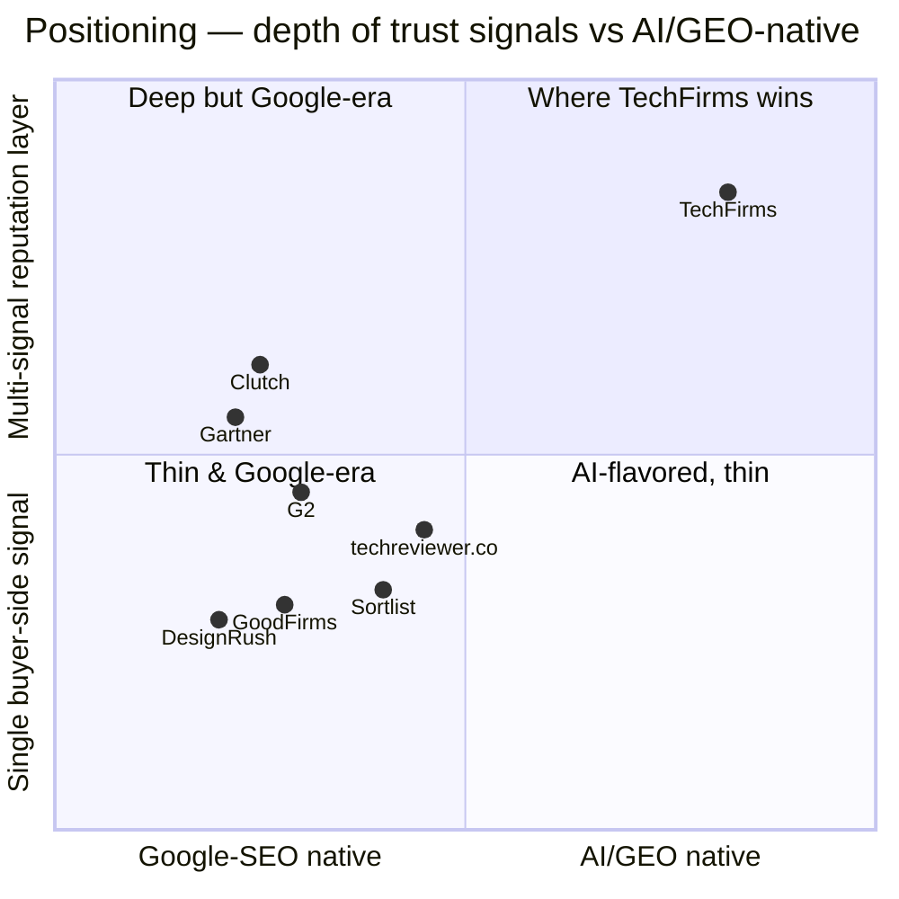
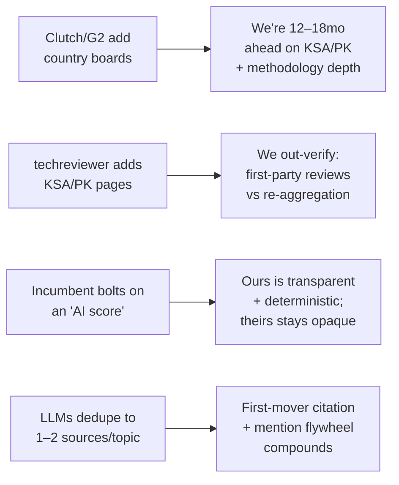

# Market & Competitor Analysis

> Status: Draft v1 · Last updated 2026-07-07

**Purpose.** This document maps the B2B discovery-directory category, benchmarks the two named reference platforms (techreviewer.co for business model, clutch.co for UX and review verification), fixes where **TechFirms** sits, and specifies the defensible white space we will build into. It is a build spec: every positioning claim below resolves to a concrete product decision that downstream docs implement. Sourced from the research briefs in [`docs/research/`](research/) — `competitors-landscape.md`, `techreviewer.md`, `clutch.md`, and `monetization-pricing.md` — and conforms to the LOCKED decisions in [`_canon.md`](research/_canon.md).

---

## 1. Market overview

The B2B "who-do-I-hire" discovery market splits into two camps that TechFirms deliberately straddles (`competitors-landscape.md` §1):

- **Software-product review sites** — G2, Gartner Peer Insights, Capterra/GetApp, TrustRadius. Users review *SaaS products*, monetized via vendor subscriptions + PPC. **Consolidating hard**: G2 acquired Capterra, GetApp and Software Advice from Gartner Digital Markets (Jan–Feb 2026). We do **not** compete here.
- **Service-provider / agency directories** — Clutch, GoodFirms, DesignRush, The Manifest, Sortlist, techreviewer.co, Wadline. Users review *the companies* that build software, monetized via sponsored placement + lead-gen. **This is TechFirms' camp**, and it is fragmented and contestable — the strategic inverse of the consolidating software side.

TechFirms reviews tech *companies* (services camp) but imports the *visual-quadrant credibility* (Gartner/G2) and *AI-first content strategy* from the product camp. That intersection — a Gartner-style, country-scoped, AI-cited reputation layer for tech companies — is genuinely under-occupied.

Three tailwinds define the moment: (1) **AI-first discovery is real** — buyers increasingly open research in ChatGPT/Perplexity, not Google, and per-engine citation pools barely overlap, so being the *cited source* is a channel incumbents (Google-SEO-native) are not built for; (2) the services side is **fragmenting** while the product side consolidates; (3) incumbents are **US/EU-centric** and thin in the Middle East + South Asia — our LOCKED priority markets (KSA → UAE → Pakistan, `_canon.md` §5). Note: techreviewer.co's #3 traffic source is already **Pakistan**, with no dedicated Pakistan or Saudi leaderboard anywhere in the incumbent set.

---

## 2. Competitor comparison

| Platform | Core function | Review verification | Ranking / quadrant | Monetization | Pricing signal | Strengths | Weaknesses |
|---|---|---|---|---|---|---|---|
| **Clutch** | B2B agency/dev-shop reviews | Gold standard — analyst phone interview (>$25k) or form (<$25k); reviewer logs in via LinkedIn/Google/company email; "Not Verified" reviews excluded from score | **Leaders Matrix**: Ability to Deliver × Focus; Clutch Rank = Reviews /20 + Clients&Experience /10 + Market Presence /10; **cannot pay in** | Sponsorship (9 tiers) + Clutch+ + PPL + Verified badge | Sales-quoted; sponsorship ~$1.5k–$7.5k+/mo, $20k–$100k+/yr top categories; Verified ~$500/yr; **12-mo lock** | Trusted verification; strong service×geo SEO; un-buyable Matrix | Hidden 12-mo-lock pricing; US/EU-centric; no employee layer; not GEO-native |
| **techreviewer.co** | IT/software directory + "analytics" | LinkedIn + phone/email + analyst case-study review for natives; but **mostly re-aggregates** Clutch/G2/GoodFirms/Trustpilot | "Techreviewer Score" = Review Score + AI Sentiment Modifier; **weights undisclosed** | **Featured placement only** + free listing | **No public price**; contact-for-quote; **PayPal only, non-refundable** | Low friction; broad taxonomy; ships AI score + data-PR flywheel; captures India/Pakistan | DA 36, declining rank; thin first-party data; opaque weights; no KSA/PK boards; no RFP/lead-gen |
| **G2** | SaaS product reviews | Identity validated via LinkedIn | **G2 Grid**: Satisfaction × Market Presence, quarterly, algorithmic | Vendor subscription + PPC + buyer-intent data | Starter ~$2.3–3k/yr; Pro ~$11.4–17.7k/yr; Ent ~$17.5–32k+/yr | Scale (3M+ reviews); intent data | Reviews products not companies; consolidating; no employee/agency layer |
| **Gartner Peer Insights** | Enterprise-tech end-user reviews | Staff-verified + strict fraud rules | Peer Insights "Voice of the Customer"; separate analyst **Magic Quadrant** | **Reports sold to buyers; inclusion is free** | Free to list; MQ reports = 5-figure enterprise | Most-cited visual in enterprise tech; "inclusion is free" trust nuance | Enterprise/analyst-gated; not agency-focused; slow, not AI-native |
| **TrustRadius** | In-depth enterprise SaaS reviews | Staff verifies recent product experience on every review; resellers excluded | **trScore** — weighted by recency, depth, sample bias | Vendor subs + Trusted Seller; free badges | Subscription, sales-led | Most sophisticated scoring model (scoring template) | Products not companies; niche traffic |
| **GoodFirms** | B2B services + software reviews | Verified reviews + self-reported data | Ranked lists by service & location | Free listing + 2 sponsorship plans | From ~$300/mo (billed yearly); Pro ~$1.5–2k/yr | Global coverage; research reports | Thin verification; no quadrant; no employee layer |
| **DesignRush** | Curated agency directory | Editorial vetting of portfolio/reviews | Human-editorial "best of" lists by category/location | Premium membership + sponsorship + marketplace PPL | From ~$200/mo (annual); bids from $50/lead | Editorial curation | Pay-to-play perception; membership $1.5k–$60k+/yr |
| **The Manifest** | B2B buying guide (Clutch sister site) | Shared Clutch verified data | "Most Reviewed" geo leaderboards | Free via Clutch + sponsored | Bundled with Clutch | Geo "most reviewed" awards | Thin auto-lists; derivative of Clutch |
| **Sortlist** | Agency-matchmaking marketplace | Brief qualification + provider verification | SEO by expertise × location; no public quadrant | Subscription + per-opportunity + CPC | **Publishes tiers**: €250 / €700 / €1,400/mo | Transparent pricing; AI brief-matching | Matchmaking not reputation; commission 3–9% |

*Pricing confidence per `monetization-pricing.md`: competitor models = high; exact dollars = medium (nearly all sales-quoted, not rate cards). Treat as negotiable list prices.*

---

## 3. Deep dive: techreviewer.co (business-model benchmark)

Techreviewer.co is a leaner, cheaper, lower-traffic Clutch clone — **precisely the seam TechFirms targets** (`techreviewer.md`). It curates ranked "Top 100+ [service] companies" lists, aggregates third-party ratings, layers an in-house score, and monetizes almost entirely through **featured (sponsored) placement**.

- **Scale (medium confidence):** ~20K visits/month, global rank #594,821 and *declining*, Moz DA 36, 42-second dwell, 1.89 pages/visit. Directory lists ~414 companies in software development. Top traffic: **India 16.4%, US 14.8%, Pakistan 6.3%** — 59% organic. The small, organic-dependent, developing-market audience is directionally reliable and it is **beatable**.
- **Revenue model:** Free self-serve "Get Listed" (3–5 day analyst review) → **Featured placement** (pick top-lists + duration, pay via **PayPal only**, non-refundable, no public price, first-come-first-served for contested slots) → weak/absent lead-gen (primary CTA is outbound "Visit website"; no RFP form).
- **Taxonomy:** Broader than ours — Software Dev, Web, eCommerce, IT Services, Mobile, Design, AI, Blockchain, IoT, Game Dev, ML, QA, VR/AR. We deliberately run a **focused 10-category taxonomy** (`_canon.md` §4) for depth over long-tail sprawl.
- **The "score":** "Techreviewer Score = Review Score + AI Sentiment Modifier," aggregated from Clutch/G2/GoodFirms/Trustpilot/Google, AI sentiment across 5 dimensions, **weights undisclosed**. Critically: **an AI-first score is not a novel wedge** — theirs exists. Our **Company Intelligence Score (CIS, 0–100)** must be *visibly better*: transparent published weights (Customer Reviews 40% / Employee Sentiment 25% / Trust Signals 20% / Market Activity 15%, `_canon.md` §6) at `/methodology`, and resting on **first-party** reviews, not re-aggregation.
- **URL architecture (copy it):** `/top-{service}-companies-in-{country}`, `/page/N` pagination, `/pricing/{service}` guide hubs. We adopt the LOCKED equivalents in `_canon.md` §3 (`/best-[service]-companies-in-[country]`, `/leaderboard/[country]/[service]`) with **SSR + JSON-LD** they lack.
- **Data-PR flywheel:** They syndicate quarterly research (BusinessWire/Yahoo) to earn backlinks and punch above DA 36 — we steal this from day one via our `/reports/[country]` "State of Tech Companies" pages.

**Attack surface:** opaque weights, PayPal-only/non-refundable checkout, no RFP lead-gen, no KSA/Pakistan boards, weak engagement. We beat all five with transparency, self-serve Stripe, an RFP query flow, priority-market boards, and denser data.

---

## 4. Deep dive: clutch.co (UX & verification benchmark)

Clutch is the category-defining benchmark for directory UX, review verification, and the leaderboard (`clutch.md`).

- **UX / card anatomy (reuse literally):** rank # + logo, dual **star rating + review count**, **service-focus % bars**, min-project + hourly-rate bands, team-size bracket, HQ, a recent-review pull-quote, dual CTAs (**Visit Website** / **View Profile**), verified badge. Filters: location, hourly rate, min project size, team size, service focus, industry, budget. Month-stamped titles ("Top Software Development Companies - Jul 2026 Rankings") auto-refreshed — our LOCKED title pattern mirrors this (`_canon.md` §3).
- **Review verification (match or beat):** analyst **phone interview** for >$25k projects (recorded, transcribed, 3-day client edit window) or online form for <$25k; reviewer logs in via **LinkedIn/Google/company email**; identity + work-history cross-checked; **"Not Verified" reviews do not count toward the score**. Company-level Clutch Verified adds a CreditSafe check (two tiers: Verified / Premier). Exact fraud methods withheld to prevent gaming. We mirror this: LinkedIn/company-email verification, "Not Verified excludes from CIS," a two-tier verified badge (replacing CreditSafe with domain age + funding + certs), and **secret fraud-detection signals** (`_canon.md` §6).
- **Leaders Matrix methodology (the trust firewall):** 2-axis scatter — X = **Focus** (placement only, *not* ranked), Y = **Ability to Deliver** (the real engine, 40 pts: Reviews /20 + Clients&Experience /10 + Market Presence /10). Four quadrants; ~top 15 become Market Leaders. **You cannot pay into the Matrix** — catalogs are sponsor-first, the Matrix is rank-only. This is Clutch's single cleanest trust mechanic and we copy it exactly: the **CIS ranking is un-buyable**; sponsorship lives only in clearly-labeled slots around the board (`_canon.md` §11).
- **Monetization:** free profiles; Verified ~$500/yr; sponsorship several $1k/mo up to $5k+/mo, **12-month commitment, no public prices**. We undercut with transparent, self-serve, no-lock pricing (details in [Monetization & Pricing](15-monetization-and-pricing.md)).

**What Clutch misses that we take:** no employee-sentiment layer, no AI score, not GEO-native, US/EU-centric, and friction-heavy hidden pricing.

---

## 5. Positioning & white space

TechFirms sits top-right: the only **multi-signal** (four LOCKED trust signals) reputation layer built **AI/GEO-first**. Our four defensible white-space bets, each with why it holds:

1. **Employee-sentiment layer.** No B2B directory combines "would clients hire them" with "what's it like inside." Defensible *because it is hard*: Glassdoor's API closed in 2021, sits behind Cloudflare, ToS bans scraping. We launch with **aggregates-only + attribution + link-out** (facts are uncopyrightable) and ship **native anonymous email-verified employee reviews in v2** — the real moat (`_canon.md` §9). The difficulty is the barrier.

2. **Company Intelligence Score (CIS).** A transparent, deterministic 0–100 composite (published weights, weekly recompute, monthly frozen snapshots, Claude only *narrates* a 3-sentence justification and never emits the number). TrustRadius proves a weighted composite carries authority; techreviewer proves an AI score alone is not enough. Our edge is **published methodology** vs their opacity.

3. **Country-scoped leaderboards as the flagship.** Not the directory — the *leaderboard* is the wedge (`_canon.md` §5). Deep, methodology-backed, monthly-refreshed "Top AI Development Companies in Saudi Arabia — July 2026" boards using **cohort scoring within country × service** (median splits, so US giants don't flatten emerging-market boards). Defensible because incumbents ship thin auto-lists and skip KSA/Pakistan entirely.

4. **GEO / LLM citation.** Answer blocks (40–60 word dated, number-bearing summaries), full SSR, `Organization`/`AggregateRating`/`Review`/`ItemList` JSON-LD, HTML-table equivalents for every chart, a public read-only API, and `/llms.txt`. **Reality check** (`_canon.md` §10): `llms.txt` is free insurance but *not* the moat — the real lever is **third-party brand mentions** (~3× stronger than backlinks for AI citation). We treat "get mentioned" as a growth KPI and instrument AI-citation tracking to *measure* it.

Detailed feature-gap mapping lives in [User Research & Feature Gaps](02-user-research-and-feature-gaps.md).

---

## 6. Threats, incumbent response & barriers to entry

**Threats.** (1) An incumbent with existing traffic (Clutch, G2) clones country leaderboards — but they must overcome US/EU inertia and rebuild methodology depth for markets they've ignored. (2) techreviewer.co ships KSA/Pakistan pages cheaply — mitigated by our first-party review network and superior verification/UX. (3) Any player bolts on an "AI score" (techreviewer already has one) — we win on transparency + determinism. (4) LLMs converge citations onto 1–2 canonical sources per topic — a *risk if we're late*, a *moat if we're early*.

**Barriers we build:**

- **Proprietary CIS with published methodology** — copyable in *shape* but not in *trust*; the transparency + first-party data are the defensibility, and re-aggregators structurally cannot match it.
- **Verified-review network effects** — every verified review raises leaderboard credibility, attracts more claims, which yields more reviews. Cold-start solved by seeding ~1,000 scraped `unclaimed` firms (`_canon.md` §9) so boards are populated before supply arrives.
- **LLM-citation lead** — first-mover on GEO for KSA/UAE/Pakistan tech queries plus the third-party-mention flywheel compounds; per-engine citation pools barely overlap, rewarding breadth of mentions early.
- **Employee-sentiment moat (v2)** — native email-verified employee reviews are legally/technically hard to replicate, widening the gap once shipped.

---

## Open questions / decisions needed

- **Employee-sentiment sourcing at launch:** bought dataset (Bright Data ~$0.0025/record) vs Apify refresh vs aggregates-only link-out. Founder call on budget vs coverage before seeding.
- **Taxonomy breadth:** hold the focused 10 categories, or add 1–2 of techreviewer's long-tail lines (Blockchain, QA) for extra pSEO surface in priority markets?
- **First flagship board sequencing:** canon fixes AI Development in KSA first — confirm whether UAE Custom Software or Pakistan Web Dev is board #2 for GTM.
- **AI-citation instrumentation:** which engines to track first (ChatGPT/Perplexity/Google AI Mode) and what counts as a "citation win" KPI threshold.
- **Data-PR cadence:** quarterly country reports are proven at techreviewer — confirm resourcing (Playwright + Claude pipeline) for the first `/reports/[country]` drop.
