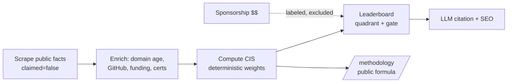
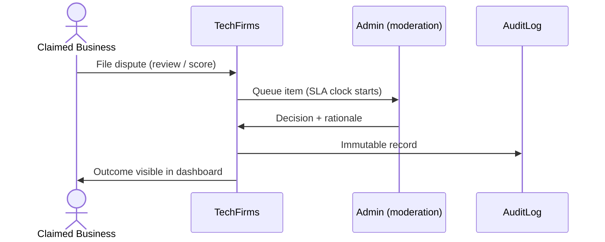

# User Research & Feature-Gap Analysis

> Status: Draft v1 · Last updated 2026-07-07

**Purpose.** This document synthesizes the real, sourced complaints buyers and listed agencies voice about incumbent directories (Clutch, G2, GoodFirms, DesignRush, Gartner Peer Insights) into a prioritized pain-point map, then converts each opportunity into a concrete, buildable feature or policy for TechFirms. It is the bridge between the raw research in [`research/user-sentiment.md`](research/user-sentiment.md) and the build sequencing in [Roadmap & Build Plan](18-roadmap-and-build-plan.md). Where this doc names a score weight, table, URL, hex, or price, it conforms to [`research/_canon.md`](research/_canon.md); it never invents alternatives to a locked decision. TechFirms' one-line thesis — an AI-first reputation layer whose **Company Intelligence Score (CIS)** is transparent, deterministic, and unbuyable — is defined in [Overview & Vision](00-overview-and-vision.md); this doc explains *why the market needs it* and *what we build to deliver it*.

---

## 1. The one structural grievance underneath all of them

Across every incumbent the same tension recurs: **the platform sells visibility to the same companies it claims to rank objectively.** Buyers stop trusting the rankings; agencies resent paying into them and complain the leads are thin. Every feature decision below flows from a single strategic response — **separate paid visibility from computed rank, and make the separation visible.** This is locked in `_canon.md` §11: *"Sponsored" is always visually labeled and never influences the CIS or organic rank.*

A caveat carried from the research: sentiment skews loud (Trustpilot / PissedConsumer / Reddit over-represent the aggrieved), and individual dollar figures are indicative, not authoritative. We win not by claiming the incumbent model is broken, but by making the trust mechanics *transparent* in a category where opacity is the norm.

---

## 2. Prioritized pain-point map

Priority = (frequency across sources) × (how directly it blocks trust or supply growth). P0 = launch-blocking wedge; P1 = strong differentiator, ship early; P2 = important, phase in.

| # | Pain point | Who feels it | Evidence / source | TechFirms opportunity (feature/policy) | Priority |
|---|---|---|---|---|---|
| 1 | **Rankings feel bought** — Grid/Matrix placement perceived as spend-driven | Buyers + agencies | G2 "pay for 10-star reviews" (LinkedIn); Clutch "completely pay to play"; NetScout v. Gartner "extortionate by its very nature" (CMSWire) | Deterministic CIS computed from fixed weights (Reviews 40 / Employee 25 / Trust 20 / Market 15); public `/methodology`; sponsored slots labeled and **excluded** from rank | **P0** |
| 2 | **Fake / incentivized reviews** dilute signal | Buyers | Bought-review solicitations on Clutch (Trustpilot); gift-card-incentivized 5-star clusters on G2 (checkthat.ai) | Verified-review provenance badges; ban incentivized reviews outright; fraud detection (velocity/co-burst, near-dup embeddings, reviewer-graph); blend with 3 non-gameable signals | **P0** |
| 3 | **Opaque rankings / arbitrary score** | Buyers + agencies | Gartner MQ "pay-to-access" perception; "same companies repeat over and over" (Trustpilot) | Published formula + weights at `/methodology`; per-profile score breakdown; AI writes only a 3-sentence *narration*, never the number | **P0** |
| 4 | **Low-quality / spammy leads** | Agencies | "super low quality leads," "spammy form submissions" (Martal) | AI query→firm matching (Sonnet 5) with pre-routing qualification; lead-reject/refund mechanism; charge **per-qualified-lead**, not per-click | **P1** |
| 5 | **Expensive listings, poor ROI, annual lock-in** | Agencies | ~$500 verified + $k/mo sponsorships, "hardly any leads," locked annual contract (Trustpilot/Martal) | Free credible baseline profile for every firm; no-annual-lock pricing; Pakistan pricing ≈ 40–50% of global so regional firms aren't priced out | **P1** |
| 6 | **Aggressive sales calls / buyer harassment** | Buyers + agencies | "STOP / JUST LOOKING" replies to G2 intent-data outreach; DesignRush cold outreach complaints | **No-cold-call promise**: buyer-consented intros only; never resell raw buyer-intent for cold blasting | **P1** |
| 7 | **Thin / stale profiles, poor data accuracy** | Buyers | "same companies repeated"; low freshness across incumbents | Auto-enriched profiles (domain age, GitHub activity, funding, certs) + visible **"last verified"** date + weekly re-score / re-scrape SLA | **P1** |
| 8 | **Opaque moderation; can't remove defamatory reviews without paying** | Agencies | Clutch/G2 "can't be deleted without subscription" (G2-on-Clutch) | Free, SLA-bound dispute/appeal workflow; every moderation decision logged in `AuditLog` and surfaced to the business | **P2** |
| 9 | **Impersonation / spam ecosystem** | Both | DesignRush fraud page: look-alike domains, fake invoices, sold "visibility boosts" | Verified-Plus identity badges; official-contact-only channel; claim via work-email domain or DNS TXT | **P2** |
| 10 | **SMB / regional buyers underserved** | Buyers | Gartner enterprise-only; Clutch/G2 US/EU-centric | Country-scoped leaderboards for KSA / UAE / Pakistan — the exact query incumbents ignore and LLMs lack a source for | **P0** |

---

## 3. Opportunities → concrete features & policies

Each opportunity above resolves to a shippable artifact. The load-bearing ones:

**Transparent published methodology (`/methodology`).** A public page stating the exact composite weights and the Bayesian/recency math. This is simultaneously the answer to pains #1/#3 and a GEO moat (LLMs cite documented methodology). Fraud-detection *signals stay secret*; the *scoring formula* is public.

```json
{
  "score": "Company Intelligence Score (CIS)",
  "scale": "0-100",
  "weights": { "customerReviews": 0.40, "employeeSentiment": 0.25, "trustSignals": 0.20, "marketActivity": 0.15 },
  "reviewsModel": { "type": "bayesian-shrinkage", "priorReviews_m": 8, "priorMean_C": "3.5 stars (~70/100)", "recencyDecay": "exponential, half-life 12mo" },
  "cohort": "ranked within country x service-category using median splits",
  "leaderboardGate": ">= 5 verified reviews AND >= 3 within 18 months",
  "recompute": "weekly; monthly frozen snapshots published"
}
```

**Verified-review provenance badges.** Every review carries a `source` of `native | imported` and a verification state. Native reviews are collected through `ReviewInvitation` (unique per-client links) so provenance is auditable end-to-end. The profile shows *how* each review was obtained — the direct antidote to pain #2.

```prisma
model CustomerReview {
  id             String       @id @default(cuid())
  companyId      String
  source         ReviewSource // native | imported
  verified       Boolean      @default(false)
  invitationId   String?      // links native reviews to a ReviewInvitation for provenance
  qualityRating  Int          // 1-5
  scheduleRating Int
  costRating     Int
  referRating    Int
  reviewText     String
  createdAt      DateTime     @default(now())
  updatedAt      DateTime     @updatedAt
  deletedAt      DateTime?
}
```

**Fraud/fake-review detection (MVP, 3 cheap wins per `_canon.md` §6).** (a) velocity/burst + co-bursting; (b) near-duplicate text via embedding similarity; (c) shared-domain/IP reviewer-graph clustering. Runs on the worker, feeds moderation triage (Haiku 4.5), never exposes the exact heuristics.

**No-cold-call promise (policy, marketed).** Buyer `Query` submissions route only to the targeted or matched businesses that the buyer consented to; TechFirms never sells raw buyer-intent for cold outreach. Stated on the homepage as a trust pillar.

**Lead quality controls.** The `QueryMatch` pipeline scores/qualifies a lead before it hits `Forwarded`; businesses can reject a low-fit lead. Monetization is **pay-per-qualified-lead** (`$40–150/lead`, validate), not per-click — structurally impossible to bill for spam.

**Freshness SLA.** `TrustSignal` and `IntelligenceScore` recompute weekly; profiles render a machine-readable `dateModified` and a human "last verified" chip. Stale-job reaping in the worker guarantees the cadence survives crashes.

---

## 4. MoSCoW feature list, mapped to roadmap phases

Phase numbers reference the build order in [Roadmap & Build Plan](18-roadmap-and-build-plan.md).

**Must have (launch — Phases 1–7)**
- Deterministic CIS with public `/methodology` page — *directly kills pain #1/#3.* (Phase 6)
- Directory + SSR company profiles with four trust signals + score badge. (Phase 3)
- `native | imported` review model with provenance + verified badge. (Phases 1, 5)
- Fraud detection MVP (3 heuristics) feeding moderation queue. (Phase 8)
- Sponsored placement **labeled and excluded from rank** (flags built even before pricing ships). (Phase 5)
- Country-scoped leaderboards (KSA / UAE / Pakistan) with Leaders / Challengers / Rising Stars / Niche Players quadrant. (Phase 6)
- Query flow + admin `New → Forwarded → Contacted → Closed` pipeline. (Phase 4)
- Claim flow (work-email domain or DNS TXT → admin approval) + free baseline profile. (Phase 5)
- Freshness: weekly re-score, visible "last verified" date. (Phases 2, 6)

**Should have (early post-launch)**
- Native verified-review collection via `ReviewInvitation` unique links.
- Dispute/appeal workflow with published SLA + `AuditLog` visibility.
- Lead qualification scoring in `QueryMatch`.
- Verified-Plus identity badge; anti-impersonation official-contact channel.

**Could have (opportunistic)**
- Pay-per-qualified-lead billing with reject/refund.
- Public read-only API (`/api/v1/...`) as machine-readable source.
- "State of Tech Companies in [Country]" report pages (`/reports/[country]`).

**Won't (not at launch — deliberate)**
- Native anonymous employee reviews (ships v2 — the moat; launch uses *aggregates only + attribution + link-out*, per `_canon.md` §9).
- Live Glassdoor scraping (API closed 2021, Cloudflare, ToS ban).
- Incentivized/gift-card reviews — **banned permanently, not deferred.**
- Reselling buyer-intent data for cold outreach — permanent anti-goal.
- Any paid path into rank position.



---

## 5. Trust design — UI/policy choices that visibly signal integrity

Trust here is not a copy exercise; it is enforced in the interface and the data model.

- **Methodology page as a first-class route.** `/methodology` is linked from every leaderboard and profile footer, renders the weights table, and is SSR'd so LLMs ingest it. Rendered in Ink Navy (`#0A1B2E`) authority surfaces with Geist headings.
- **Sponsored disclosure.** Any `Sponsorship` slot renders a persistent "Sponsored" label (never a subtle tint), sits in a visually distinct band, and is excluded from the numbered rank. The CIS chip uses **Intelligence Violet** (`#6D3EF0`) reserved exclusively for AI/score elements, so score and ad can never be visually confused.
- **Review provenance surfaced inline.** Each review shows a badge: "Verified — native (invited client)" vs "Imported (public source)". Verified uses `success-600 #16A34A`; never red for anything but errors.
- **Score breakdown, not a black box.** The profile's AI Intelligence tab shows the four sub-scores and their weights alongside a 3-sentence Claude *narration* — the number itself is deterministic; Claude never emits it.
- **Freshness stamp.** A "Last verified: [date]" chip on every profile and leaderboard, backed by real `dateModified`.
- **Appeal process with an SLA.** A business can dispute a review or its score; the request enters a tracked queue, the decision is written to `AuditLog`, and the outcome is visible to the business — the opposite of "pay to delete."



---

## 6. Anti-goals — what we deliberately won't do at launch

1. **No paid rank.** Money buys labeled visibility around the board, never a position on it.
2. **No incentivized reviews, ever.** A permanent marketing pillar, positioned against G2's gift-card model.
3. **No live Glassdoor scraping / no verbatim employee-review text.** Aggregates + attribution + link-out only at launch; native employee reviews are a v2 moat.
4. **No cold-call lead reselling.** Buyer-consented intros only.
5. **No dark-pattern lock-in.** No hidden annual contracts; pricing and cancellation are transparent.
6. **No scraping arms race.** A Cloudflare/DataDome challenge is treated as "no" (`_canon.md` §9) — we never spoof to bypass anti-bot defenses.
7. **No global-absolute cutoffs that flatten emerging markets.** Cohort scoring by country × service uses median splits so US giants don't bury Pakistan/KSA firms.

---

## Open questions / decisions needed

- **Pricing validation.** Featured `$49–99/mo`, Sponsored `$300–1,500/mo`, Verified-Plus `$199–399/mo`, per-lead `$40–150` are all tagged `(validate)` in `_canon.md` §11 — needs founder sign-off before billing ships.
- **Appeal SLA target.** What concrete turnaround do we publish (e.g. 5 business days)? Needed to make the appeal promise credible.
- **Imported-review display depth.** Do we show imported reviews as full entries or only fold their aggregate into the CIS? Affects both trust optics and the copyright posture on regenerated text.
- **Fraud-signal disclosure line.** Exactly how much of the detection approach do we acknowledge publicly (existence yes, mechanics no) without teaching gamers?
- **Lead-refund threshold.** What objective criteria define a "non-qualified" lead eligible for reject/refund, to avoid disputes?
