# Information Architecture & Sitemap

> Status: Draft v1 · Last updated 2026-07-07

This document is the canonical map of every URL, page, and navigation surface in TechFirms — the AI-first reputation layer and directory for technology companies. It defines the full sitemap (public site, business dashboard, admin, auth), the locked URL scheme and slug strategy, the service and geography taxonomies, global navigation and breadcrumbs, the faceted-navigation crawl-budget policy, and a page-by-page inventory with render modes. It is the routing contract that every other build doc conforms to. All URLs, table names, and tokens here are inherited from [`_canon.md`](research/_canon.md) and must not be contradicted.

---

## 1. Site map (Mermaid tree)

```mermaid
graph TD
  ROOT["/"]

  subgraph PUBLIC["Public site — SSR/ISR, indexable"]
    ROOT --> DIR["/companies (directory)"]
    DIR --> PROFILE["/companies/[slug]"]
    ROOT --> LBC["/leaderboard/[country]"]
    LBC --> LBCS["/leaderboard/[country]/[service]"]
    ROOT --> PSEO_C["/best-[service]-companies-in-[country]"]
    ROOT --> PSEO_CITY["/best-[service]-companies-in-[city]"]
    ROOT --> SVC["/services (hub)"]
    SVC --> SVC1["/services/[service]"]
    ROOT --> REP["/reports (index)"]
    REP --> REP1["/reports/[country]"]
    ROOT --> METH["/methodology"]
    ROOT --> STATIC["/about /pricing /contact /for-businesses /blog /legal/*"]
    PROFILE --> CLAIM["/claim/[slug]"]
    ROOT --> LLMS["/llms.txt · /sitemap.xml · /robots.txt"]
  end

  subgraph AUTH["Auth (noindex)"]
    ROOT --> LOGIN["/login /signup /reset /verify /callback"]
  end

  subgraph DASH["Business dashboard — SSR, auth-gated, noindex"]
    LOGIN --> D0["/dashboard"]
    D0 --> D1["/dashboard/profile"]
    D0 --> D2["/dashboard/reviews"]
    D0 --> D3["/dashboard/queries"]
    D0 --> D4["/dashboard/invitations"]
    D0 --> D5["/dashboard/analytics"]
    D0 --> D6["/dashboard/billing"]
    D0 --> D7["/dashboard/settings"]
  end

  subgraph ADMIN["Admin — SSR, role-gated, noindex"]
    LOGIN --> A0["/admin"]
    A0 --> A1["/admin/companies"]
    A0 --> A2["/admin/claims"]
    A0 --> A3["/admin/reviews"]
    A0 --> A4["/admin/queries"]
    A0 --> A5["/admin/leaderboards"]
    A0 --> A6["/admin/sponsorships"]
    A0 --> A7["/admin/scraper"]
    A0 --> A8["/admin/audit"]
  end

  subgraph API["Public read-only API — JSON, noindex"]
    ROOT --> API1["/api/v1/*"]
  end
```

---

## 2. Canonical URL scheme (every route)

All routes below are locked in `_canon.md §3`. `[country]` and `[service]` are always readable slugs (see §3–4). Leaderboard and pSEO pages carry month-stamped `<title>`s (e.g. `Top AI Development Companies in Saudi Arabia — July 2026`).

| Purpose | Route | Canonical rule |
|---|---|---|
| Home | `/` | Self |
| Directory (facets in querystring) | `/companies?service=&country=&size=&rate=&rating=&sort=` | Canonical → bare `/companies`; facet params **noindex** (§6) |
| Company profile | `/companies/[slug]` | Self |
| Country leaderboard | `/leaderboard/[country]` | Self |
| Country + service leaderboard | `/leaderboard/[country]/[service]` | Self |
| Programmatic SEO — country | `/best-[service]-companies-in-[country]` | Self; `rel=canonical` cross-references the twin `/leaderboard/[country]/[service]` as the ranking source of truth |
| Programmatic SEO — city | `/best-[service]-companies-in-[city]` | Self |
| Service hub (all services) | `/services` | Self |
| Service category hub | `/services/[service]` | Self |
| Country report | `/reports/[country]` | Self (`State of Tech Companies in [Country]`) |
| Reports index | `/reports` | Self |
| Methodology | `/methodology` | Self |
| Claim a profile | `/claim/[slug]` | `noindex` |
| Marketing/static | `/about`, `/pricing`, `/for-businesses`, `/contact`, `/blog`, `/blog/[slug]`, `/legal/privacy`, `/legal/terms` | Self |
| Business dashboard | `/dashboard`, `/dashboard/{profile,reviews,queries,invitations,analytics,billing,settings}` | `noindex, nofollow` |
| Admin | `/admin`, `/admin/{companies,claims,reviews,queries,leaderboards,sponsorships,scraper,audit}` | `noindex, nofollow` |
| Auth | `/login`, `/signup`, `/reset-password`, `/verify-email`, `/auth/callback` | `noindex, nofollow` |
| Public API | `/api/v1/*` | Not crawled; see [Public API Spec](16-public-api-spec.md) |
| Machine surfaces | `/llms.txt`, `/robots.txt`, `/sitemap.xml`, `/sitemap/[id].xml` | n/a |

**Pagination & sort:** directory and leaderboard pagination uses `?page=n`; `page≥2` and any `?sort=` variant `rel=canonical` back to the base page-1 URL. Never canonicalize one country to another.

### Slug strategy

- **Company slug** — kebab-case of the legal/display name, ASCII-folded, stopwords kept; on collision append a numeric suffix (`-2`, `-3`). Stored immutable in `Company.slug` (unique). Renames keep the old slug as a 301 alias.
- **Service slug** — fixed enum from §4 (`ServiceCategory`), never free-typed.
- **Country slug** — readable and stable (`saudi-arabia`, `united-arab-emirates`, `pakistan`), stored in `Country.slug` with the ISO-3166 alpha-2 code alongside in `Country.iso2`.
- **City slug** — kebab-case city name, disambiguated by country when needed (`dubai`, `riyadh`, `lahore`); stored in `City.slug`, FK to `Country`.
- **Canonicalization rules:** lowercase; trailing slash stripped; unknown/empty facet combos and empty pSEO/leaderboard combos return **HTTP 404** (never soft-redirect); self-referencing canonical on every primary page.

---

## 3. Geography taxonomy (countries & cities)

Backed by `Country` and `City` (`_canon.md §12`). Countries store `iso2` (ISO-3166-1 alpha-2), `iso3`, `name`, `slug`, `currency` (ISO-4217), and `region`. Cities store `slug`, `name`, `Country` FK, and lat/lng for future map use. Leaderboards are **country-scoped only** — this is the core content strategy; city pages exist purely as pSEO surfaces.

**Launch seed (locked priority order):**

| Country | `iso2` | slug | Seed cities |
|---|---|---|---|
| Saudi Arabia | `SA` | `saudi-arabia` | riyadh, jeddah, dammam |
| United Arab Emirates | `AE` | `united-arab-emirates` | dubai, abu-dhabi, sharjah |
| Pakistan | `PK` | `pakistan` | karachi, lahore, islamabad |

Then global expansion (US `us`, UK `united-kingdom`, India `india`, Canada `canada`, etc.) as data density clears the eligibility gate. Rationale: KSA and Pakistan have **no dedicated leaderboards** on Clutch/techreviewer.co — an open SEO/GEO lane. First three seeded boards: AI Development in Saudi Arabia · Custom Software in UAE · Web/Custom Software in Pakistan.

---

## 4. Service taxonomy (locked)

Ten categories, `ServiceCategory` enum. Company↔Service is many-to-many via `CompanyService` with a `focusPct` on the join (drives leaderboard X-axis placement and the profile focus bars).

| Service | Slug |
|---|---|
| AI Development | `ai-development` |
| Custom Software Development | `custom-software` |
| Web Development | `web-development` |
| Mobile App Development | `mobile-app-development` |
| Cloud | `cloud` |
| DevOps | `devops` |
| Data Engineering | `data-engineering` |
| Cybersecurity | `cybersecurity` |
| IT Staff Augmentation | `it-staff-augmentation` |
| UI/UX Design | `ui-ux-design` |

---

## 5. Global navigation & breadcrumbs

### Header (public, sticky, Ink Navy `#0A1B2E` on scroll)

- **Logo** → `/`
- **Companies** → `/companies`
- **Leaderboards** (dropdown) → country picker → `/leaderboard/[country]`; footer link "All leaderboards"
- **Services** (mega-menu, 10 items) → `/services/[service]`
- **Reports** → `/reports`
- **Methodology** → `/methodology`
- **Search** (⌘K command palette, SSR fallback to `/companies?q=`)
- **For Businesses** → `/for-businesses`; primary CTA **"Claim your profile"** (teal-700 `#0F6E6B` button) → `/login?next=/dashboard`
- Auth state: logged-out → **Log in**; logged-in → avatar menu (Dashboard, Settings, Sign out; Admin link if `role ∈ {admin, super_admin}`)

### Footer (Ink Navy, four columns)

- **Directory:** Browse companies · All services (10 links) · Leaderboards by country (seed list) · Country reports
- **Product:** Methodology · For Businesses · Pricing · Get a Quote
- **Company:** About · Blog · Contact · Careers
- **Legal & machine:** Privacy · Terms · `llms.txt` · Public API · Sitemap
- Row: locale/region hint, © line, social links.

### Breadcrumbs (site-wide, `BreadcrumbList` JSON-LD)

| Page | Trail |
|---|---|
| Directory | Home › Companies |
| Profile | Home › Companies › [Company] |
| Country leaderboard | Home › Leaderboards › [Country] |
| Country+service leaderboard | Home › Leaderboards › [Country] › [Service] |
| pSEO country | Home › Leaderboards › [Country] › [Service] |
| pSEO city | Home › Leaderboards › [Country] › [City] › [Service] |
| Service hub | Home › Services › [Service] |
| Country report | Home › Reports › [Country] |

Breadcrumbs are rendered visibly and emitted as JSON-LD on every public page (SEO parity requirement).

---

## 6. Faceted navigation & crawl-budget policy

Only **curated `service × country` (and top `city`) combos** are crawlable canonical URLs, materialized as `/leaderboard/*` and `/best-*` pages. Every other user-facing filter is a **querystring facet on `/companies` that never mints an indexable URL**.

| Facet | Mechanism | Indexable? |
|---|---|---|
| service × country (curated) | Own route (`/leaderboard/[country]/[service]`, `/best-…`) | **Yes** — canonical, in sitemap |
| service only, country only | Directory querystring | No — canonical → `/companies` |
| team size, hourly rate, min budget, rating, sort, page | Directory querystring | No |
| free-text search `q` | Querystring | No |

**Rules (from `_canon.md §3` + [SEO Playbook](09-seo-playbook.md)):** `robots.txt` disallows filter param patterns (`/*?*rating=`, `/*?*size=`, `/*?*rate=`, `/*?*sort=`, `/*?*page=`); the directory emits `<meta robots="noindex,follow">` whenever any facet param is present; empty filter/leaderboard combos return **HTTP 404**, never a redirect; `&` is the sole param separator with a fixed param order. A curated leaderboard is only published when it clears the eligibility gate (≥5 verified reviews AND ≥3 recent per company; minimum qualifying-company count) — the primary defense against Scaled-Content-Abuse. Full internal-linking, schema, and sitemap detail lives in [SEO & GEO Playbook](09-seo-playbook.md).

---

## 7. Page inventory

Render modes: **ISR** = statically generated + revalidated on-demand via `revalidateTag` after the worker re-scores; **SSR** = per-request (search, personalized, auth-gated). Components are shadcn/ui + Recharts, themed to the tokens in [Design System](03-design-system.md).

| Page | Route | Render | Primary purpose | Key components |
|---|---|---|---|---|
| Home | `/` | ISR | Hero search, funnel to directory/leaderboards | HeroSearch, CategoryGrid, CountryGrid, LeaderboardPreview, LatestReviews |
| Directory | `/companies` | SSR | Filterable company search | FilterRail, SortBar, CompanyCard grid, Pagination, ItemList JSON-LD |
| Company profile | `/companies/[slug]` | ISR | Canonical company record + CIS | ScoreBadge (violet CIS chip), AnswerBlock, Tabs (Overview/Reviews/Employee Sentiment/Trust Signals/AI Summary), RightRailCard, GetQuoteCTA, ClaimBanner, Org+AggregateRating+Review JSON-LD |
| Country leaderboard | `/leaderboard/[country]` | ISR | Gartner-style country board | CountrySelector, AnswerBlock, QuadrantChart (Recharts) + HTML `<table>` twin, RankTable, MovementBadge, ItemList JSON-LD |
| Country+service board | `/leaderboard/[country]/[service]` | ISR | Scoped ranked board | same as above, service-scoped |
| pSEO country | `/best-[service]-companies-in-[country]` | ISR | Long-tail landing → board | AnswerBlock, AIIntro (monthly refresh), Top-10 table, FAQBlock (FAQPage JSON-LD) |
| pSEO city | `/best-[service]-companies-in-[city]` | ISR | City long-tail landing | same, city-scoped |
| Service hub | `/services/[service]` | ISR | Category overview + top firms | ServiceIntro, CountryBoardLinks, TopCompanies, FAQBlock |
| Country report | `/reports/[country]` | ISR | Data-PR long-form ("State of…") | ReportHero, DataCharts + tables, StatCallouts, CitationBlock |
| Methodology | `/methodology` | ISR | Publish CIS formula/weights (GEO moat) | WeightsTable, FormulaBlock, SignalCards |
| Claim | `/claim/[slug]` | SSR | Start claim (email/DNS verify) | ClaimWizard, VerificationStep, AuthGate |
| Get-a-quote flow | `/companies/[slug]` (modal) + `/for-businesses` | SSR | Lead capture → `Query` | QueryForm, MatchedFirms (AI), Confirmation |
| Dashboard home | `/dashboard` | SSR | Claimed-company overview | KPIStats, QueryFeed, LeaderboardTrend |
| Dashboard sub-pages | `/dashboard/{profile,reviews,queries,invitations,analytics,billing,settings}` | SSR | Manage profile, reviews, queries, review-invites, analytics, Stripe billing | ProfileEditor, ReviewResponder, QueryTable, InvitationSender, AnalyticsCharts, BillingPanel |
| Admin | `/admin/*` | SSR | Ops: CRUD, moderation, scoring, sponsorship, scraper, audit | AdminDashboard, ClaimsQueue, ReviewModeration, QueryPipeline, LeaderboardControls, SponsorshipManager, ScraperControls, AuditLog |
| Auth | `/login`, `/signup`, `/reset-password`, `/verify-email` | SSR | Supabase Auth | AuthForm, OAuthButtons, RoleRedirect |

Key user paths through these pages (visitor → quote, owner → claim, admin → moderation) are specified in [User Flows & Journeys](05-user-flows-and-journeys.md).

---

## 8. Open questions / decisions needed

- **Locale routing:** Arabic (KSA/UAE) is planned (Noto Sans Arabic is locked). Decide `/ar/*` path-prefix i18n vs. `hreflang`-only. Recommendation: ship English-only at launch, reserve `/ar` prefix — needs founder sign-off before URL contract freezes.
- **pSEO ↔ leaderboard duplication:** `/best-[service]-companies-in-[country]` and `/leaderboard/[country]/[service]` are near-identical data. Current call: keep both, cross-`canonical` the pSEO twin to the leaderboard. Confirm we won't instead 301 one into the other.
- **City board depth:** how many cities per launch country get pSEO pages before the eligibility gate starves them of qualifying firms? Proposed: top 3 cities/country, gated on ≥8 qualifying companies.
- **Company vanity vs. profile prefix:** locked scheme uses `/companies/[slug]` (not Clutch's `/profile/[slug]`). Confirm no marketing preference for `/profile/`.
