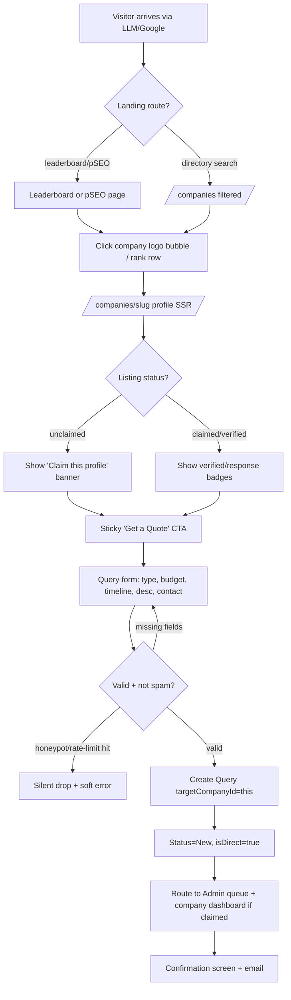
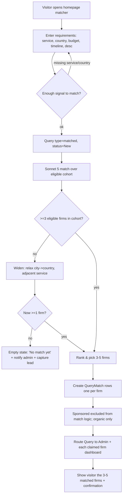
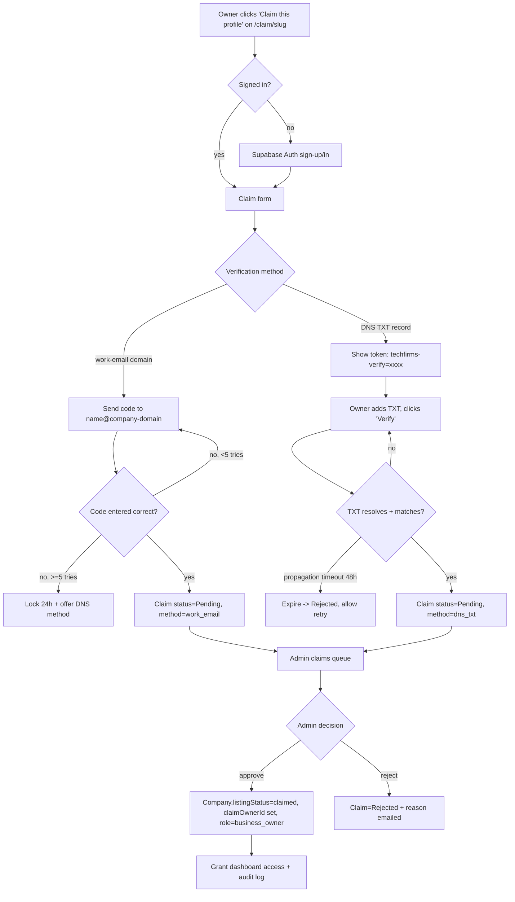
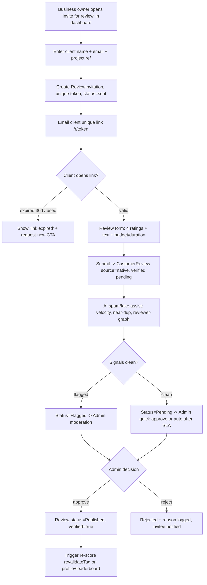
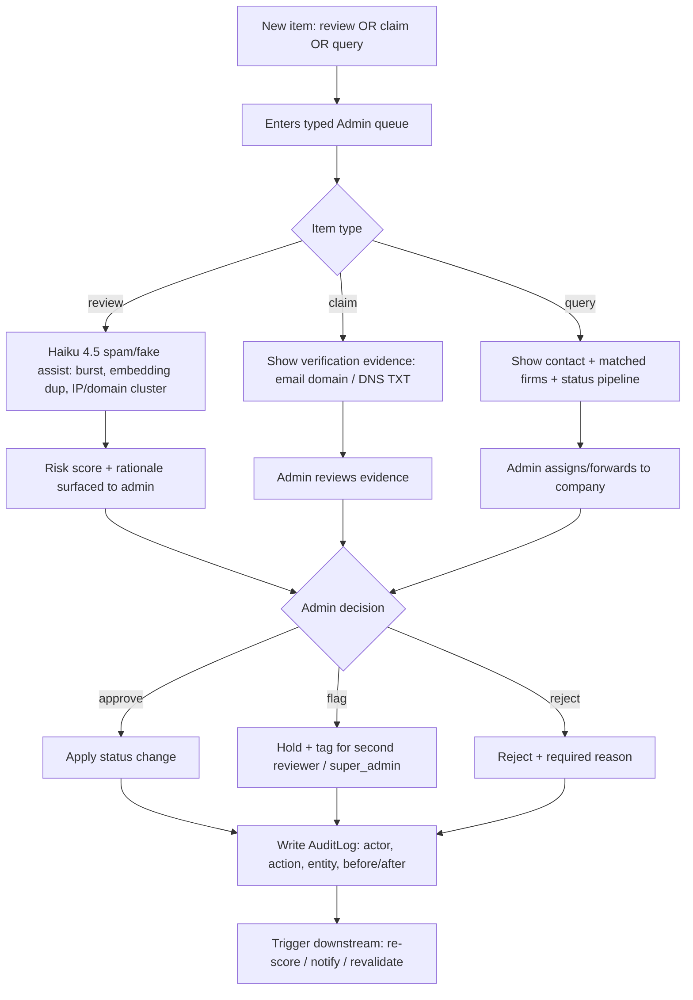
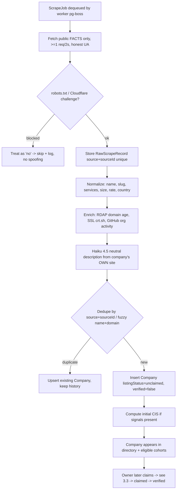
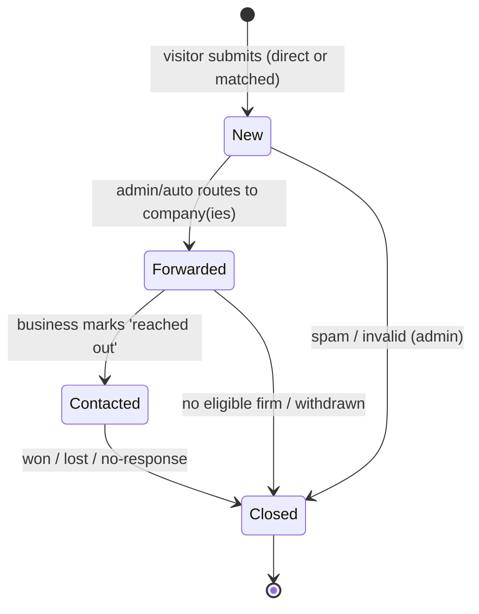
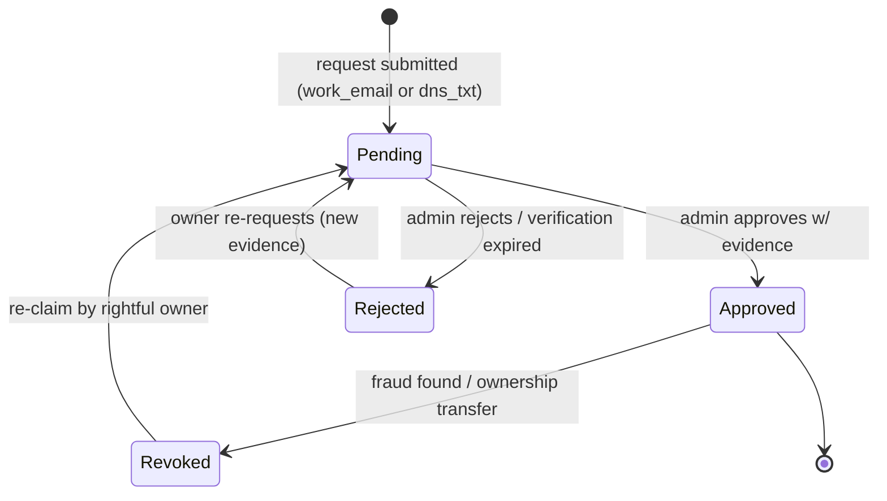
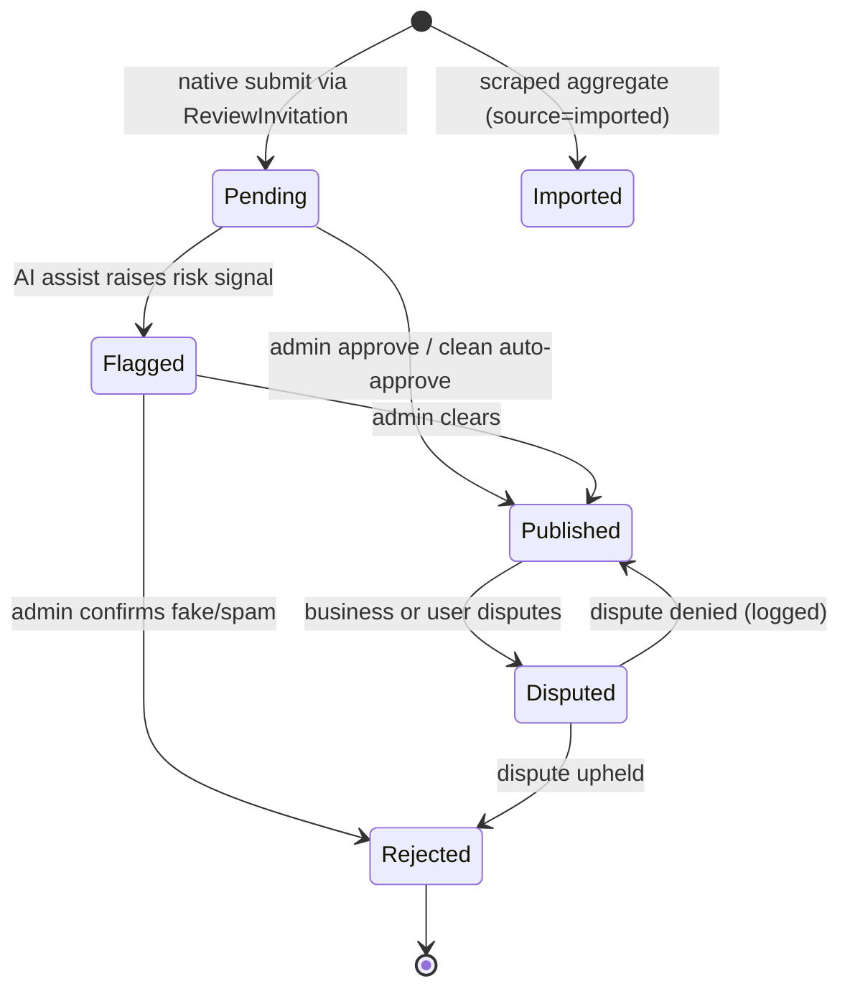

# Personas, User Flows & Journey Maps

> Status: Draft v1 · Last updated 2026-07-07

This document defines *who* uses TechFirms and *how they move through it*. It fixes the primary personas, maps the buyer's end-to-end journey (LLM/Google discovery → leaderboard → profile → query → follow-up), and specifies six core flows as decision-branched Mermaid flowcharts plus the state machines for the three pipeline entities (`Query`, `Claim`, `CustomerReview`). Every name, route, table, enum value, and score weight here conforms to [`_canon.md`](research/_canon.md); where a flow has an obvious empty/error/edge state, it is called out inline. Deep operational detail lives in the adjacent specs and is cross-linked, not duplicated: [Admin Panel](12-admin-panel-spec.md), [Business Dashboard](13-business-dashboard-spec.md), [Query & Lead-Gen Flow](14-query-and-leadgen-flow.md), [Scraping & Seeding Pipeline](07-scraping-and-seeding-pipeline.md).

---

## 1. Personas

We build for four personas. The first (Buyer) is the demand side that our SEO/GEO strategy chases; the next two (Agency Owner, Marketing Lead) are the supply/revenue side; the last (Admin) keeps the trust mechanics honest. Each persona's frustrations are grounded directly in the incumbent-directory grievances documented in [`user-sentiment.md`](research/user-sentiment.md) — TechFirms exists to invert them.

### 1.1 Priya — Buyer / CTO (primary, unauthenticated)

| Attribute | Detail |
|---|---|
| Role enum | `visitor` |
| Context | VP Engineering / CTO / Head of Digital at a mid-market firm in KSA, UAE, or a US firm sourcing an offshore partner. Sourcing a build partner for one of the ten locked services (e.g. `ai-development`, `custom-software`). |
| Entry point | Asks an LLM "best AI development companies in Saudi Arabia" **or** googles the same; lands on a `/leaderboard/[country]/[service]` or `/best-[service]-companies-in-[country]` page. |
| Goals | Build a credible shortlist of 3–5 vetted firms fast; understand *why* a firm ranks where it does; contact them without getting spammed. |
| Frustrations (grounded) | "Rankings feel bought" (pain #1); fake/incentivized reviews (#2); thin, repetitive, stale profiles — same companies on every page (#7); Gartner is enterprise-only and ignores her region (#9). |
| What success looks like | Leaves with a defensible shortlist and one submitted `Query`, trusting that rank ≠ ad spend because she read the public `/methodology` and saw sponsored slots labeled and excluded from the ranked score. |
| Key screens | Leaderboard quadrant + table → company profile tabs (Overview / Reviews / Employee Sentiment / Trust Signals / AI Intelligence Summary) → "Get a Quote". |

### 1.2 Omar — Agency Owner claiming a profile (supply side)

| Attribute | Detail |
|---|---|
| Role enum | `business_owner` (after claim approval) |
| Context | Founder/owner of a 25–120 person software house in Lahore, Riyadh, or Dubai. Discovers TechFirms already lists his firm as `unclaimed` (seeded by our scraper). |
| Goals | Claim the free baseline profile, correct the facts, respond to reviews, and start receiving qualified `Query` leads. |
| Frustrations (grounded) | Priced out of Clutch/DesignRush (#4 — ~$500 verified + $k/mo sponsorships, annual lock-in); "super low quality leads" and spammy form fills (#3); can't remove defamatory reviews without paying (#6); aggressive upsell sales (#5). |
| What success looks like | Claims in under 10 minutes via work-email domain match (no sales call), sees full contact details on incoming queries, and can invite past clients to leave verified reviews — all on the free tier. |
| Key screens | `/claim/[slug]` → verification → [Business Dashboard](13-business-dashboard-spec.md) (profile editor, queries inbox, review invitations, analytics). |

### 1.3 Layla — Marketing Lead buying sponsorship (revenue side)

| Attribute | Detail |
|---|---|
| Role enum | `business_owner` (of an already-`verified` company) |
| Context | Head of Marketing / Growth at a larger, already-claimed agency. Owns a lead-gen budget and wants more visibility in a specific `country × service` cohort. |
| Goals | Buy a `Featured` badge or `Sponsored` placement to raise impressions/clicks — **without** touching organic rank (she knows buyers distrust pay-to-play and wants the credibility to survive). |
| Frustrations (grounded) | Poor ROI and no proof of value on incumbents (#4); wants ranking integrity preserved so the placement still converts (#1). |
| What success looks like | Buys a labeled sponsored slot scoped to `{country, category, slotRank, dates}`, sees impression/click tracking proving ROI in the dashboard, and her organic CIS is provably unaffected. |
| Key screens | Dashboard → Sponsorship/Upgrade tab (flags: `tier`, `Sponsorship`, `badges[]`); billing via Stripe / manual invoice. Pricing per [`_canon.md` §11](research/_canon.md). |

### 1.4 Sana — Admin / Moderator (trust operator)

| Attribute | Detail |
|---|---|
| Role enum | `admin` (escalations to `super_admin`) |
| Context | TechFirms staff. The human in the loop that makes "transparent trust mechanics" real. |
| Goals | Clear the claims queue, moderate reviews with AI spam assistance, route/triage queries, and keep every action in the audit log. |
| Frustrations (grounded) | Opaque moderation is the incumbents' sin (#6); fake-review rings (#2); impersonation/spam ecosystem (#8). Sana needs signal, not noise. |
| What success looks like | Approves a legitimate claim in seconds with verification evidence shown; catches a co-bursting fake-review ring flagged by the AI assist; every decision is logged to `AuditLog` and reversible. |
| Key screens | [Admin Panel](12-admin-panel-spec.md): dashboard KPIs, claims queue, review moderation, query management (`New → Forwarded → Contacted → Closed`), company CRUD, leaderboard controls. |

---

## 2. Buyer journey map (Priya)

The buyer never authenticates. The whole journey is public, SSR, and instrumented for AI-citation tracking. Stages, emotions, and the product opportunity at each step:

| Stage | Buyer action | Touchpoint | Emotion | Opportunity |
|---|---|---|---|---|
| **1. Awareness** | Asks an LLM or googles "best AI development companies in Saudi Arabia 2026" | LLM citation → `/leaderboard/saudi-arabia/ai-development` or `/best-ai-development-companies-in-saudi-arabia` | Skeptical, time-pressed | The 40–60 word dated **answer block** near the top is the exact text LLMs quote; month-stamped title `Top AI Development Companies in Saudi Arabia — July 2026` earns the click. |
| **2. Orientation** | Scans the Gartner-style quadrant (X = Market Presence, Y = Client Satisfaction) and the ranked table below | Leaderboard page | Curious but guarded | Quadrants **Leaders / Challengers / Rising Stars / Niche Players**; every chart has an HTML `<table>` equivalent; sponsored rows labeled and visually separated from the ranked list. |
| **3. Evaluation** | Opens 2–3 company profiles, reads the CIS chip (0–100) + 3-sentence AI justification, flips through the four trust-signal tabs | `/companies/[slug]` | Building confidence | CIS is deterministic; the violet score chip + "last verified" freshness date answers "is this stale/bought?"; `/methodology` link defuses pay-to-play doubt. |
| **4. Conversion** | Clicks sticky "Get a Quote" — either on one firm's profile (direct) or the homepage matcher (AI-matched) | Query form | Committed but wary of spam | Buyer-consented intro only; no reselling raw intent; short, structured form (project type, budget, timeline, description, contact). |
| **5. Follow-up** | Receives an intro/confirmation; the claimed firm(s) contact her | Email + firm outreach; admin routing | Relief or impatience | Query status is tracked (`New → Forwarded → Contacted → Closed`); she is contacted by ≤5 firms she chose, not cold-blasted. |

---

## 3. Core flows (Mermaid)

### 3.1 Visitor discovery → profile → direct "Get a Quote"

**Edge/empty states:** profile 404 for a bad slug (self-referencing canonicals prevent index bloat); empty filter combo returns **HTTP 404** per canon; if the targeted company is `unclaimed`, the query still lands in the admin queue with no dashboard fan-out (admin brokers it); duplicate submit within 10 min from same email → dedupe, no second `Query`.

### 3.2 AI-matched query (requirements → 3–5 firms → routing)

Matching detail (scoring inputs, prompt-injection hardening on scraped/user text, dedupe) lives in [Query & Lead-Gen Flow](14-query-and-leadgen-flow.md). **Edge states:** thin cohort → widen then fall back to a captured lead + admin notice; all-sponsored cohort still matches on organic CIS only (sponsorship never influences the match set); Claude never invents a firm — matches are drawn only from real `Company` rows.

### 3.3 Claim flow (request → verify → approve → dashboard)

**Edge states:** domain mismatch (personal Gmail) → force DNS method; company already `claimed` → block with "contact support to transfer"; two owners racing to claim the same slug → first approved wins, second auto-`Rejected`; disposable-email domains rejected at form. Full method spec in [Business Dashboard](13-business-dashboard-spec.md).

### 3.4 Verified-review invitation (invite → link → submit → verify → publish)

**Edge states:** invitee is the business itself (self-review) → reviewer-graph flags shared domain/IP; link forwarded/shared → single-use token invalidates after first submit; client abandons form → invitation stays `sent` until 30-day expiry; published review later disputed → business files dispute (free, logged, SLA) per grievance #6.

### 3.5 Admin moderation (queue → AI assist → decide → audit)

The AI only *assists* — a human makes every approve/flag/reject call, and fraud-detection signals stay secret (canon §6). Full queue UX, CSV export, and KPI dashboard in [Admin Panel](12-admin-panel-spec.md).

### 3.6 Data seed / scrape lifecycle (crawl → normalize → enrich → describe → insert → later claim)

Never copy editorial text or review prose — all copy is Claude-regenerated; the store upserts by stable key and never wipes history (canon §9). Full crawler architecture, queue config, and stale-job reaping in [Scraping & Seeding Pipeline](07-scraping-and-seeding-pipeline.md).

---

## 4. Entity state machines

### 4.1 `Query` status (canon-locked pipeline)

`QueryStatus = New | Forwarded | Contacted | Closed`. Reopen is **not** a transition — a re-engaged lead is a new `Query` linked by contact email. Spam caught at intake never becomes `New`.

### 4.2 `Claim` status

`ClaimStatus = Pending | Approved | Rejected | Revoked`. Approval flips `Company.listingStatus` to `claimed` and sets `claimOwnerId`; `verified` is a *later* status reached via profile completeness + admin verification, not by the claim alone.

### 4.3 `CustomerReview` status

Only `Published`, `verified=true`, recent reviews count toward the leaderboard eligibility gate (**≥5 verified AND ≥3 within 18 months**, canon §6). `ReviewSource = native | imported`; imported aggregates never carry `verified=true`.

---

## 5. Cross-flow empty / error / edge states

| Flow | Empty state | Error / edge state |
|---|---|---|
| Discovery → profile | Directory filter combo with no firms → **HTTP 404** (canon §3) | Bad slug → 404; unclaimed profile → claim banner, no dashboard fan-out |
| AI match | Cohort < 3 firms → widen, then capture lead + notify admin | All-sponsored cohort → match on organic CIS only; Claude never fabricates a firm |
| Claim | No verifiable domain (Gmail) → force DNS TXT | DNS propagation > 48h → expire to `Rejected`, allow retry; race → first approved wins |
| Review invite | Client never opens link → `sent` until 30-day expiry | Reused/forwarded token → single-use invalidation; self-review → reviewer-graph flag |
| Moderation | Empty queue → "all clear" dashboard state | Two admins on one item → optimistic lock, second sees "already actioned" |
| Scrape | No new records on re-run → job completes as no-op, history intact | Cloudflare/DataDome challenge → treat as "no", log, skip |

---

## 6. Open questions / decisions needed

1. **Auto-approve SLA for clean native reviews** — do clean-signal reviews auto-publish after N hours, or always require a human tap? (Trust vs. throughput; recommend auto after 24h with post-hoc audit.)
2. **Query fan-out cap for matched leads** — hard cap at 5 firms per matched `Query`, or let sponsored firms buy a guaranteed slot? (Canon says sponsorship never influences the *match set* — confirm it also can't buy into an over-cap slot.)
3. **Dispute resolution SLA** — what response window do we commit to publicly for review disputes (grievance #6 win)? Suggest 5 business days.
4. **Claim transfer** — self-serve ownership transfer when a `claimOwnerId` employee leaves, or admin-only? Recommend admin-only at MVP.
5. **Buyer identity on queries** — do we ever require buyer email verification before fan-out to reduce fake leads (agency grievance #3), or keep the form frictionless? Lean frictionless + spam scoring.
