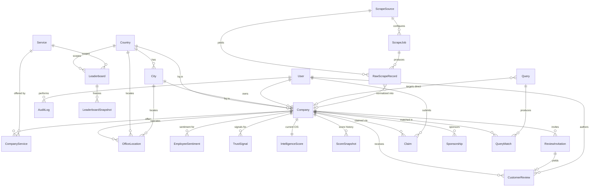

# Data Model & Database Schema

> Status: Draft v1 · Last updated 2026-07-07

This document is the implementation-ready specification for the TechFirms persistence layer: the complete Postgres/Prisma data model behind the reputation platform — companies, their services and locations, the four trust signals (customer reviews, employee sentiment, public trust signals, market activity), the deterministically-computed **Company Intelligence Score (CIS)**, country-scoped leaderboards, the lead-gen query pipeline, claims and users, monetization flags, and the scrape provenance tables. It fixes every table name, column, enum, index, and invariant so the schema can be dropped into `packages/db/schema.prisma` and migrated without further design decisions. Names, hexes, weights, and URL patterns conform to [`_canon.md`](research/_canon.md); adjacent behavior lives in the cross-linked docs below.

---

## 1. Design principles

- **Postgres + Prisma, one shared schema.** Supabase Postgres is the source of truth; the Prisma schema lives in `packages/db` and is imported by both `apps/web` and `apps/worker`. Search starts on Postgres `tsvector` + GIN and only graduates to Meilisearch past ~5K firms.
- **Facts, not prose, are stored raw.** Per the scraping doctrine, we persist structured facts and *regenerate* all descriptive copy via Claude. Employee-sentiment and imported reviews are stored as **aggregates + attribution + link-out**, never verbatim third-party text.
- **Provenance is first-class.** Every scraped row carries `source` + `sourceId` with a composite unique constraint so re-runs **upsert and never wipe history** (mirrors the CapitalForAll pattern).
- **The CIS is a stored, versioned artifact.** It is computed deterministically off the four signals, recomputed weekly, and frozen into monthly snapshots. Claude only *narrates* the justification; the number never comes from the LLM.
- **Conventions (locked):** PascalCase models, camelCase fields, `createdAt`/`updatedAt` on every table, soft-delete via nullable `deletedAt` on user-editable tables, money stored as `amount` (Int, minor units) + ISO `currency`, and monetization flags built now even though pricing ships later.

---

## 2. Entity-relationship diagram



The relational spine: `Company` is the hub. Everything factual (services, locations, reviews, sentiment, trust signals) hangs off it; everything computed (`IntelligenceScore`, `ScoreSnapshot`, `Leaderboard*`) is derived from it; everything commercial (`Claim`, `Sponsorship`, `Query`) attaches to it; and everything ingested (`RawScrapeRecord`) normalizes into it.

---

## 3. Enumerations

```prisma
enum Role {
  visitor
  business_owner
  admin
  super_admin
}

enum ListingStatus {
  unclaimed   // claimed=false, verified=false — seeded state
  claimed     // owner verified control, awaiting/passed admin
  verified    // admin-approved, trust badge eligible
}

enum ReviewSource {
  native      // collected on-platform via ReviewInvitation
  imported    // ingested aggregate (rating only, no verbatim prose)
}

enum ClaimStatus {
  pending
  approved
  rejected
}

enum QueryStatus {
  New
  Forwarded
  Contacted
  Closed
}

enum VerificationMethod {
  work_email_domain   // reviewer/claimant email domain matches company domain
  dns_txt             // TXT record proves domain control
}

enum Quadrant {
  Leaders        // high Presence + high Satisfaction
  Challengers    // high Presence, lower Satisfaction
  Rising_Stars   // high Satisfaction, lower Presence (the emerging-market story)
  Niche_Players  // low / low
}

enum ScoreTier {
  Unrated        // below eligibility gate (<5 verified OR <3 recent)
  Rated
}

enum ServiceCategory {
  ai_development
  custom_software
  web_development
  mobile_app_development
  cloud
  devops
  data_engineering
  cybersecurity
  it_staff_augmentation
  ui_ux_design
}

enum SponsorshipTier {
  featured        // Featured badge
  sponsored       // Sponsored placement (slot in a country×category board)
  verified_plus   // Verified-Plus tier
}
```

`Quadrant.Rising_Stars`/`Niche_Players` use underscores because Prisma enum members cannot contain spaces; the UI maps them to the display strings "Rising Stars" and "Niche Players". `ServiceCategory` mirrors the locked slug taxonomy so an enum value maps 1:1 to a `Service.slug`.

---

## 4. Complete Prisma schema

```prisma
// packages/db/schema.prisma
generator client {
  provider = "prisma-client-js"
}

datasource db {
  provider  = "postgresql"
  url       = env("DATABASE_URL")   // pooled, ?pgbouncer=true
  directUrl = env("DIRECT_URL")     // migrations
}

// ─────────────────────────── Identity & access ───────────────────────────

model User {
  id            String    @id @default(cuid())
  email         String    @unique
  fullName      String?
  role          Role      @default(visitor)
  supabaseId    String?   @unique   // maps to Supabase Auth uid
  ownedCompanies Company[] @relation("CompanyOwner")
  claims        Claim[]
  reviews       CustomerReview[]
  auditLogs     AuditLog[]
  createdAt     DateTime  @default(now())
  updatedAt     DateTime  @updatedAt
  deletedAt     DateTime?

  @@index([role])
}

// ─────────────────────────── Geography ───────────────────────────

model Country {
  id           String   @id @default(cuid())
  slug         String   @unique          // saudi-arabia, united-arab-emirates, pakistan
  name         String
  isoCode      String   @unique          // ISO-3166 alpha-2, e.g. SA, AE, PK
  currency     String                    // default ISO-4217 for regional pricing
  priceMultiplier Decimal @default(1.0) @db.Decimal(4, 2) // KSA/UAE ~1.4, PK ~0.45
  cities       City[]
  companies    Company[]        @relation("CompanyHqCountry")
  offices      OfficeLocation[]
  leaderboards Leaderboard[]
  createdAt    DateTime @default(now())
  updatedAt    DateTime @updatedAt
}

model City {
  id        String   @id @default(cuid())
  slug      String                        // kebab-case, unique within country
  name      String
  countryId String
  country   Country  @relation(fields: [countryId], references: [id])
  companies Company[]        @relation("CompanyHqCity")
  offices   OfficeLocation[]
  createdAt DateTime @default(now())
  updatedAt DateTime @updatedAt

  @@unique([countryId, slug])
  @@index([countryId])
}

// ─────────────────────────── Company core ───────────────────────────

model Company {
  id             String        @id @default(cuid())
  slug           String        @unique          // kebab-case + numeric disambiguation
  name           String
  logoUrl        String?
  tagline        String?
  description    String?       @db.Text          // AI-regenerated, never scraped prose
  website        String?
  domain         String?                          // bare domain, used for claim matching
  foundedYear    Int?
  employeeRangeMin Int?
  employeeRangeMax Int?
  hourlyRateMin  Int?                             // minor units of rateCurrency
  hourlyRateMax  Int?
  rateCurrency   String        @default("USD")
  minProjectSize Int?                             // minor units of rateCurrency
  listingStatus  ListingStatus @default(unclaimed)
  claimed        Boolean       @default(false)
  verified       Boolean       @default(false)
  ownerId        String?
  owner          User?         @relation("CompanyOwner", fields: [ownerId], references: [id])

  hqCountryId    String?
  hqCountry      Country?      @relation("CompanyHqCountry", fields: [hqCountryId], references: [id])
  hqCityId       String?
  hqCity         City?         @relation("CompanyHqCity", fields: [hqCityId], references: [id])

  // provenance for the seed pipeline
  source         String?                          // e.g. "techreviewer.co"
  sourceId       String?                          // stable key on that source

  // full-text search vector (maintained by a trigger; see §6)
  searchVector   Unsupported("tsvector")?

  services         CompanyService[]
  offices          OfficeLocation[]
  reviews          CustomerReview[]
  employeeSentiment EmployeeSentiment[]
  trustSignals     TrustSignal[]
  intelligenceScore IntelligenceScore?
  scoreSnapshots   ScoreSnapshot[]
  reviewInvitations ReviewInvitation[]
  claims           Claim[]
  sponsorships     Sponsorship[]
  queryMatches     QueryMatch[]
  directQueries    Query[]        @relation("QueryDirectTarget")
  rawRecords       RawScrapeRecord[]

  createdAt      DateTime      @default(now())
  updatedAt      DateTime      @updatedAt
  deletedAt      DateTime?

  @@unique([source, sourceId])                    // dedupe/upsert on re-scrape
  @@index([hqCountryId])
  @@index([listingStatus])
  @@index([slug])
}

model Service {
  id        String           @id @default(cuid())
  slug      String           @unique              // ai-development, custom-software, ...
  name      String
  category  ServiceCategory  @unique
  companies CompanyService[]
  leaderboards Leaderboard[]
  createdAt DateTime         @default(now())
  updatedAt DateTime         @updatedAt
}

model CompanyService {
  companyId String
  serviceId String
  focusPct  Int      @default(0)                  // 0–100, share of company focus
  company   Company  @relation(fields: [companyId], references: [id], onDelete: Cascade)
  service   Service  @relation(fields: [serviceId], references: [id])
  createdAt DateTime @default(now())
  updatedAt DateTime @updatedAt

  @@id([companyId, serviceId])
  @@index([serviceId])
}

model OfficeLocation {
  id         String   @id @default(cuid())
  companyId  String
  company    Company  @relation(fields: [companyId], references: [id], onDelete: Cascade)
  countryId  String
  country    Country  @relation(fields: [countryId], references: [id])
  cityId     String?
  city       City?    @relation(fields: [cityId], references: [id])
  addressLine String?
  isHeadquarters Boolean @default(false)
  createdAt  DateTime @default(now())
  updatedAt  DateTime @updatedAt

  @@index([companyId])
  @@index([countryId])
}

// ─────────────────────────── Signal 1: customer reviews ───────────────────────────

model CustomerReview {
  id              String       @id @default(cuid())
  companyId       String
  company         Company      @relation(fields: [companyId], references: [id], onDelete: Cascade)
  authorUserId    String?
  author          User?        @relation(fields: [authorUserId], references: [id])
  invitationId    String?      @unique
  invitation      ReviewInvitation? @relation(fields: [invitationId], references: [id])

  reviewerName    String?
  reviewerTitle   String?
  reviewerCompany String?
  projectBudget   Int?                              // minor units, projectCurrency
  projectCurrency String       @default("USD")
  projectDurationMonths Int?

  // four sub-ratings, 1–5 (×100 stored as int 100–500 for precision-free math)
  ratingQuality   Int?
  ratingSchedule  Int?
  ratingCost      Int?
  ratingWillingToRefer Int?
  ratingOverall   Int                               // derived, 100–500

  body            String?      @db.Text             // native reviews only; imported = null
  source          ReviewSource @default(native)
  verified        Boolean      @default(false)
  flagged         Boolean      @default(false)      // fraud-detection hold
  // provenance for imported aggregates
  sourceName      String?
  sourceId        String?
  reviewedAt      DateTime     @default(now())      // drives recency decay
  createdAt       DateTime     @default(now())
  updatedAt       DateTime     @updatedAt
  deletedAt       DateTime?

  @@unique([sourceName, sourceId])
  @@index([companyId, verified])
  @@index([companyId, reviewedAt])
}

// ─────────────────────────── Signal 2: employee sentiment (aggregates only) ───────────────────────────

model EmployeeSentiment {
  id             String   @id @default(cuid())
  companyId      String
  company        Company  @relation(fields: [companyId], references: [id], onDelete: Cascade)
  overallRating  Decimal  @db.Decimal(3, 2)         // 0.00–5.00 aggregate
  culture        Decimal? @db.Decimal(3, 2)
  compensation   Decimal? @db.Decimal(3, 2)
  workLifeBalance Decimal? @db.Decimal(3, 2)
  leadership     Decimal? @db.Decimal(3, 2)
  recommendPct   Int?                                // 0–100
  reviewCount    Int      @default(0)
  sourceName     String                              // e.g. "glassdoor"
  sourceUrl      String                              // link-out, attribution
  sourceId       String?
  asOf           DateTime                            // snapshot date of the aggregate
  createdAt      DateTime @default(now())
  updatedAt      DateTime @updatedAt

  @@unique([companyId, sourceName, asOf])
  @@index([companyId])
}

// ─────────────────────────── Signal 3: trust signals ───────────────────────────

model TrustSignal {
  id                String   @id @default(cuid())
  companyId         String
  company           Company  @relation(fields: [companyId], references: [id], onDelete: Cascade)
  domainAgeYears    Decimal? @db.Decimal(5, 2)       // from RDAP
  sslValid          Boolean?                         // crt.sh / WhoisJSON
  githubOrgActivity Int?                             // commits/stars proxy, GitHub REST
  linkedinFollowers Int?                             // manual/self-reported only
  certifications    Json?                            // ["ISO 27001","SOC 2"] self-attested
  awards            Json?
  fundingRaised     Int?                             // minor units, fundingCurrency
  fundingCurrency   String   @default("USD")
  crunchbaseUrl     String?
  asOf              DateTime @default(now())
  createdAt         DateTime @default(now())
  updatedAt         DateTime @updatedAt

  @@unique([companyId, asOf])
  @@index([companyId])
}

// ─────────────────────────── The Company Intelligence Score ───────────────────────────

model IntelligenceScore {
  id             String    @id @default(cuid())
  companyId      String    @unique                   // one current score per company
  company        Company   @relation(fields: [companyId], references: [id], onDelete: Cascade)
  cis            Int                                  // 0–100 composite
  reviewsScore   Int                                  // R, 0–100 (weight 0.40)
  sentimentScore Int?                                 // E, 0–100 (weight 0.25)
  trustScore     Int?                                 // T, 0–100 (weight 0.20)
  marketScore    Int?                                 // M, 0–100 (weight 0.15)
  marketPresence Int                                  // leaderboard X axis, 0–100
  clientSatisfaction Int                              // leaderboard Y axis, 0–100
  quadrant       Quadrant?
  tier           ScoreTier @default(Unrated)
  justification  String?   @db.Text                   // Claude 3-sentence narration
  formulaVersion String    @default("cis-v1")
  computedAt     DateTime  @default(now())
  createdAt      DateTime  @default(now())
  updatedAt      DateTime  @updatedAt

  @@index([cis])
  @@index([quadrant])
}

model ScoreSnapshot {
  id             String   @id @default(cuid())
  companyId      String
  company        Company  @relation(fields: [companyId], references: [id], onDelete: Cascade)
  periodYear     Int
  periodMonth    Int                                  // 1–12, frozen monthly snapshot
  cis            Int
  reviewsScore   Int
  sentimentScore Int?
  trustScore     Int?
  marketScore    Int?
  marketPresence Int
  clientSatisfaction Int
  quadrant       Quadrant?
  formulaVersion String
  createdAt      DateTime @default(now())

  @@unique([companyId, periodYear, periodMonth])     // month-over-month movement
  @@index([companyId])
}

// ─────────────────────────── Lead-gen query pipeline ───────────────────────────

model Query {
  id             String      @id @default(cuid())
  projectType    String
  serviceCategory ServiceCategory?
  countryId      String?
  budgetMin      Int?
  budgetMax      Int?
  budgetCurrency String      @default("USD")
  timeline       String?
  description    String      @db.Text
  contactName    String
  contactEmail   String
  contactPhone   String?
  status         QueryStatus @default(New)
  // (a) direct-to-company entry point
  directCompanyId String?
  directCompany  Company?    @relation("QueryDirectTarget", fields: [directCompanyId], references: [id])
  adminNotes     String?     @db.Text
  matches        QueryMatch[]
  createdAt      DateTime    @default(now())
  updatedAt      DateTime    @updatedAt
  deletedAt      DateTime?

  @@index([status])
  @@index([directCompanyId])
}

model QueryMatch {
  id         String   @id @default(cuid())
  queryId    String
  query      Query    @relation(fields: [queryId], references: [id], onDelete: Cascade)
  companyId  String
  company    Company  @relation(fields: [companyId], references: [id])
  rank       Int                                     // 1–5, AI match ordering
  matchScore Decimal? @db.Decimal(5, 2)              // Sonnet match confidence
  forwarded  Boolean  @default(false)
  createdAt  DateTime @default(now())

  @@unique([queryId, companyId])
  @@index([companyId])
}

// ─────────────────────────── Claims & review collection ───────────────────────────

model Claim {
  id                 String             @id @default(cuid())
  companyId          String
  company            Company            @relation(fields: [companyId], references: [id], onDelete: Cascade)
  userId             String
  user               User               @relation(fields: [userId], references: [id])
  status             ClaimStatus        @default(pending)
  verificationMethod VerificationMethod
  verificationEvidence Json?                          // matched domain, TXT token, etc.
  reviewedByUserId   String?
  reviewedAt         DateTime?
  createdAt          DateTime           @default(now())
  updatedAt          DateTime           @updatedAt

  @@index([status])
  @@index([companyId])
}

model ReviewInvitation {
  id          String    @id @default(cuid())
  companyId   String
  company     Company   @relation(fields: [companyId], references: [id], onDelete: Cascade)
  token       String    @unique                       // unique review link
  clientEmail String
  clientName  String?
  usedAt      DateTime?
  review      CustomerReview?
  createdAt   DateTime  @default(now())
  updatedAt   DateTime  @updatedAt
  deletedAt   DateTime?

  @@index([companyId])
}

// ─────────────────────────── Leaderboards ───────────────────────────

model Leaderboard {
  id         String   @id @default(cuid())
  countryId  String
  country    Country  @relation(fields: [countryId], references: [id])
  serviceId  String?                                   // null = all-services country board
  service    Service? @relation(fields: [serviceId], references: [id])
  title      String                                    // "Top AI Development Companies in Saudi Arabia"
  answerBlock String? @db.Text                         // 40–60 word GEO summary
  snapshots  LeaderboardSnapshot[]
  createdAt  DateTime @default(now())
  updatedAt  DateTime @updatedAt

  @@unique([countryId, serviceId])
  @@index([countryId])
}

model LeaderboardSnapshot {
  id            String   @id @default(cuid())
  leaderboardId String
  leaderboard   Leaderboard @relation(fields: [leaderboardId], references: [id], onDelete: Cascade)
  periodYear    Int
  periodMonth   Int
  rankings      Json                                    // ordered [{companyId,rank,cis,quadrant,movement}]
  publishedAt   DateTime?
  createdAt     DateTime @default(now())

  @@unique([leaderboardId, periodYear, periodMonth])
  @@index([leaderboardId])
}

// ─────────────────────────── Monetization ───────────────────────────

model Sponsorship {
  id          String          @id @default(cuid())
  companyId   String
  company     Company         @relation(fields: [companyId], references: [id], onDelete: Cascade)
  tier        SponsorshipTier
  countryId   String?                                  // scope of a sponsored slot
  serviceCategory ServiceCategory?
  slotRank    Int?                                     // sponsored position
  badges      Json?                                    // ["featured","verified-plus"]
  priceAmount Int?                                      // minor units
  priceCurrency String        @default("USD")
  startsAt    DateTime
  endsAt      DateTime?
  active      Boolean         @default(true)
  impressions Int             @default(0)               // ROI proof
  clicks      Int             @default(0)
  createdAt   DateTime        @default(now())
  updatedAt   DateTime        @updatedAt

  @@index([companyId])
  @@index([active, endsAt])
}

// ─────────────────────────── Audit ───────────────────────────

model AuditLog {
  id         String   @id @default(cuid())
  actorId    String?
  actor      User?    @relation(fields: [actorId], references: [id])
  action     String                                    // "claim.approve", "company.merge"
  entityType String
  entityId   String
  metadata   Json?                                     // before/after diff
  ipAddress  String?
  createdAt  DateTime @default(now())

  @@index([entityType, entityId])
  @@index([actorId])
}

// ─────────────────────────── Scrape pipeline ───────────────────────────

model ScrapeSource {
  id          String   @id @default(cuid())
  name        String   @unique                          // "techreviewer.co"
  baseUrl     String
  robotsTxt   String?  @db.Text                          // cached copy honored by worker
  crawlDelayMs Int     @default(2000)                    // ≥1 req/2s
  enabled     Boolean  @default(true)
  jobs        ScrapeJob[]
  records     RawScrapeRecord[]
  createdAt   DateTime @default(now())
  updatedAt   DateTime @updatedAt
}

model ScrapeJob {
  id          String   @id @default(cuid())
  sourceId    String
  source      ScrapeSource @relation(fields: [sourceId], references: [id])
  jobType     String                                     // "seed", "enrich", "refresh"
  targetUrl   String?
  status      String   @default("queued")                // queued|running|done|failed
  workerId    String?                                    // stale-job reaping
  attempts    Int      @default(0)
  startedAt   DateTime?
  finishedAt  DateTime?
  lastError   String?  @db.Text
  records     RawScrapeRecord[]
  createdAt   DateTime @default(now())
  updatedAt   DateTime @updatedAt

  @@index([status])
  @@index([sourceId])
}

model RawScrapeRecord {
  id          String   @id @default(cuid())
  sourceId    String
  source      ScrapeSource @relation(fields: [sourceId], references: [id])
  jobId       String?
  job         ScrapeJob?   @relation(fields: [jobId], references: [id])
  sourceRecordId String                                  // stable key on source
  url         String
  httpStatus  Int?
  payload     Json                                        // parsed facts only
  contentHash String                                      // diff detection across re-runs
  companyId   String?                                     // set once normalized
  company     Company? @relation(fields: [companyId], references: [id])
  fetchedAt   DateTime @default(now())
  createdAt   DateTime @default(now())

  @@unique([sourceId, sourceRecordId])                    // upsert, never wipe history
  @@index([companyId])
}
```

---

## 5. Money, timestamps & soft-deletes

- **Multi-currency.** Every monetary field is a pair: an integer `*Amount`/`*Min`/`*Max` in **minor units** (cents/halalas/paise) plus an ISO-4217 `*Currency` string. This avoids float drift and lets us render KSA/UAE (~1.3–1.5×) and Pakistan (~40–50%) regional pricing off `Country.priceMultiplier` without a second money type. Star ratings are stored as integers ×100 (100–500) for the same reason — the Bayesian and recency math in [Scoring & Leaderboards](08-scoring-and-leaderboards.md) stays integer/decimal-exact.
- **Timestamps.** `createdAt` (`@default(now())`) and `updatedAt` (`@updatedAt`) on every table. Signal tables additionally carry a semantic time — `CustomerReview.reviewedAt` (drives the 12-month half-life decay), `EmployeeSentiment.asOf`, `TrustSignal.asOf` — so recency is computed off *when the fact was true*, not when we ingested it.
- **Soft-delete.** Nullable `deletedAt` on user-editable tables (`User`, `Company`, `CustomerReview`, `Query`, `ReviewInvitation`). Application queries filter `deletedAt: null` by default; computed tables (`IntelligenceScore`, snapshots, raw scrape records) are hard-deletable/regenerable and intentionally omit it.

---

## 6. Indexing & full-text search

**Strategy: Postgres `tsvector` + GIN at launch, Meilisearch past ~5K firms; Postgres stays the source of truth.**

`Company.searchVector` is a generated `tsvector` over name, tagline, and description, kept current by a trigger and indexed with GIN — GIN is the correct index for the many-keys-per-row inverted structure a full-text vector needs (a B-tree cannot answer `@@` membership queries). The migration adds what Prisma cannot express natively:

```sql
-- add the generated column + trigger + GIN index in a raw migration
ALTER TABLE "Company"
  ADD COLUMN IF NOT EXISTS "searchVector" tsvector
  GENERATED ALWAYS AS (
    setweight(to_tsvector('simple', coalesce(name, '')), 'A') ||
    setweight(to_tsvector('simple', coalesce(tagline, '')), 'B') ||
    setweight(to_tsvector('simple', coalesce(description, '')), 'C')
  ) STORED;

CREATE INDEX IF NOT EXISTS company_search_idx
  ON "Company" USING GIN ("searchVector");
```

Weighting name > tagline > description makes exact-name hits rank first. Beyond FTS, the hot query paths are indexed in-schema: directory facets and leaderboard cohorts on `Company(hqCountryId)`, `Company(listingStatus)`, and `CompanyService(serviceId)`; leaderboard reads on `IntelligenceScore(cis)` and `(quadrant)`; the admin query pipeline on `Query(status)`; the claims queue on `Claim(status)`; and every scrape/dedupe path on the `@@unique([source, sourceId])`-style composites. Country×service leaderboard membership is served by joining `CompanyService` → `Company(hqCountryId)` → `IntelligenceScore`, all covered.

---

## 7. Key invariants & constraints

| Invariant | Enforcement |
|---|---|
| A review always belongs to exactly one company | `CustomerReview.companyId` NOT NULL, FK, `onDelete: Cascade` |
| Company slug is globally unique | `Company.slug @unique`; collisions get numeric disambiguation at write time |
| A scraped entity is ingested once per source | `@@unique([source, sourceId])` on `Company`; `@@unique([sourceId, sourceRecordId])` on `RawScrapeRecord` → upsert, never duplicate |
| Exactly one *current* CIS per company | `IntelligenceScore.companyId @unique` (1:1); history lives in `ScoreSnapshot` |
| One frozen score per company per month | `@@unique([companyId, periodYear, periodMonth])` |
| One leaderboard per country×service | `@@unique([countryId, serviceId])`, null service = all-services board |
| Claim ownership is singular & audited | On `Claim` approval, set `Company.ownerId`, `claimed=true`, `listingStatus=claimed`; every transition writes an `AuditLog` row |
| Leaderboard eligibility gate | Enforced in the scoring job, not the schema: ≥5 verified reviews AND ≥3 within 18 months, else `tier=Unrated` and excluded from ranked boards |
| Sponsored never influences rank | `Sponsorship` is a sibling of `IntelligenceScore`, never an input to it — the trust rule is structural, not a runtime check |
| CIS is deterministic, weekly | Recomputed weekly by the worker; `IntelligenceScore.justification` is Claude narration only — the LLM never emits `cis` |
| A native review maps to at most one invitation | `CustomerReview.invitationId @unique` + `ReviewInvitation.review` back-relation |

---

## 8. How scrape provenance flows into the model

`ScrapeSource` (with cached `robotsTxt` + `crawlDelayMs` the worker honors) configures `ScrapeJob`s; each job writes `RawScrapeRecord`s keyed by `@@unique([sourceId, sourceRecordId])` with a `contentHash` for diff detection. Normalization upserts facts into `Company` (matched on `@@unique([source, sourceId])`), backfills `RawScrapeRecord.companyId`, and seeds the row as `listingStatus=unclaimed, claimed=false, verified=false`. Descriptions are AI-regenerated into `Company.description`; imported ratings land in `CustomerReview` (`source=imported`, `body=null`) and `EmployeeSentiment` (aggregate + `sourceUrl` attribution). The full crawl/enrich/normalize orchestration is specified in [Scraping & Seeding Pipeline](07-scraping-and-seeding-pipeline.md).

---

## 9. Adjacent docs

- **[Scraping & Seeding Pipeline](07-scraping-and-seeding-pipeline.md)** — how `ScrapeSource`/`ScrapeJob`/`RawScrapeRecord` are populated (Playwright + Cheerio worker, RDAP/GitHub enrichment, robots/rate-limit posture, stale-job reaping).
- **[Scoring & Leaderboards](08-scoring-and-leaderboards.md)** — the deterministic math (`0.40·R + 0.25·E + 0.20·T + 0.15·M`, Bayesian m≈8/C≈70, 12-month half-life, cohort median splits) that fills `IntelligenceScore`, `ScoreSnapshot`, and `LeaderboardSnapshot`.
- **[Public API Spec](16-public-api-spec.md)** — the read-only `/api/v1/...` JSON surface that serializes these tables for machine/LLM consumption.

---

## 10. Open questions / decisions needed

1. **Review sub-ratings when imported.** Imported aggregates rarely carry the four-axis breakdown — confirm we store only `ratingOverall` for `source=imported` and leave the axis columns null (current schema allows it).
2. **Multi-country HQ vs. office set.** We model a single `hqCountryId`/`hqCityId` plus an `OfficeLocation[]`. Confirm leaderboard eligibility keys off HQ country only (not any office country) to avoid a firm appearing on many national boards.
3. **`ScoreTier` vs. `Quadrant` overlap.** `tier=Unrated` firms have no meaningful quadrant — confirm they render as "Unrated" and are omitted from the scatter chart rather than plotted at origin.
4. **Currency of record for cross-country comparison.** Rates are stored in native currency; confirm whether leaderboards normalize to USD for display or show native + converted.
5. **Retention of `RawScrapeRecord`.** History is never wiped by design; set a cold-storage/archival horizon (e.g. 24 months) before the table's row count becomes a cost concern.
6. **Fake-review flag surface.** `CustomerReview.flagged` is a single boolean; decide whether MVP needs a separate `fraudSignals Json` column to record *why* (velocity/duplicate/graph) for the moderation queue.
