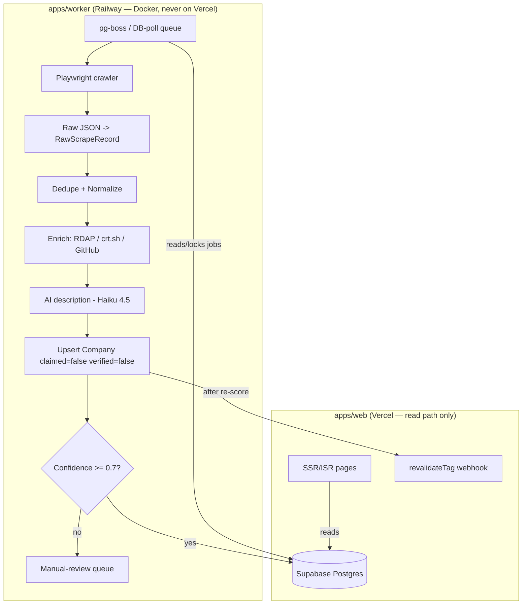

# Scraping & Seed-Data Pipeline

> Status: Draft v1 · Last updated 2026-07-07

**Purpose.** This document is the build spec for how TechFirms acquires its initial ~1,000 company profiles and keeps them fresh. It defines a **facts-only** scraping doctrine, a dedicated worker service (never inside the Next.js web app), a Postgres-backed job queue with stale-job reaping, an enrichment stack that covers three of the four CIS trust signals cheaply and legally, and a re-scrape/diff strategy that never clobbers claimed-owner edits. Every table name, enum value, score weight, and legal posture here conforms to [`_canon.md`](research/_canon.md); the persistent-store, paging, and DB-polling-queue patterns are mirrored from the CapitalForAll codebase already proven on this machine.

---

## 1. Goal & non-goals

**Goal:** seed ~1,000 top technology firms — prioritized to the launch markets (Saudi Arabia, UAE, Pakistan → then global) — as `unclaimed` listings (`claimed=false, verified=false`, per the `ListingStatus` lifecycle), with enough factual and enrichment data to compute a provisional **Company Intelligence Score (CIS)** and populate the first three GTM leaderboards (AI Development in KSA · Custom Software in UAE · Web/Custom Software in Pakistan).

**We extract FACTUAL data only:**

| Field | Prisma target | Notes |
|---|---|---|
| Company name | `Company.name` | Normalized, whitespace-collapsed |
| HQ + office locations | `OfficeLocation`, `Country`, `City` | ISO-3166 country code stored alongside readable slug |
| Services + focus % | `CompanyService.focusPct` | Mapped to the 10-item locked taxonomy |
| Team size | `Company.employeeRange` | Banded (`10-49`, `50-249`, `1000+`) |
| Hourly rate | `Company.hourlyRateRange` | Amount + ISO currency (multi-currency rule) |
| Founded year | `Company.foundedYear` | Integer, sanity-bounded 1970–current |
| Website | `Company.website` | Normalized domain drives the dedupe key |
| Aggregate rating | `Company` (provisional) → `IntelligenceScore` | `ratingValue` mirrored to JSON-LD exactly |
| Review count | `Company` (provisional) | Count only — **not the review text** |

**Non-goals (hard prohibitions from the legal brief):**

- **Never copy review prose or editorial descriptions.** Facts are uncopyrightable; expression is not. Every human-readable description is **regenerated by Claude (Haiku 4.5) from the company's OWN website content** — a neutral ~100-word profile, never a paraphrase of a competitor's copy. See [AI Features Spec](11-ai-features-spec.md).
- **Never log in, never create accounts, never accept a click-wrap.** Logged-off, no-assent scraping is the single most protective rule (*Meta v. Bright Data*, N.D. Cal. Jan 2024).
- **Never scrape verbatim employee-review text.** Employee sentiment ships as **aggregates + attribution + link-out only** at launch; native anonymous reviews are a v2 moat. Not covered in depth here — see [Data Model & Schema](06-data-model-and-schema.md) for the `EmployeeSentiment` shape.
- **No fingerprint-spoofing arms race.** A Cloudflare/DataDome managed challenge is treated as an explicit "no."

---

## 2. Architecture

The scraper is a **separate Dockerized worker** on Railway (or Fly), started with an entrypoint flag (`--warmup-only` / `--api-only`), reading jobs from Supabase Postgres. It is **never** invoked inside a Vercel web request. This mirrors the CapitalForAll separation: the web tier serves SSR/ISR pages; the worker does all fetching, parsing, and writing, then triggers `revalidateTag` on the web app after a re-score.



Repo layout (locked): `apps/web`, `apps/worker`, `packages/db` (shared Prisma schema), `packages/ui`. The crawler, enrichers, normalizers, and queue driver all live under `apps/worker`.

---

## 3. Pipeline stages (CapitalForAll-proven patterns)

### 3.1 Shared HTTP client

One axios instance for all non-browser fetches (enrichment APIs, sitemaps, `robots.txt`, company home pages). Playwright is reserved for pages that genuinely require JS; **prefer axios + Cheerio** for static HTML — it is faster, cheaper, and lower-signal.

```ts
// apps/worker/src/http/client.ts
import axios from "axios";

export const http = axios.create({
  timeout: 18_000, // 18s, matches CapitalForAll
  headers: {
    "User-Agent":
      "TechFirmsBot/1.0 (+https://techfirms.co/bot; contact=crawl@techfirms.co)",
    Accept: "text/html,application/xhtml+xml,application/json;q=0.9,*/*;q=0.8",
    "Accept-Language": "en-US,en;q=0.9",
  },
  maxRedirects: 5,
  validateStatus: (s) => s < 500, // 4xx handled as data, not thrown
});
```

The UA is **honest and identifies the bot with an info URL** — load-bearing legal evidence, not a spoof. "Rotate UA reasonably" means minor desktop-browser variance on the Playwright fetch layer for pages that block the literal bot string, never fake-account fingerprinting.

### 3.2 Cheerio parsing + normalization helpers

Parse with Cheerio; run every extracted value through shared normalizers before it touches the store, so persisted data is already clean.

```ts
// apps/worker/src/normalize.ts
export const clean = (s?: string | null) =>
  s == null ? null : s.replace(/\s+/g, " ").trim() || null;

export const slugify = (s: string) =>
  clean(s)!.toLowerCase().replace(/[^a-z0-9]+/g, "-").replace(/^-|-$/g, "");

export const normDomain = (url?: string | null) => {
  const c = clean(url);
  if (!c) return null;
  try {
    const h = new URL(c.startsWith("http") ? c : `https://${c}`).hostname;
    return h.replace(/^www\./, "").toLowerCase();
  } catch {
    return null;
  }
};

export const coerceYear = (v?: string | number | null) => {
  const n = Number(String(v ?? "").replace(/\D/g, ""));
  return n >= 1970 && n <= new Date().getFullYear() ? n : null;
};
```

Rules: collapse whitespace, lowercase slugs/domains, coerce nullish → `null`, band `employeeRange` and `hourlyRateRange` to fixed enums, map free-text service labels to the 10 locked service slugs (see §7 mapping table).

### 3.3 Persistent accumulating store — UPSERT by stable key, never wipe

Raw fetch output lands in `RawScrapeRecord` (full JSON + provenance) and is then **upserted** into `Company`. Following the CapitalForAll "cache store" pattern: keyed by a **stable natural key**, an **UPSERT that merges** newly fetched rows, and a `STORE_MAX_ITEMS`-equivalent cap on unbounded growth. History is **never** wiped on a warmup — a re-run merges.

**Stable dedupe key (in priority order):**
1. `normalizedDomain` (from `Company.website`) — the strongest natural key.
2. `(source, sourceId)` unique-together — the scrape provenance pair per `_canon.md` §12, used when a company has no resolvable domain yet.

```prisma
// packages/db — provenance + raw capture (names per _canon.md §12)
model ScrapeSource {
  id        String      @id @default(cuid())
  name      String      @unique          // "techreviewer", "rdap", "github"
  baseUrl   String
  records   RawScrapeRecord[]
  jobs      ScrapeJob[]
  createdAt DateTime    @default(now())
  updatedAt DateTime    @updatedAt
}

model RawScrapeRecord {
  id           String       @id @default(cuid())
  source       String                     // ScrapeSource.name
  sourceId     String                     // stable id on that source
  normDomain   String?
  payload      Json                        // full parsed facts as fetched
  contentHash  String                      // sha256 of payload for diff detection
  fetchedAt    DateTime     @default(now())
  scrapeSource ScrapeSource @relation(fields: [source], references: [name])
  @@unique([source, sourceId])            // upsert target — never wiped
  @@index([normDomain])
}
```

The `Company` upsert writes only fields the incoming row can improve and **honors claimed edits** (§8). Growth is bounded operationally: the seed job is capped at ~1,000 companies; `RawScrapeRecord` is pruned by a retention window (keep 90 days of raw history), never by wiping the live `Company` table.

### 3.4 Offset paging + deep backfill

Two fetch modes, exactly as in CapitalForAll:
- **Recent paging** (scheduled): walk `techreviewer.co/top-{service}-companies-in-{country}/page/N` with offset pagination, newest/top pages first, ≥1 req/2s.
- **Deep backfill** (separate one-shot job): walk all `service × country` list pages and deeper pagination windows to build the initial 1,000-firm seed. Run once for seeding, then decommission to scheduled recent-paging only.

### 3.5 Re-runnable with diff detection

Every raw payload carries a `contentHash` (sha256 of normalized facts). On re-fetch: if the hash matches the stored `RawScrapeRecord`, **no-op** (skip enrich + AI + upsert — saves cost). If it differs, compute a field-level diff and update only changed, non-claimed fields, writing an `AuditLog` entry describing the delta.

---

## 4. Job queue design

**Decision: pg-boss** (Postgres-native, no Redis — matches the locked stack). Where a hand-rolled path is preferred, the **DB-polling pattern from CapitalForAll's snapTrade sync queue** is an accepted equivalent and is what the `ScrapeJob` table below models directly. Both give us: bounded per-tick throughput, an anti-overlap guard, a worker identity, and **stale-job reaping**.

```prisma
model ScrapeJob {
  id          String    @id @default(cuid())
  source      String                       // ScrapeSource.name
  jobType     String                       // "seed" | "refresh" | "enrich" | "describe"
  target      String                       // list URL, domain, or companyId
  status      String    @default("queued") // queued|running|done|failed|dead
  priority    Int       @default(0)
  attempts    Int       @default(0)
  maxAttempts Int       @default(5)
  workerId    String?                      // set on lock, cleared on release
  lockedAt    DateTime?
  runAfter    DateTime  @default(now())    // backoff gate
  lastError   String?
  createdAt   DateTime  @default(now())
  updatedAt   DateTime  @updatedAt
  @@index([status, runAfter, priority])
}
```

**Tick parameters:**

| Knob | Value | Purpose |
|---|---|---|
| `POLL_INTERVAL_MS` | `2000` | Poll cadence (also enforces the ≥1 req/2s crawl floor) |
| `MAX_JOBS_PER_TICK` | `5` | One tick can never run unbounded |
| `draining` guard | in-memory bool | A tick returns early if the previous tick is still draining — no overlap |
| `WORKER_ID` | `hostname:pid:cuid` | Identifies the locking worker |
| `STALE_JOB_MS` | `600000` (10 min) | If a job is `running` past this, it is reaped |
| Backoff | `min(60s * 2^attempts, 1h)` | Exponential, jittered |
| Dead-letter | `attempts >= maxAttempts` | Status → `dead`, alert raised |

**Stale-job reaping** — the crash-safety guarantee. If a worker locks a job then dies, the row sits `running` with a stale `lockedAt`. A reaper requeues it:

```sql
-- runs each tick, before claiming new work
UPDATE "ScrapeJob"
SET status = 'queued', "workerId" = NULL, "lockedAt" = NULL,
    attempts = attempts + 1,
    "runAfter" = now() + interval '30 seconds'
WHERE status = 'running'
  AND "lockedAt" < now() - interval '10 minutes';
```

Claiming is atomic via `FOR UPDATE SKIP LOCKED` so two workers never grab the same job:

```sql
UPDATE "ScrapeJob" SET status='running', "workerId"=$1, "lockedAt"=now()
WHERE id IN (
  SELECT id FROM "ScrapeJob"
  WHERE status='queued' AND "runAfter" <= now()
  ORDER BY priority DESC, "runAfter" ASC
  FOR UPDATE SKIP LOCKED
  LIMIT 5  -- MAX_JOBS_PER_TICK
) RETURNING *;
```

**Worker supervision** (mirrors CapitalForAll's warmup harness): warmups are gated by a `RUN_WARMUPS` env flag and kicked off from the worker entrypoint; a restart-on-failure timer plus an external health monitor restarts the worker if it dies, with an inline fallback tick so a single crash doesn't stall the queue.

---

## 5. Compliance guardrails

Derived from [`scraping-legal-tech.md`](research/scraping-legal-tech.md). The legal posture in one line: **scrape logged-off public FACTS, treat ToS/contract + GDPR (not the CFAA) as the real risk, and never copy expression.**

| Guardrail | Implementation |
|---|---|
| **robots.txt + Crawl-delay** | Fetch and parse `/robots.txt` per host, cache it, obey `Disallow` and honor `Crawl-delay`. Fetching robots then ignoring it is *stronger* bad-faith evidence than never fetching — so we obey. |
| **Rate limit** | ≥1 request / 2s per host (enforced by `POLL_INTERVAL_MS` + a per-host token bucket); 2–5s for small sites like techreviewer.co. |
| **Honest UA** | `TechFirmsBot/1.0 (+https://techfirms.co/bot)` with contact. Minor desktop-UA variance only where the literal bot string is blocked — never fake accounts. |
| **Log everything** | Every request logs `timestamp, url, status, bytes, jobId` to Axiom. These logs are the primary litigation defense. |
| **Facts, not expression** | Store facts; regenerate all descriptive copy with Claude from the company's own site. Never persist review prose or editorial text. |
| **Honor takedowns** | A documented takedown path: a company can request removal/correction; admin can soft-delete (`deletedAt`) and suppress re-scrape via a `doNotScrape` flag on `ScrapeSource`/`Company`. |
| **Anti-bot = "no"** | A Cloudflare/DataDome/HUMAN managed challenge halts the job for that host; no proxy/fingerprint bypass. |
| **Contact data = radioactive** | Store company-level and role addresses (`info@`, `sales@`) only; no personal emails/phones. Documented Legitimate Interest Assessment before any KSA/UAE/EU outreach. |

**Legal summary.** *hiQ v. LinkedIn* (9th Cir. 2022) established that scraping public, un-gated data is **not** CFAA "unauthorized access" — but hiQ still lost on **breach of ToS + trespass to chattels** ($500k, non-precedential settlement). *Meta v. Bright Data* (N.D. Cal. Jan 2024) held that a **logged-off** scraper "stands in the same shoes as a visitor" the ToS cannot bind. **Copyright** protects expression (review prose, editorial descriptions) but **not facts**; the **EU sui generis database right** independently bars extracting a *substantial part* of a curated DB and is **not** cleared by the AI/TDM exception. **GDPR/PECR** is the biggest real risk on contact data (CNIL fined KASPR €240k for LinkedIn contact scraping). The line we hold: **facts (uncopyrightable) yes; expression (copyrightable) no; personal data minimized and logged.**

---

## 6. Enrichment sources

Covers **3 of the 4 CIS trust signals** (Trust Signals is 20% of the score) cheaply and legally. LinkedIn follower scraping is **skipped** — no compliant path.

| Signal | Source | Availability | Cost (2025–26) | Method | Legality |
|---|---|---|---|---|---|
| **Domain age** | RDAP (JSON WHOIS); WhoisJSON fallback | Very high | Free / no key (WhoisJSON 1,000/mo free) | `http.get` RDAP endpoint, parse registration date | Public registration data — clear |
| **SSL / TLS cert** | crt.sh (Certificate Transparency); WhoisJSON SSL | High | Free | Query CT logs by domain | Public — clear |
| **GitHub org activity** | GitHub REST API (official) | Medium (only firms with a public org) | Free: 5,000 req/hr authenticated | Authenticated API; respect 900 pts/min secondary limit | Legal via API |
| **Funding** | Crunchbase API | Medium | Free tier gone; Basic $49/mo, Pro $99/mo | Licensed API only — no rescraping | License required; ToS forbids rescrape |
| **LinkedIn follower count** | — | — | — | **SKIP** | No compliant option (Proxycurl shut down 2025) |
| **Certifications (ISO/SOC2/CMMI)** | Self-attestation + report upload | Owner-provided | Free | Claimed-company dashboard upload | IAF CertSearch ceased 2026-01-01; SOC 2 has no public registry — self-attest, validate Global ACI successor before wiring any ISO API |

**MVP enrichment set:** RDAP + crt.sh + GitHub (all free, all legal). Crunchbase is deferred until revenue justifies the $49–99/mo. Each enrichment result is written to `TrustSignal` with an `as_of` timestamp and a `source` provenance string; renormalize CIS weights when a signal is missing (per `_canon.md` §6).

---

## 7. Data quality

### 7.1 Dedupe strategy
Primary key = `normalizedDomain`. Companies with the same normalized domain are the same entity → upsert, never insert a duplicate. No-domain rows dedupe on `(source, sourceId)` and are later reconciled to a domain when one is discovered. A fuzzy secondary pass (normalized-name trigram similarity ≥ 0.85 **within the same country**) flags likely dupes into the manual-review queue rather than auto-merging — admin `merge duplicates` action makes the final call.

### 7.2 Normalization rules
- **Country:** map free-text → ISO-3166 code + readable slug (`saudi-arabia`, `united-arab-emirates`, `pakistan`).
- **Service:** map source labels → the 10 locked service slugs.

| Source label (examples) | → `ServiceCategory` slug |
|---|---|
| "Artificial Intelligence", "AI Agents", "Generative AI", "ML" | `ai-development` |
| "Software Development", ".NET", "Java", "Python" | `custom-software` |
| "Web Development", "React", "Node", "PHP" | `web-development` |
| "Mobile", "iOS", "Android", "Flutter" | `mobile-app-development` |
| "Cloud Consulting", "AWS", "Azure" | `cloud` |
| "DevOps" | `devops` |
| "Data Analytics", "Data Engineering" | `data-engineering` |
| "Cybersecurity", "Security" | `cybersecurity` |
| "Staff Augmentation" | `it-staff-augmentation` |
| "Design", "UI/UX" | `ui-ux-design` |

Anything unmapped is dropped from `CompanyService` and logged for taxonomy review (never force-fit).

### 7.3 Confidence scoring
Each seeded `Company` gets a `confidence` in [0,1] = weighted completeness of critical fields:

```
confidence =
  0.30 * has(normalizedDomain)
+ 0.20 * has(country && city)
+ 0.15 * (mappedServices >= 1)
+ 0.10 * has(foundedYear)
+ 0.10 * has(employeeRange)
+ 0.10 * (enrichmentSignals >= 1)   // domain age OR SSL OR GitHub resolved
+ 0.05 * has(hourlyRateRange)
```

- **≥ 0.70** → auto-publish as `unclaimed`.
- **< 0.70** → route to the **manual-review queue** (admin "Company CRUD" surface); not shown publicly until an admin approves. This also feeds the leaderboard eligibility gate (≥5 verified reviews AND ≥3 recent) downstream — low-confidence rows never reach a "best in [country]" board.

### 7.4 Monitoring & alerting
- **Sentry** for worker exceptions; **Axiom** for request/job logs.
- Per-run metrics: pages fetched, robots blocks, 4xx/5xx rates, dedupe hits, enrichment success rate, avg confidence, dead-letter count.
- **Alerts:** dead-letter job created; enrichment success rate < 80%; robots-block rate spikes; a run inserts 0 rows (likely a selector break); reaper requeues > 10 jobs/hour (worker instability).

---

## 8. Refresh schedule & non-clobbering diffs

| Job | Cadence | Scope |
|---|---|---|
| **Seed backfill** | One-shot | Initial ~1,000 firms across launch markets |
| **Recent re-scrape** | Weekly | Top list pages per `service × country` |
| **Enrichment refresh** | Monthly | RDAP/SSL/GitHub for all live companies |
| **CIS recompute** | Weekly (deterministic) | Not a scrape job — see [Data Model & Schema](06-data-model-and-schema.md); publishes a monthly frozen `ScoreSnapshot` |

**Non-clobbering rule (critical).** Once a listing is `claimed` or `verified`, the owner edits are authoritative. On re-scrape, the upsert follows a **field-level provenance policy**:

- **Owner-owned fields** (any field the owner has edited on a `claimed`/`verified` company — tracked via a `fieldSource` map or `updatedBy`): the scraper **never overwrites**. A differing scraped value is recorded as a *suggested update* in the manual-review queue, not applied.
- **Scraper-owned fields** (untouched on an `unclaimed` listing): updated in place when the `contentHash` diff shows a change; each change writes an `AuditLog` row.
- **Append-only enrichment** (`TrustSignal`, provisional rating/review counts): new `as_of` rows appended; history retained for month-over-month movement, never overwritten.

```ts
// upsert guard (pseudocode)
for (const [field, incoming] of Object.entries(scraped)) {
  const owned = company.claimed && company.fieldSource[field] === "owner";
  if (owned) {
    if (incoming !== company[field]) enqueueSuggestion(company.id, field, incoming);
    continue; // never clobber a claimed edit
  }
  if (incoming !== company[field]) {
    updates[field] = incoming;
    audit.push({ field, from: company[field], to: incoming });
  }
}
```

After a successful upsert + re-score, the worker calls the web app's `revalidateTag` webhook so affected profiles/leaderboards regenerate via ISR.

---

## 9. Open questions / decisions needed

- **Primary seed source beyond techreviewer.co.** techreviewer lists only ~414 software firms and skews to global markets; hitting 1,000 across KSA/UAE/Pakistan likely needs additional robots-permitted sources (local business registries, curated Google Business data). Founder to confirm the source shortlist.
- **Crunchbase spend.** Ship MVP without funding data (free enrichment only), or budget $49–99/mo from day one to strengthen the 20% Trust Signals weight in launch markets?
- **pg-boss vs. hand-rolled `ScrapeJob` polling.** Both are canon-acceptable; default is pg-boss. Confirm before implementation so migrations match.
- **Certification verification successor.** Validate the Global ACI replacement for IAF CertSearch before wiring any automated ISO lookup; until then, self-attestation + upload only.
- **KSA/UAE Arabic-language sources.** Do we scrape Arabic-language directory pages at seed, or English-only first and localize later (affects Noto Sans Arabic content and normalization)?
