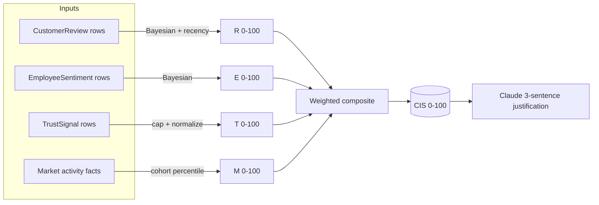
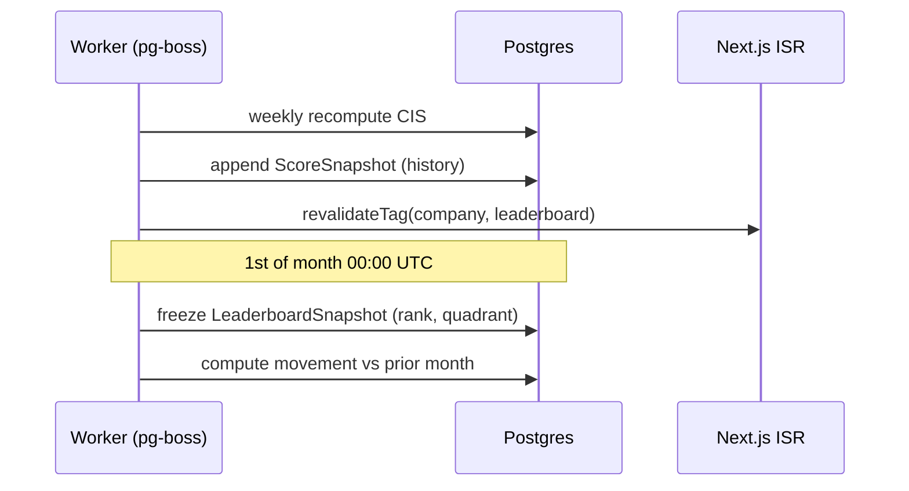
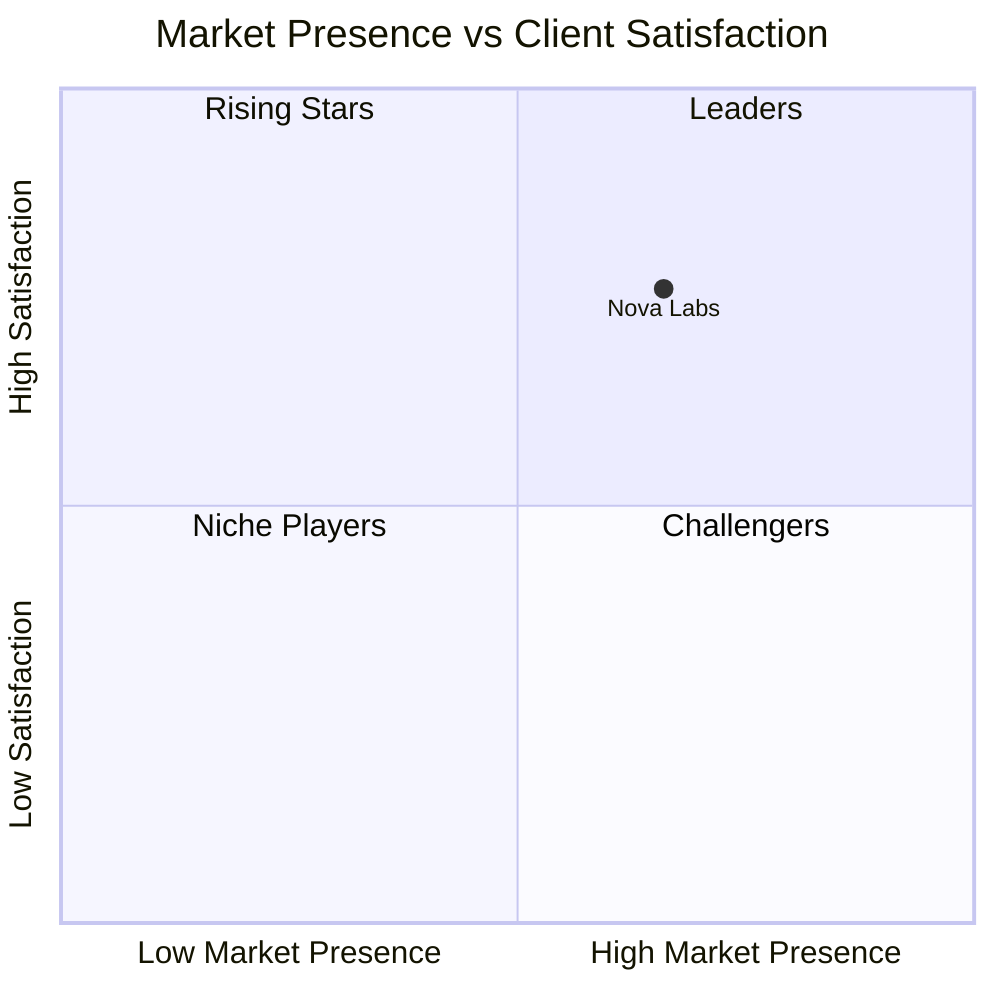
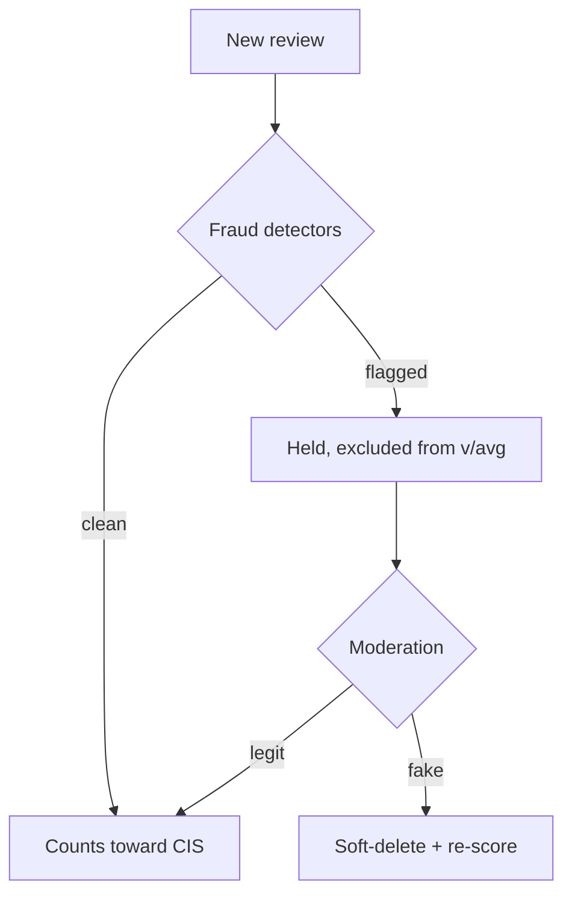

# Intelligence Score & Country Leaderboards

> Status: Draft v1 · Last updated 2026-07-07

This document is the implementation-ready specification for the **Company Intelligence Score (CIS)** — TechFirms' 0–100 composite reputation metric — and for the country-scoped, Gartner-style **leaderboards** built on top of it. It defines every sub-signal, the exact math (Bayesian shrinkage, recency decay, missing-signal renormalization), a fully worked numeric example, the AI-written justification, recompute cadence and snapshots, the quadrant placement rules that drive the Recharts scatter, fake-review detection, the public `/methodology` page, and edge cases. All names, weights, hexes, and routes conform to [`_canon.md`](research/_canon.md). Adjacent specs are summarized and cross-linked, not duplicated: the Prisma tables live in [Data Model & Schema](06-data-model-and-schema.md), the answer-block/GEO surface in [GEO & LLM Optimization](10-geo-llm-optimization.md), and the Claude prompt plumbing in [AI Features Spec](11-ai-features-spec.md).

---

## 1. What the CIS is (and is not)

The **Company Intelligence Score (CIS)** is a **deterministically computed** number on a **0–100** scale. It is a weighted composite of four normalized sub-signals, always referenced in this fixed order:

1. **Customer Reviews** — 40%
2. **Employee Sentiment** — 25%
3. **Trust Signals** — 20%
4. **Market Activity** — 15%

**Determinism is non-negotiable.** The math is pure and reproducible from stored inputs; Claude never emits, adjusts, or rounds the number. The LLM's only job is to *narrate* a 3-sentence justification of an already-computed score (§6). An opaque LLM-emitted score would be strictly *less* trustworthy than a transparent Bayesian average and would forfeit the LLM-citation moat — the entire point of TechFirms.

```
CIS = 0.40·R + 0.25·E + 0.20·T + 0.15·M
```

where `R`, `E`, `T`, `M` are each independently normalized to 0–100 before weighting. The result is rounded to one decimal for display (`87.4`) but stored at full precision in `IntelligenceScore`.



---

## 2. Sub-signal definitions & normalization

Every sub-signal resolves to a 0–100 float. Cohort-relative signals are computed **within the company's country × service-category cohort** so US giants never flatten the Pakistan/KSA boards.

### 2.1 R — Customer Reviews (40%)

The heaviest input, and the only one with both Bayesian shrinkage and recency decay applied.

- **Source ratings.** Each `CustomerReview` carries four star sub-ratings (quality, schedule, cost, willingness-to-refer) on 1–5. The review's rating is their mean, mapped `stars → (stars − 1) / 4 × 100` (so 1★ → 0, 3.5★ → 62.5, 5★ → 100).
- **Recency-weighted Bayesian rating (70% of R).** Apply exponential recency decay to produce a weighted count `v` and weighted mean `avg`, then shrink toward the prior (§3). Call this `R_adj`.
- **Verification-coverage factor (30% of R).** `verif = 100 × (verified review weight / total review weight)` — the recency-weighted share of reviews with `verified = true`. Rewards firms whose reviews carry proof-of-engagement.

```
R = 0.70 · R_adj + 0.30 · verif
```

### 2.2 E — Employee Sentiment (25%)

From `EmployeeSentiment` **aggregates only** at launch (no verbatim text — see [`_canon.md`](research/_canon.md) §9; native anonymous employee reviews ship in v2).

- **Overall rating (80% of E).** Aggregate 1–5 overall → 0–100, run through the **same Bayesian shrinkage** as reviews (sparse employers pulled to the prior) using the employer's `review_count`. No recency decay here — aggregates arrive with a single `as_of` timestamp, not per-review dates; instead a source older than 24 months is linearly faded toward the prior by up to 30%.
- **Recommend-to-friend (20% of E).** `% recommend` mapped directly (it is already 0–100).

```
E = 0.80 · E_bayes + 0.20 · pctRecommend
```

### 2.3 T — Trust Signals (20%)

Objective, scrape-derived public facts from `TrustSignal`. Each component is **capped**, scored 0–100, then averaged with fixed intra-signal weights. Caps prevent any single lever (e.g. a 25-year-old domain) from dominating.

| Component | Measure | Cap / scale | Intra-weight |
|---|---|---|---|
| Domain age | RDAP registration age | log-scaled, cap 15 yrs = 100 | 25% |
| Certifications | ISO 27001, SOC 2, CMMI, cloud-partner badges | additive, 4+ badges = 100 (25 each) | 25% |
| Code/social proof | GitHub org activity + LinkedIn followers | min-max within country cohort | 25% |
| Funding/scale | Funding tier or employee range | tiered 0–100 | 25% |

```
T = 0.25·domainAge + 0.25·certs + 0.25·socialProof + 0.25·fundingTier
```

Certifications are **self-attested + report upload** (IAF CertSearch ceased 2026-01-01; SOC 2 has no public registry) — the admin approves before the badge counts toward T.

### 2.4 M — Market Activity (15%)

Momentum and freshness, scored as a **percentile rank within the country × service cohort** (avoids absolute cutoffs; keeps emerging markets meaningful).

- Review velocity — count of reviews in the trailing 12 months.
- Profile freshness — recency of `Company.updatedAt` / last verified data refresh.
- Portfolio depth — case-study / project count.
- Headcount growth — employee-range trajectory where available.

Each is percentile-ranked within cohort (0–100), then averaged equally. `M = percentileMean(velocity, freshness, portfolio, growth)`.

---

## 3. Bayesian shrinkage & recency decay

### 3.1 Bayesian shrinkage (low review counts)

A firm with 2 glowing reviews must not outrank a firm with 200 solid ones. We use the Trustpilot/IMDb weighted-prior form:

```
R_adj = ( v / (v + m) ) · avg  +  ( m / (v + m) ) · C
```

| Symbol | Meaning | Locked value |
|---|---|---|
| `v` | recency-weighted review count | computed |
| `avg` | recency-weighted mean rating, 0–100 | computed |
| `m` | prior strength (imaginary seed reviews) | **8** |
| `C` | prior mean (≈ 3.5★) | **70** |

A firm with 2 reviews sits near 70; by ~25 weighted reviews its own average dominates (>75% of the weight). Same `m`/`C` applies to `E_bayes`.

### 3.2 Recency / time-decay weighting

Each review's contribution is weighted by an exponential half-life:

```
w_i = 0.5 ^ ( age_months_i / H )     with  H = 12 months
```

So a review is full-weight when fresh, ~50% at 24 months, ~25% at 36 months. The **weighted count and weighted mean** both feed the Bayesian term, so recency and volume interact — a firm coasting on old reviews decays toward the prior naturally.

```
v   = Σ w_i
avg = ( Σ w_i · score_i ) / v
```

```typescript
const H = 12;      // half-life, months
const M_PRIOR = 8; // prior strength
const C_PRIOR = 70;

function reviewSubscore(reviews: { score: number; ageMonths: number; verified: boolean }[]) {
  let v = 0, weightedSum = 0, verifiedW = 0;
  for (const r of reviews) {
    const w = Math.pow(0.5, r.ageMonths / H);
    v += w;
    weightedSum += w * r.score;
    if (r.verified) verifiedW += w;
  }
  const avg = v > 0 ? weightedSum / v : C_PRIOR;
  const rAdj = (v / (v + M_PRIOR)) * avg + (M_PRIOR / (v + M_PRIOR)) * C_PRIOR;
  const verif = v > 0 ? (verifiedW / v) * 100 : 0;
  return 0.70 * rAdj + 0.30 * verif;
}
```

### 3.3 Missing signals → renormalize weights

Not every firm has all four signals (an unclaimed firm may have zero employee-sentiment data). When a signal is **absent** (no rows, or below the minimum sample), **drop it and renormalize the remaining weights to sum to 1** — never impute a fake value, never treat missing as zero (zero would unfairly tank the score).

```
CIS = ( Σ present  w_k · S_k ) / ( Σ present w_k )
```

Example: a firm with reviews + trust signals but **no** employee sentiment and **no** market activity is scored on `R` (weight 0.40) and `T` (0.20) only:

```
CIS = (0.40·R + 0.20·T) / (0.40 + 0.20) = 0.667·R + 0.333·T
```

`IntelligenceScore` stores a `signalsPresent` bitmask and the effective weights used, so any score is fully auditable and reproducible.

---

## 4. Worked example — end to end

**Firm:** *Nova Labs* — an AI Development company, HQ Karachi, Pakistan. Cohort = `pakistan × ai-development`.

**Step 1 — Customer Reviews (R).** Six reviews:

| # | Stars (mean of 4) | Age (mo) | Verified | score (0–100) | w = 0.5^(age/12) |
|---|---|---|---|---|---|
| 1 | 5.0 | 2  | yes | 100.0 | 0.891 |
| 2 | 4.5 | 5  | yes | 87.5  | 0.749 |
| 3 | 5.0 | 9  | no  | 100.0 | 0.595 |
| 4 | 4.0 | 14 | yes | 75.0  | 0.445 |
| 5 | 4.5 | 20 | yes | 87.5  | 0.315 |
| 6 | 3.5 | 30 | no  | 62.5  | 0.177 |

- `v = 0.891+0.749+0.595+0.445+0.315+0.177 = 3.172`
- `weightedSum = 89.1+65.5+59.5+33.4+27.5+11.1 = 286.1` → `avg = 286.1 / 3.172 = 90.2`
- Bayesian: `R_adj = (3.172/11.172)·90.2 + (8/11.172)·70 = 0.284·90.2 + 0.716·70 = 25.6 + 50.1 = 75.7`
- Verified weight = `0.891+0.749+0.445+0.315 = 2.400` → `verif = 2.400/3.172 × 100 = 75.7`
- `R = 0.70·75.7 + 0.30·75.7 = 75.7`

**Step 2 — Employee Sentiment (E).** Aggregate 4.1/5 overall, 82 employer reviews, 78% recommend, `as_of` 6 mo ago (no fade).
- `E_bayes` on 4.1★ = 77.5/100 with 82 reviews: `(82/90)·77.5 + (8/90)·70 = 70.6 + 6.2 = 76.8`
- `E = 0.80·76.8 + 0.20·78 = 61.4 + 15.6 = 77.0`

**Step 3 — Trust Signals (T).** Domain 7 yrs (log-scaled ≈ 82), certs = ISO 27001 + SOC 2 (2 badges = 50), social proof cohort-percentile 68, funding tier 40.
- `T = 0.25·82 + 0.25·50 + 0.25·68 + 0.25·40 = 20.5+12.5+17+10 = 60.0`

**Step 4 — Market Activity (M).** Cohort percentiles: velocity 72, freshness 90, portfolio 55, growth 63.
- `M = (72+90+55+63)/4 = 70.0`

**Step 5 — Composite.** All four signals present:

```
CIS = 0.40·75.7 + 0.25·77.0 + 0.20·60.0 + 0.15·70.0
    = 30.28 + 19.25 + 12.00 + 10.50
    = 72.0
```

**Nova Labs CIS = 72.0.** Stored with the sub-scores `{R:75.7, E:77.0, T:60.0, M:70.0}`, weights, and `signalsPresent` for audit and for the justification prompt.

---

## 5. Score storage, recompute cadence & snapshots

- **Recompute weekly.** A `pg-boss` job on the worker recomputes every firm's CIS weekly (and on-demand when new verified reviews land or an admin triggers a re-score). After recompute, the worker calls `revalidateTag` for affected profile and leaderboard routes (ISR — see [`_canon.md`](research/_canon.md) §7).
- **`IntelligenceScore`** holds the *current* live score + sub-scores + justification. **`ScoreSnapshot`** is the immutable per-recompute history row (this doubles as the `score_history` the leaderboard uses for movement).
- **Monthly frozen snapshots.** On the 1st of each month (UTC) the current scores and leaderboard orderings are frozen into `LeaderboardSnapshot`. Leaderboards **display the frozen monthly snapshot** (stable, citable, month-stamped) while the live score keeps moving underneath — this is what makes `Top AI Development Companies in Saudi Arabia — July 2026` a stable URL an LLM can cite.
- **Movement vs last month** = `thisMonthSnapshot.rank − lastMonthSnapshot.rank`, rendered as ▲/▼/– with the delta. Full field-level shapes are in [Data Model & Schema](06-data-model-and-schema.md).



---

## 6. The AI-written 3-sentence justification

Every score carries a **Claude-generated, exactly 3-sentence** plain-language rationale, stored on `IntelligenceScore.justification`.

- **What it summarizes.** It narrates *why* the deterministic number is what it is, in terms of the four sub-scores — e.g. strong recent verified reviews, mid-tier trust signals, thin employee data. It is generated with **Sonnet 5** (per [`_canon.md`](research/_canon.md) §8).
- **Guardrails.** (1) The number is passed in and is immutable — the prompt forbids Claude from stating, recomputing, or contradicting any score; it may only reference the provided sub-scores. (2) No fabricated facts — it may only cite the numeric inputs it is handed. (3) Neutral, non-promotional register. (4) Resistant to prompt injection from scraped/review text (inputs are structured numbers, not free text). (5) Exactly three sentences; a validator rejects and regenerates otherwise.
- **Regenerated on every recompute.** The justification is stale the moment the score changes, so it is regenerated whenever the CIS is recomputed (weekly / on-demand) and re-frozen with the monthly snapshot. Full prompt, model routing, and injection defenses live in [AI Features Spec](11-ai-features-spec.md).

```json
{
  "companyId": "cmp_nova_labs",
  "score": 72.0,
  "subScores": { "R": 75.7, "E": 77.0, "T": 60.0, "M": 70.0 },
  "justification": "Nova Labs earns a Company Intelligence Score of 72, anchored by consistently strong and recently verified customer reviews that place it above the Pakistan AI-development median on satisfaction. Healthy employee sentiment (4.1/5 with 78% recommending) reinforces the picture, while trust signals sit mid-tier, held back by moderate certification coverage and funding scale. Steady review velocity and a freshly maintained profile give it clear upward momentum in its cohort."
}
```

---

## 7. Leaderboard computation

Leaderboards are the core content product: **one board per country per service category**, plus a country-level roll-up. Routes (locked): `/leaderboard/[country]` and `/leaderboard/[country]/[service]`, with pSEO twins at `/best-[service]-companies-in-[country]`.

### 7.1 Eligibility gate

To appear on a *ranked* board a firm needs **≥5 verified reviews AND ≥3 recent (within 18 months)**. Below that it is listed as **"Unrated"** in a separate section — never ranked, never placed in a quadrant. This mirrors Gartner's 20-review bar scaled to a young marketplace and stops a 1-review firm topping "best AI companies in Saudi Arabia."

### 7.2 Ranking

Eligible firms are **ranked by CIS descending** within the cohort. The table below the chart shows rank, CIS, the four sub-scores, quadrant, and month-over-month movement.

### 7.3 Quadrant axes & placement

The scatter uses two **cohort-relative** axes (fixed per [`_canon.md`](research/_canon.md) §1):

- **X = Market Presence** = `0.60·M + 0.40·(T presence sub-signals)` — review volume, employee count, funding, web authority. 0–100.
- **Y = Client Satisfaction** = `R` (Bayesian, recency-weighted). 0–100.

Split **each axis at the cohort median** (robust to outliers; matches Gartner/G2 relative-to-market distribution rather than absolute cutoffs). The two median lines carve four quadrants:

| | Low Presence (X < median) | High Presence (X ≥ median) |
|---|---|---|
| **High Satisfaction (Y ≥ median)** | **Rising Stars** | **Leaders** |
| **Low Satisfaction (Y < median)** | **Niche Players** | **Challengers** |

- **Leaders** — top-right: high satisfaction *and* high presence.
- **Challengers** — high presence, weaker satisfaction (established but slipping).
- **Rising Stars** — loved but small/new: the emerging-market story TechFirms amplifies.
- **Niche Players** — limited on both, or specialized.

The `Quadrant` enum is persisted on `LeaderboardSnapshot`, so a firm's quadrant is frozen monthly alongside its rank.

```typescript
function assignQuadrant(x: number, y: number, medX: number, medY: number): Quadrant {
  const highX = x >= medX, highY = y >= medY;
  if (highX && highY)  return "LEADERS";
  if (highX && !highY) return "CHALLENGERS";
  if (!highX && highY) return "RISING_STARS";
  return "NICHE_PLAYERS";
}
```

### 7.4 Recharts mapping

The scatter is a themed Recharts `<ScatterChart>`: `XAxis dataKey="marketPresence"` (0–100), `YAxis dataKey="clientSatisfaction"` (0–100). The two median splits are `<ReferenceLine>`s (`x={medX}`, `y={medY}`) drawn in `gray-300 #CBD5E1`. Each dot is a logo bubble, teal `teal-500 #11A69E`, sized by review volume, clickable through to `/companies/[slug]`. Quadrant labels sit in the four corners. Per [`_canon.md`](research/_canon.md) §10 GEO rules, **every chart ships an accessible HTML `<table>` equivalent** (rank, company, X, Y, quadrant, CIS) for crawlers and screen readers — see [GEO & LLM Optimization](10-geo-llm-optimization.md).



---

## 8. Anti-gaming & fake-review detection

Fraud detection runs in the worker before a review is counted toward any score. **The detection signals are deliberately kept secret** (published methodology covers the *scoring* formula only — see §9) so we don't hand attackers a roadmap, exactly as Clutch and Trustpilot justify. Three cheap, high-yield detectors ship at MVP:

| Signal class | Detector | Action |
|---|---|---|
| **Velocity / burst** | Sliding-window spike detection; co-bursting (same reviewers hitting the same firms in a short window); U-shaped all-5/all-1 distributions | flag burst cluster |
| **Reviewer graph** | Shared IP / device / email-domain edges cluster into star-shaped rings; degree-centrality & PageRank separate collusion from genuine popularity | flag ring |
| **Linguistic** | Near-duplicate / templated text via embedding cosine similarity; rating–sentiment inconsistency; elevated brand-name / first-person frequency | flag likely-fake |

**Verification requirement.** Proof-of-engagement (contract/invoice or reviewer LinkedIn) marks a review `verified = true`. Only verified reviews count toward the **eligibility gate**, and verification coverage is 30% of `R` — structurally rewarding legitimacy.

**How flags affect scores.** A flagged review is set aside pending moderation (Haiku-assisted triage, admin decision — [AI Features Spec](11-ai-features-spec.md)) and **excluded from `v`, `avg`, and verification coverage** during that window, so it cannot move the CIS. Confirmed-fake reviews are soft-deleted (`deletedAt`) and permanently excluded; a whole confirmed ring is purged in one action and the affected firms are re-scored immediately. Because scoring is recency-weighted and verification-gated, a burst of unverified 5★ reviews barely moves `R_adj` (they inflate `v` but not the verified share, and shrinkage toward the prior blunts small counts).



---

## 9. Transparency — the public `/methodology` page

A public, SSR page at **`/methodology`** (locked route) that publishes **the formula, the four weights, the Bayesian seed (`m=8`, `C=70`), the 12-month half-life, the eligibility gate, and the quadrant median-split rule** — in prose, a `<table>`, and worked numbers. It **does not** disclose fraud-detection signals.

This page is a dual-purpose asset: it builds user trust (radical transparency is the wedge against Clutch's opaque box) and it is **GEO-quotable** — an LLM can cite "per TechFirms' published methodology, the Company Intelligence Score weights customer reviews at 40%…". It carries a dated, number-bearing answer block near the top (per [`_canon.md`](research/_canon.md) §10; format in [GEO & LLM Optimization](10-geo-llm-optimization.md)) and `FAQPage` structured data. Copy is refreshed whenever weights or constants change (they are locked in `_canon.md`, so changes are rare and version-stamped).

---

## 10. Edge cases

| Case | Rule |
|---|---|
| **Too few reviews to rank** | Below the gate (≥5 verified AND ≥3 recent) → **"Unrated"** section, never ranked or placed in a quadrant. A CIS may still be computed and shown on the profile (Bayesian prior keeps it near 70), clearly labeled provisional. |
| **New / unclaimed firms** | Scored on whatever signals exist with **missing-signal renormalization** (§3.3); typically only `T` (+ some `R`). Shown with a "Claim this profile" CTA. Never appears on a ranked board until it clears the gate. |
| **No employee-sentiment or market data** | Drop those weights and renormalize (§3.3); store `signalsPresent` so the profile can honestly say "scored on N of 4 signals." |
| **Ties in CIS** | Deterministic tiebreak chain: (1) higher **verified** review weight, (2) higher recency-weighted `v`, (3) more recent last verified review, (4) alphabetical by slug. Guarantees a stable, reproducible ordering. |
| **Ties on a median line** | A firm exactly at the median is placed in the **higher** band (`≥` is inclusive on both axes), so median firms lean toward Leaders/Rising Stars rather than being penalized. |
| **Tiny cohort (< 4 eligible firms)** | Median split is unstable → suppress the quadrant chart, render the ranked table only, and label the board "Emerging cohort — quadrant view pending." |
| **Score jump / dispute** | Every recompute is an immutable `ScoreSnapshot`; disputes are answerable by replaying stored inputs. Justification regenerates each recompute so narrative never drifts from the number. |

---

## Open questions / decisions needed

- **Funding-tier data source.** Crunchbase is paid ($49–99/mo). Ship `T`'s funding component from employee-range as a proxy until budget approved, or gate the component out (renormalize) — founder call on the spend.
- **Employee-sentiment fade constant.** The 24-month/30% linear fade on stale aggregates is a hypothesis (`validate`); revisit once we see real `as_of` distributions from bought datasets.
- **"Unrated" firms on pSEO pages.** Do provisional-CIS firms appear (labeled) on `/best-[service]-companies-in-[country]` pages, or are those strictly gated? Affects page data-density vs. credibility.
- **Movement display window.** Month-over-month is locked; decide whether to also surface a 3-month trend sparkline on profiles (needs `ScoreSnapshot` aggregation).
