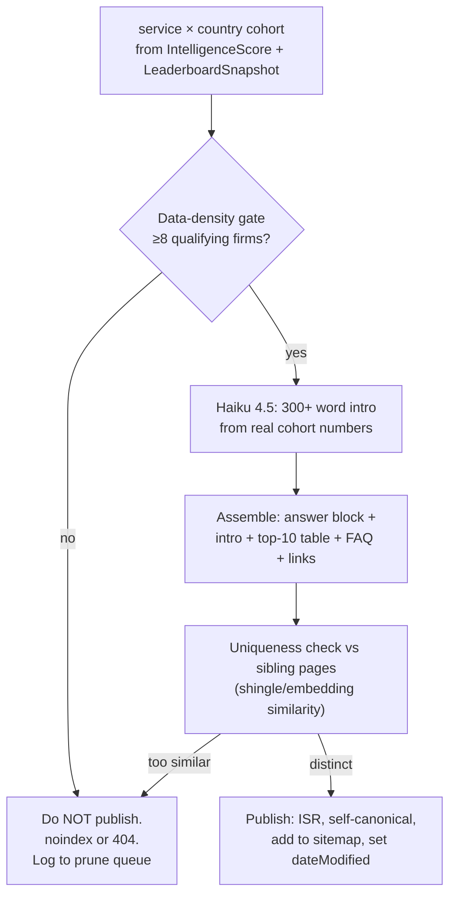
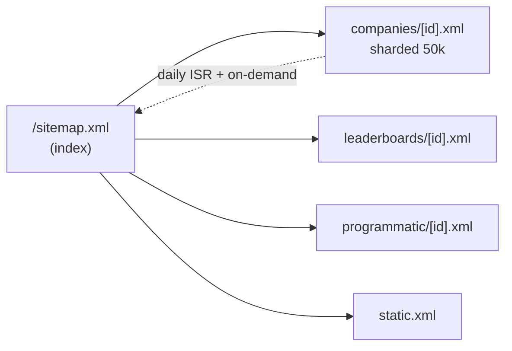
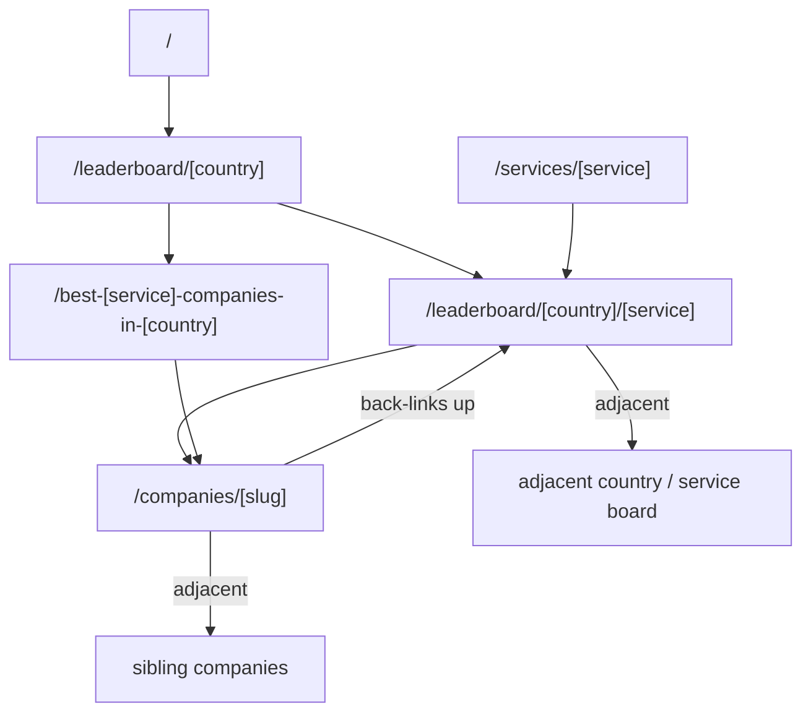

# SEO Playbook (Technical & Programmatic)

> Status: Draft v1 · Last updated 2026-07-07

This document is the build spec for how TechFirms wins organic search and gets cited by LLMs. It mandates server-side rendering on every public page, defines the exact Schema.org JSON-LD emitted per page type, specifies how the programmatic `/best-[service]-companies-in-[country]` pages are generated and defended against thin-content penalties, sets facet-indexation and canonical rules, dynamic sitemap generation, a Core Web Vitals budget with the Next.js techniques to hit it, per-company OG image generation, and a scaled internal-linking model. It ends with a prioritized launch checklist. It conforms to the locked decisions in [`research/_canon.md`](research/_canon.md). For the URL map and page inventory see [Information Architecture & Sitemap](04-information-architecture-and-sitemap.md); for `llms.txt`, answer blocks, and AI-citation tactics see [GEO / LLM Optimization](10-geo-llm-optimization.md) — this playbook covers the search/technical layer those two build on.

---

## 1. SSR-everything mandate

**Rule: every public URL returns fully-rendered HTML on first byte. Zero client-only content on public pages.** This is locked in `_canon.md` §10 and it is non-negotiable.

Two reasons, both existential for this business:

1. **AI crawlers do not execute JavaScript.** GPTBot, ClaudeBot, PerplexityBot, and Google-Extended fetch raw HTML and leave. Any score, rating, ranking, or answer block that only appears after hydration is invisible to the exact machines we are built to be cited by. Being "the source LLMs quote" (`_canon.md` §1) is impossible if the content isn't in the initial response.
2. **Faceted, programmatic directories live or die on crawl efficiency.** Server-rendered HTML means Googlebot spends its crawl budget reading content, not waiting on a render queue.

Implementation, on the locked stack (Next.js 14+/15 App Router, `_canon.md` §7):

| Page type | Rendering strategy | Rationale |
|---|---|---|
| Company profile `/companies/[slug]` | **ISR** + on-demand `revalidateTag('company:'+id)` | Static-fast; worker revalidates after re-score |
| Leaderboards `/leaderboard/[country]`, `/leaderboard/[country]/[service]` | **ISR** + `revalidateTag('leaderboard:'+key)` | Recompute weekly, publish monthly snapshot |
| Programmatic `/best-[service]-companies-in-[country]` / `-[city]` | **ISR**, `revalidate: 86400` | Refreshed monthly, tolerates daily regen |
| Service hubs `/services/[service]`, reports `/reports/[country]`, `/methodology` | **ISR** | Content-stable |
| Directory `/companies` | **SSR** | Query/facet driven, personalized sort |
| `/dashboard/*`, `/admin/*` | **SSR**, `noindex` | Auth-gated, never indexed |

- All content that matters for ranking or citation is emitted by **React Server Components**. Client Components (`"use client"`) are reserved for interactivity only — the Recharts quadrant chart, filter controls, tab switching — and are **always** hydration enhancements over server-rendered HTML, never the sole source of the content.
- **Every chart ships an HTML `<table>` equivalent** in the server payload (`_canon.md` §10). The Recharts quadrant scatter is decorative; the ranked table beneath it is the canonical, crawlable, LLM-readable data.

---

## 2. Schema.org JSON-LD — per page type

Emit JSON-LD via a `<script type="application/ld+json">` injected server-side (Next.js: return it from the RSC, or via the `metadata`/route script). One graph per page. **The golden rule from Google: marked-up values must exactly match visible on-page content** — same `ratingValue`, same `reviewCount`, same order.

### 2.1 The self-serving-review compliance line (read first)

Google's Review Snippet policy: *if the entity being reviewed controls the reviews about itself, its `Organization`/`LocalBusiness` markup is ineligible for star treatment.* TechFirms is a **third-party** directory rating **other** companies — the same posture as Clutch, G2, Trustpilot — so `AggregateRating` + `Review` on a company profile is **permitted**. To stay compliant we enforce three rules in code:

1. **Visibility parity** — every rating/review value in JSON-LD is rendered visibly on the page. A shared serializer builds the JSON-LD *from the same data object* that renders the DOM, so they cannot drift.
2. **Exact numeric match** — `ratingValue` and `reviewCount`/`ratingCount` are the identical rounded values shown in the UI; dot decimals only (`4.4`, never `4,4`).
3. **No company controls its own markup** — claimed business owners (`business_owner` role) can respond to reviews but can **never** edit `ratingValue`, `reviewCount`, or inject their own review markup. Markup is server-generated from `CustomerReview` / `IntelligenceScore` rows only.

> Reality check: leaderboards will **not** earn a Google carousel rich result (carousels only support Recipe/Course/Movie/Restaurant). We emit `ItemList` anyway — it's for crawler + LLM ranking clarity, which is the actual goal.

### 2.2 Company profile — `/companies/[slug]`

`Organization` + `AggregateRating` + `Review` (+ `BreadcrumbList`). `aggregateRating` maps to the customer-reviews signal; the CIS is exposed as an `additionalProperty` so machines can read our proprietary score.

```json
{
  "@context": "https://schema.org",
  "@type": "Organization",
  "@id": "https://techfirms.com/companies/acme-ai#org",
  "name": "Acme AI",
  "url": "https://techfirms.com/companies/acme-ai",
  "logo": "https://cdn.techfirms.com/logos/acme-ai.png",
  "sameAs": ["https://acme.ai", "https://github.com/acme-ai"],
  "address": {
    "@type": "PostalAddress",
    "addressLocality": "Riyadh",
    "addressCountry": "SA"
  },
  "aggregateRating": {
    "@type": "AggregateRating",
    "ratingValue": "4.4",
    "reviewCount": "37",
    "bestRating": "5",
    "worstRating": "1"
  },
  "additionalProperty": {
    "@type": "PropertyValue",
    "name": "Company Intelligence Score",
    "value": 82,
    "maxValue": 100,
    "description": "TechFirms composite (Customer Reviews 40%, Employee Sentiment 25%, Trust Signals 20%, Market Activity 15%)"
  },
  "review": [
    {
      "@type": "Review",
      "author": { "@type": "Person", "name": "Sara K." },
      "datePublished": "2026-05-12",
      "reviewRating": {
        "@type": "Rating", "ratingValue": "5", "bestRating": "5", "worstRating": "1"
      },
      "reviewBody": "Delivered our ML pipeline two weeks early…"
    }
  ]
}
```

Rules: cap the embedded `review` array at the **most recent 5–10** verified reviews (the rest are on-page/paginated); `reviewCount` reflects the true total, not the array length; only `verified` / on-page reviews are marked up.

### 2.3 Directory & leaderboards — `ItemList`

Ranked list with `position` on every item, mirroring the visible table order exactly. Applies to `/companies`, `/leaderboard/[country]`, `/leaderboard/[country]/[service]`, and the programmatic pages.

```json
{
  "@context": "https://schema.org",
  "@type": "ItemList",
  "name": "Top AI Development Companies in Saudi Arabia — July 2026",
  "itemListOrder": "https://schema.org/ItemListOrderDescending",
  "numberOfItems": 10,
  "itemListElement": [
    {
      "@type": "ListItem",
      "position": 1,
      "url": "https://techfirms.com/companies/acme-ai",
      "item": {
        "@type": "Organization",
        "name": "Acme AI",
        "aggregateRating": {
          "@type": "AggregateRating", "ratingValue": "4.4", "reviewCount": "37"
        }
      }
    }
  ]
}
```

All items must be the same `@type`; `position` is 1-indexed and matches the rendered rank column.

### 2.4 Breadcrumbs — `BreadcrumbList`, site-wide

Every page below the root emits a breadcrumb reflecting the URL hierarchy (`_canon.md` §3).

```json
{
  "@context": "https://schema.org",
  "@type": "BreadcrumbList",
  "itemListElement": [
    { "@type": "ListItem", "position": 1, "name": "Home", "item": "https://techfirms.com/" },
    { "@type": "ListItem", "position": 2, "name": "Leaderboards", "item": "https://techfirms.com/leaderboard/saudi-arabia" },
    { "@type": "ListItem", "position": 3, "name": "AI Development in Saudi Arabia", "item": "https://techfirms.com/leaderboard/saudi-arabia/ai-development" }
  ]
}
```

### 2.5 FAQ — `FAQPage`, category + programmatic pages only

Emit **only where a genuine, visible FAQ block exists** — service hubs, `/reports/[country]`, and the programmatic pages. Never fabricate Q&A to farm markup.

```json
{
  "@context": "https://schema.org",
  "@type": "FAQPage",
  "mainEntity": [
    {
      "@type": "Question",
      "name": "What is the average cost to hire an AI development company in Saudi Arabia?",
      "acceptedAnswer": {
        "@type": "Answer",
        "text": "As of July 2026, TechFirms-tracked AI development firms in Saudi Arabia quote median hourly rates of $45–$90…"
      }
    }
  ]
}
```

### 2.6 Per-page-type emission matrix

| Route | Organization | AggregateRating+Review | ItemList | BreadcrumbList | FAQPage |
|---|:--:|:--:|:--:|:--:|:--:|
| `/companies/[slug]` | ✅ | ✅ | — | ✅ | — |
| `/companies` (directory) | — | — | ✅ | ✅ | — |
| `/leaderboard/[country]` | — | — | ✅ | ✅ | optional |
| `/leaderboard/[country]/[service]` | — | — | ✅ | ✅ | ✅ |
| `/best-[service]-companies-in-[country]` / `-[city]` | — | — | ✅ | ✅ | ✅ |
| `/services/[service]` | — | — | ✅ | ✅ | ✅ |
| `/reports/[country]` | — | — | ✅ | ✅ | ✅ |

---

## 3. Programmatic SEO: `/best-[service]-companies-in-[country]` and `-[city]`

This is the growth engine and the biggest penalty risk. Google's **Scaled Content Abuse** policy (tightened in the Aug 2025 and Dec 2025 updates) targets exactly the pattern we're mass-producing: one template × thousands of rows. The defense is **data density, not prose volume** (`_canon.md` §10). Each page must differ on *real proprietary data* — company sets, ratings, employee-sentiment aggregates, trust signals, CIS — not a swapped country string.

### 3.1 Page anatomy

Each programmatic page is composed server-side from:

1. **Answer block (40–60 words, dated, number-bearing)** near the top — the LLM-quotable summary (spec'd in [GEO / LLM Optimization](10-geo-llm-optimization.md)).
2. **Unique AI intro, 300+ words, refreshed monthly.** Generated by **Haiku 4.5** (`_canon.md` §8) from *this cohort's real numbers* — median rate, count of firms, top mover, average employee sentiment — not a generic template. Regenerated on the monthly snapshot with fresh figures and a rolled month/year token.
3. **Top-10 table** — the real ranked cohort with CIS, rating, review count, location, rate. This is the canonical data and the `ItemList` target.
4. **FAQ block** (3–6 genuine questions) → `FAQPage` markup.
5. **Internal links** — to each listed profile, the parent `/leaderboard/[country]/[service]`, adjacent countries, and sibling services (§7).



### 3.2 Anti-thin-content gates (all must pass before a page is indexable)

- **Data-density gate.** Do not publish a `best-[service]-in-[country]` page unless the cohort has **≥8 qualifying companies** with real data. (This aligns with, and sits just above, the leaderboard eligibility gate in `_canon.md` §6: ≥5 verified reviews AND ≥3 recent per firm.) Below threshold → `noindex, follow` or, for an empty combo, **HTTP 404** (`_canon.md` §3). Never ship a skeleton page.
- **Uniqueness threshold.** Before publish, compare the assembled page against its sibling pages (same service other country, same country other service). If content shingle / embedding similarity exceeds ~0.8, the intro is regenerated or the page is held. Practitioner heuristic target: ≥500 words of genuinely differentiated content per page — directional, not a Google rule; the durable signal is the real per-cohort data underneath.
- **Indexation gating.** A page is added to the sitemap and given an indexable self-canonical **only after** it passes both gates. City pages (`-[city]`) are held to the same bar and only minted for cities with a real qualifying cohort — no long-tail city spam.
- **Pruning loop.** Weekly, read Google Search Console for `Duplicate` / `Soft 404` / `Crawled – not indexed`. Consolidate or `noindex` losers rather than leaving thin combos crawlable. Track this as an ongoing ops task, not a one-time launch step.

City vs country: country pages launch first (priority markets Saudi Arabia, UAE, Pakistan per `_canon.md` §5); city pages only for metros with enough qualifying firms (e.g. Riyadh, Dubai, Lahore, Karachi).

---

## 4. Faceted navigation, indexation & canonicals

The directory `/companies` exposes many filters (service, country, city, team size, hourly rate, min budget, rating). If each combination minted a crawlable URL we'd hemorrhage crawl budget on near-duplicates. **Locked posture (`_canon.md` §3): only curated `service × country` (and top `city`) combos are crawlable canonical URLs. Everything else is querystring/fragment and non-indexable.**

| Facet layer | URL form | Indexable? | Handling |
|---|---|---|---|
| Curated service × country | `/leaderboard/[country]/[service]`, `/best-[service]-companies-in-[country]` | ✅ Yes | Self-canonical, in sitemap |
| Curated service × city | `/best-[service]-companies-in-[city]` | ✅ Yes (gated) | Self-canonical, in sitemap |
| Service hub | `/services/[service]` | ✅ Yes | Self-canonical |
| Directory refinement (rating, team size, rate, budget) | `/companies?service=&country=&rating=&size=` | ❌ No | JS/fragment filters; robots.txt disallows param patterns |
| Sort / pagination variants | `?sort=`, `?page=` | ❌ No | Canonical to base page |

Concrete rules:

- **Crawl-budget control via `robots.txt`** — the Google-preferred method (more effective than relying on canonical or nofollow, which still burn budget because the page must be crawled to see them):

```
User-agent: *
Disallow: /*?*rating=
Disallow: /*?*size=
Disallow: /*?*rate=
Disallow: /*?*budget=
Disallow: /*?*sort=
Disallow: /*?*page=
Allow: /companies$

Sitemap: https://techfirms.com/sitemap.xml
```

- **Fragment filters where possible.** User-facing refinement (rating slider, team-size toggles) manipulate the URL **fragment** (`#`) or client state, which Google's faceted-nav doc confirms has *no impact on crawling* — no crawlable URL is ever minted.
- **Empty combos return HTTP 404**, never a redirect and never a soft-200 empty page (`_canon.md` §3).
- **Self-referencing canonical on every primary page.** Pagination and sorted variants canonicalize to the base leaderboard. **Never canonicalize a country page to a different country** — each country page is its own entity. Canonical is a clarification signal, not a crawl-budget tool (that's robots.txt's job).
- **Consistent param encoding** for any params that do survive: `&` separator, stable param order, lowercase.

---

## 5. Dynamic sitemaps

Generate with Next.js App Router `sitemap.ts` + **`generateSitemaps()`**, sharded under a **sitemap index**. Hard limits: **50,000 URLs / 50 MB per file** (`_canon.md` §10). Segment by content type for clean diagnostics: companies, leaderboards, programmatic, static.

```typescript
// apps/web/app/sitemap.ts
import type { MetadataRoute } from 'next';
import { prisma } from '@techfirms/db';

const PER_SHARD = 50_000;

// One shard per 50k companies; separate shards for other types handled by sibling routes.
export async function generateSitemaps() {
  const count = await prisma.company.count({ where: { deletedAt: null } });
  const shards = Math.max(1, Math.ceil(count / PER_SHARD));
  return Array.from({ length: shards }, (_, id) => ({ id }));
}

export default async function sitemap(
  { id }: { id: number }
): Promise<MetadataRoute.Sitemap> {
  const companies = await prisma.company.findMany({
    where: { deletedAt: null },
    select: { slug: true, updatedAt: true },
    orderBy: { id: 'asc' },
    skip: id * PER_SHARD,
    take: PER_SHARD,
  });
  return companies.map((c) => ({
    url: `https://techfirms.com/companies/${c.slug}`,
    lastModified: c.updatedAt,      // REAL lastmod from updatedAt, never "now"
    changeFrequency: 'weekly',
    priority: 0.7,
  }));
}
```

- **Sitemap index** references each type's shards: `/sitemap/companies/[id].xml`, `/sitemap/leaderboards/[id].xml`, `/sitemap/programmatic/[id].xml`, `/sitemap/static.xml`.
- **Real `lastmod`** everywhere — driven by `updatedAt` (companies) or `LeaderboardSnapshot.createdAt` / score-recompute time (leaderboards). Never stamp "now" on every URL; false freshness erodes crawl trust.
- **Regenerated daily** via ISR (`revalidate: 86400`) and on-demand after a bulk re-score. Only pages that passed the §3 gates appear.
- **Priority/changefreq:** profiles 0.7 weekly; leaderboards 0.9 weekly; programmatic 0.8 monthly; static 0.5.



---

## 6. Core Web Vitals budget

Targets at the **75th percentile** of real users (CrUX). `_canon.md` §10 sets LCP ≤ 2.5s / INP ≤ 200ms / CLS ≤ 0.1; the master build prompt pushes LCP even harder to **< 2s**. We adopt the stricter LCP.

| Metric | Budget (p75) | How we hit it on Next.js |
|---|---|---|
| **LCP** | **< 2.0s** | `next/image` with `priority` on the hero/logo; streaming SSR (RSC) so HTML flushes early; Vercel edge CDN; low TTFB via ISR (pre-rendered, no per-request DB wait) |
| **CLS** | **< 0.1** | Explicit `width`/`height` (or `fill` + sized container) on every image; reserve space for the score badge, rating stars, and chart; `next/font` with `font-display: swap` and matched fallback metrics — no FOUT reflow |
| **INP** | **< 200ms** | Minimize client JS; keep everything a Server Component except the chart, filters, and tabs; the quadrant chart hydrates lazily below the fold; break long tasks; guard INP as directory filters grow |

Techniques, locked:

- **`next/image`** for all logos, OG previews, and hero art — automatic responsive `srcset`, lazy-loading below the fold, `priority` above it. This directly serves LCP and CLS.
- **Streaming SSR / RSC** — render the answer block, ranked table, and profile header on the server and stream them; defer the Recharts bundle. The crawlable content is in the first flush.
- **Font strategy (`_canon.md` §2):** self-host **Geist** (display), **Inter** (body/UI), **Geist Mono** (tabular figures for ranks/scores) via `next/font`; expose as `--font-display`, `--font-sans`, `--font-mono`. `next/font` inlines and preloads, eliminating render-blocking font requests and layout shift. Noto Sans Arabic for RTL (KSA/UAE).
- **No layout shift from the CIS chip or star row** — these are fixed-dimension components; reserve their box in the server HTML.
- **Enforce in CI** — a Lighthouse-CI / CrUX budget check on profile, leaderboard, and programmatic templates; fail the build on regression. Only ~48% of mobile pages pass all three CWV — nailing this is a real competitive edge.

---

## 7. Per-company OG images (auto-generated)

Every profile and leaderboard gets a branded 1200×630 card via Next.js **`opengraph-image.tsx`** + the **`ImageResponse`** API (`next/og`, Satori/resvg — flexbox + CSS subset only; `_canon.md` §7). Colocate the file at the dynamic segment so it receives route params.

- **Company card:** logo + name + **CIS score badge** (the violet `#6D3EF0` score chip, the one place violet is allowed per `_canon.md` §2) + star rating + review count + "TechFirms" wordmark on Ink Navy `#0A1B2E`.
- **Leaderboard card:** `Top AI Development Companies in Saudi Arabia — July 2026` + top-3 firms, Signal Teal accents.

```tsx
// apps/web/app/companies/[slug]/opengraph-image.tsx
import { ImageResponse } from 'next/og';
export const size = { width: 1200, height: 630 };
export const contentType = 'image/png';

export default async function OG({ params }: { params: { slug: string } }) {
  const c = await getCompanyForOg(params.slug); // name, cis, rating, reviewCount, logoUrl
  return new ImageResponse(
    (
      <div style={{ display: 'flex', flexDirection: 'column', width: '100%', height: '100%',
        background: '#0A1B2E', color: '#F1F5F9', padding: 64, justifyContent: 'space-between' }}>
        <div style={{ display: 'flex', alignItems: 'center', gap: 24 }}>
          
          <div style={{ fontSize: 56, fontWeight: 700 }}>{c.name}</div>
        </div>
        <div style={{ display: 'flex', alignItems: 'center', gap: 40 }}>
          <div style={{ display: 'flex', flexDirection: 'column' }}>
            <span style={{ fontSize: 22, color: '#94A3B8' }}>Company Intelligence Score</span>
            <span style={{ fontSize: 120, fontWeight: 800, color: '#6D3EF0' }}>{c.cis}</span>
          </div>
          <div style={{ fontSize: 32, color: '#2CC7BD' }}>
            ★ {c.rating} · {c.reviewCount} reviews
          </div>
        </div>
        <div style={{ fontSize: 28, color: '#2CC7BD', fontWeight: 600 }}>TechFirms</div>
      </div>
    ),
    { ...size }
  );
}
```

- **Cache/persist** generated cards (store the PNG keyed by company + score version) rather than rendering on every crawl — controls compute cost; regenerate only when the CIS or logo changes (tie to the same `revalidateTag` that refreshes the profile). Edge runtime for fast cold starts.
- Set `og:image`, `twitter:image`, `twitter:card=summary_large_image` in `metadata`.

---

## 8. Internal linking at scale

Directory link equity dies in orphan pages. Use a **programmatic hub-and-spoke** model generated from the DB, not hand-authored links. Bidirectional pillar↔cluster linking is the lever that moves crawl coverage (practitioner data: 40% → 70% Googlebot coverage).



Auto-generated links per template:

- **Company profile** → its `[service] in [country]` leaderboard, its `[service]` global hub, 4–6 sibling companies (same service × country cohort), and its `BreadcrumbList` ancestors.
- **Leaderboard** → each listed profile, adjacent countries (same service), adjacent services (same country), and the country `/reports/[country]`.
- **Programmatic page** → listed profiles, parent leaderboard, sibling programmatic pages (adjacent country/service).
- **Service hub / country report** → the relevant leaderboards and top profiles.

Maintain a **generated link map** (every URL → primary keyword, hub assignment, links-out, links-in) as a build artifact so orphans are detectable in CI. Every indexable URL must have ≥1 internal inbound link from a hub.

---

## 9. Prioritized SEO launch checklist

| # | Priority | Item | Done when |
|---|---|---|---|
| 1 | **P0** | SSR/ISR on all public routes; zero client-only content; every chart has an HTML `<table>` twin | View-source shows full content on profile, leaderboard, programmatic |
| 2 | **P0** | Review-markup posture: `Organization`+`AggregateRating`+`Review` as third-party, visible-content parity, exact numbers, no owner-controlled markup | Rich Results Test passes; QA confirms JSON-LD == on-page values |
| 3 | **P0** | Data-density + uniqueness gates on all programmatic/leaderboard pages; empty combos 404 | Below-threshold cohorts are `noindex`/404, never published thin |
| 4 | **P0** | Faceted-nav discipline: only curated service×country(×city) crawlable; robots.txt disallows param patterns; filters are JS/fragment | `robots.txt` live; GSC shows no param URLs crawled |
| 5 | **P1** | Sharded sitemap index (companies/leaderboards/programmatic/static) via `generateSitemaps()`, real `lastmod`, daily regen | Sitemaps submitted in GSC, valid, sharded |
| 6 | **P1** | Self-referencing canonicals; pagination/sort → base; never cross-country canonical | Spot-check canonical tags across templates |
| 7 | **P1** | `ItemList` (with `position`) on directories/leaderboards/programmatic; `BreadcrumbList` site-wide; `FAQPage` only on real FAQ pages | Structured-data coverage report clean in GSC |
| 8 | **P1** | Programmatic hub-and-spoke internal linking generated from DB; link map in CI; no orphans | Link-map audit: every indexable URL has inbound links |
| 9 | **P2** | CWV budget in CI: LCP < 2.0s, INP < 200ms, CLS < 0.1 at p75; `next/font`, `next/image`, streaming SSR | Lighthouse-CI gate passing on 3 templates |
| 10 | **P2** | Per-page OG images via `ImageResponse`, cached, showing rating + CIS | OG cards render for profiles + leaderboards |
| 11 | **P2** | `llms.txt` + answer blocks shipped (see [GEO / LLM Optimization](10-geo-llm-optimization.md)) | Cross-doc dependency satisfied |
| 12 | **Ongoing** | GSC pruning loop on soft-404/duplicate; AI-citation tracking | Weekly ops review scheduled |

---

## Open questions / decisions needed

- **Production apex domain** — this doc assumes `https://techfirms.com`. Confirm the registered domain and whether `www` or apex is canonical (affects every absolute URL, sitemap, and JSON-LD `@id`).
- **Data-density threshold number** — set at **≥8 qualifying firms** per programmatic page here (one above the leaderboard's ≥5-review firm gate). Founder to confirm 8 vs a higher bar for launch markets where cohorts are thin (Pakistan cities especially).
- **City rollout list** — which specific metros get `-[city]` pages at launch (proposed: Riyadh, Jeddah, Dubai, Abu Dhabi, Lahore, Karachi, Islamabad). Needs a per-city cohort-size check before minting.
- **OG image cache invalidation cadence** — regenerate on every CIS change (weekly recompute) vs only on monthly frozen snapshot, trading freshness against render cost.
- **`changeFrequency`/`priority` values** are hints Google largely ignores — kept for completeness; no action needed unless we later find crawl-shaping value.
