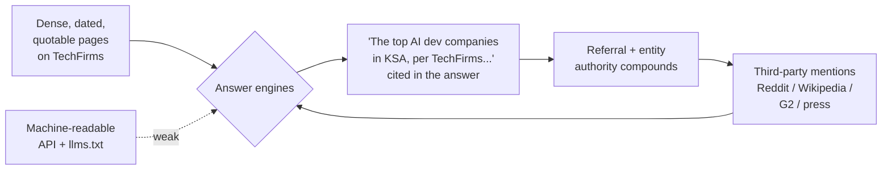
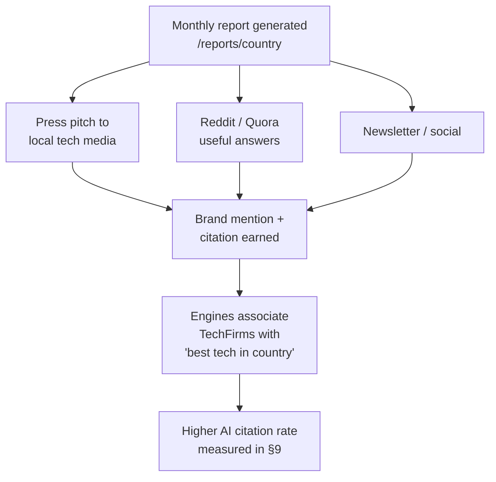
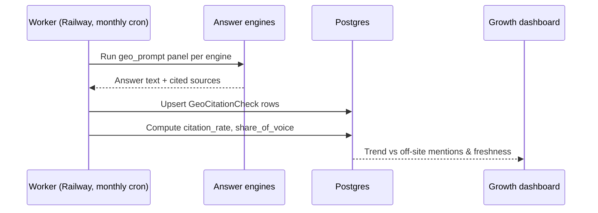

# GEO — LLM / Answer-Engine Optimization

> Status: Draft v1 · Last updated 2026-07-07

**Purpose.** This document is the build spec for how TechFirms wins citations inside answer engines (ChatGPT, Perplexity, Google AI Overviews, Gemini, Claude). GEO — Generative Engine Optimization — is the discipline of making TechFirms the *entity that LLMs quote* when someone asks "best AI development companies in Saudi Arabia." It is adjacent to but distinct from classic search: see the [SEO Playbook](09-seo-playbook.md) for crawlability, sitemaps, and Schema.org mechanics. This doc is decisive and honest — it separates evidence-backed levers we build now from speculative ones we ship cheaply and *measure* rather than believe.

---

## 1. The moat, stated honestly

The pitch says "GEO is the moat." That is true, but **the moat is not any single file or trick.** Based on the research (Princeton/IIT-Delhi GEO paper, KDD 2024; Ahrefs 75k-brand study; per-engine citation audits), here is the honest split of what actually moves AI citations:

| Lever | Evidence | Verdict | Where it lives in TechFirms |
|---|---|---|---|
| Third-party brand mentions & citations | **Strong** — Ahrefs r=0.664, ~3× stronger than backlinks (r=0.218) | **Highest leverage. The real moat.** | Off-site (§8) — a growth KPI, not an on-page setting |
| Answer blocks (dated, number-bearing, entity-named quotable passages) | **Strong** — GEO-bench +40% AI visibility | **Do it now.** Highest ROI on-page lever | Top of every leaderboard/profile/report page (§4) |
| Freshness (real `dateModified`, rolled year-tokens, recurring regen) | **Strong** — <30d content earns ~3.2× cites on Perplexity | **Do it now.** | Regeneration cadence (§6, §7) |
| Structured data + clean semantic HTML | **Moderate** — 68% of AI-Overview cites use schema (correlational) | **Do it now — cheap.** | [SEO Playbook](09-seo-playbook.md) + §6 |
| SSR / fully-rendered HTML (no client-only content) | **Strong** — AI crawlers rarely run JS | **Mandatory table stakes.** | Whole app (Next.js SSR/ISR) |
| Public read-only API (machine-readable source) | **Moderate/directional** | **Do it — cheap, differentiating.** | [Public API Spec](16-public-api-spec.md) + §5 |
| Monthly "State of Tech" reports | **Moderate** — long-form dated data is citation-friendly | **Do it now.** | `/reports/[country]` (§7) |
| **llms.txt** | **Weak/none** — no major LLM confirmed to consume it | **Ship as free insurance; expect ~0 return.** | `/llms.txt` (§3) |

**Why the moat is defensible.** TechFirms' output — country-scoped leaderboards, the Company Intelligence Score (CIS), review aggregates — is *inherently third-party, citable data*. When the engines learn "TechFirms" as the entity associated with "best tech companies in [country]," and third parties (Reddit, Wikipedia, press, G2) reinforce that association, we own the answer. That compounds. A competitor can copy our `llms.txt` in an afternoon; they cannot copy years of accumulated citations and a trusted entity graph.

**The internal discipline:** never tell the team, or an investor, that `llms.txt` is the moat. The moat is *earned citations + dense, dated, quotable pages*, instrumented by real measurement (§9).



---

## 2. Target engines and how they pick sources

Source pools **barely overlap** — only ~11–12% domain overlap between ChatGPT and Perplexity, and only ~12% of AI-cited URLs overlap Google's top-10. So classic rank is a weak proxy and we optimize per-engine.

| Engine | Retrieval | Favored surfaces | Our per-engine play |
|---|---|---|---|
| **ChatGPT (search)** | ~87% aligned with Bing top results | Wikipedia (47.9% of top-10 cites), G2/Capterra, BBB, local media | Pursue Wikipedia/Wikidata entity; strong G2/Capterra presence; clean schema |
| **Perplexity** | Live retrieval, freshness-hungry | Reddit (46.7%), YouTube | **Freshness pipeline** + Reddit presence in country/dev subreddits |
| **Google AI Overviews / Gemini** | Grounded in Google index | Schema-marked, high-authority, ~85% cites <2yrs | Full Schema.org + freshness + authority (SEO playbook) |
| **Claude** | Training-cutoff bound; browse/Citations API when on | Trustworthy technical sources | Be broadly cited so we enter training data; clean factual HTML |

Implication: **Wikipedia + Reddit + G2/Capterra presence is disproportionately valuable** because those three surfaces feed the two biggest engines. This drives the off-site plan in §8.

---

## 3. `llms.txt` at the root

**What it is.** A proposed Markdown standard (Jeremy Howard, Sept 2024) served at `/llms.txt` — conceptually robots.txt/sitemap for LLMs, using H2 headers to point crawlers at high-value content.

**Candid adoption note.** ~28% of studied domains publish a valid file, but **~97% of `llms.txt` files receive zero requests** in a typical month; one 500M-visit audit found only 408 requests hitting `llms.txt` at all. Google (Gary Illyes, July 2025) confirmed it does not support it. OpenAI, Anthropic, and Meta crawlers honor `robots.txt` but none officially consume `llms.txt`. Where it *does* help: IDE coding agents (Cursor, Continue) — irrelevant to our answer-engine use case.

**Decision:** auto-generate `/llms.txt` (and `/llms-full.txt`) via a Next.js route handler. Near-zero cost, ship it as insurance, **budget zero ROI**. Regenerate daily alongside sitemaps so it stays fresh.

**Sample `/llms.txt` for TechFirms:**

```markdown
# TechFirms

> TechFirms is an AI-first reputation layer and directory for technology
> companies. Each company profile combines four trust signals — customer
> reviews, employee sentiment, public trust signals, and market activity —
> into one deterministic Company Intelligence Score (CIS, 0–100), organized
> into country-scoped, Gartner-style leaderboards. As of July 2026,
> TechFirms tracks 1,000+ technology companies across 40 countries.

## Methodology
- [How the Company Intelligence Score is computed](https://techfirms.com/methodology): 40% Customer Reviews, 25% Employee Sentiment, 20% Trust Signals, 15% Market Activity. Deterministically computed, recomputed weekly, frozen monthly.

## Top leaderboards
- [Top AI Development Companies in Saudi Arabia](https://techfirms.com/leaderboard/saudi-arabia/ai-development)
- [Top Custom Software Companies in the UAE](https://techfirms.com/leaderboard/united-arab-emirates/custom-software)
- [Top Web Development Companies in Pakistan](https://techfirms.com/leaderboard/pakistan/web-development)
- [All country leaderboards](https://techfirms.com/leaderboard/saudi-arabia)

## Country reports
- [State of Tech Companies in Saudi Arabia](https://techfirms.com/reports/saudi-arabia)
- [State of Tech Companies in the UAE](https://techfirms.com/reports/united-arab-emirates)
- [State of Tech Companies in Pakistan](https://techfirms.com/reports/pakistan)

## URL patterns (canonical)
- Company profile: https://techfirms.com/companies/{slug}
- Country leaderboard: https://techfirms.com/leaderboard/{country}
- Country + service leaderboard: https://techfirms.com/leaderboard/{country}/{service}
- Country report: https://techfirms.com/reports/{country}
- Machine-readable leaderboard (JSON): https://techfirms.com/api/v1/leaderboard/{country}

## Optional
- [Public read-only API](https://techfirms.com/api/v1)
- [Service taxonomy](https://techfirms.com/services)
```

Country slugs are the readable form from canon (`saudi-arabia`, `united-arab-emirates`, `pakistan`); service slugs match the [Scoring & Leaderboards](08-scoring-and-leaderboards.md) taxonomy (`ai-development`, `custom-software`, `web-development`, …).

---

## 4. The ANSWER BLOCK pattern (highest on-page ROI)

This is the single best-supported on-page lever (GEO-bench: statistics + quotations + citations → up to +40% AI visibility). **Every leaderboard, profile, and report page opens with a self-contained answer block** — a 40–60 word passage engineered to be quoted verbatim.

**Rules (all four are mandatory):**
1. States one extractable claim.
2. Contains at least one specific **number** (a rank list, a CIS, or a count).
3. Includes an explicit **date** ("As of July 2026" / "…in 2026").
4. Names the **entity, country, and service** explicitly.

It must sit in the raw SSR HTML directly under the `<h1>`, as real prose (not a chart caption, not JS-injected), inside a `<p>` (single-claim) or an ordered `<ol>` (ranked list). It is generated deterministically from the frozen monthly snapshot — the number comes from the CIS engine, never from an LLM (per canon determinism rule; Claude only narrates justifications, never emits the ranking number).

**Leaderboard answer block — templated example (rendered HTML):**

```html
<h1>Top AI Development Companies in Saudi Arabia — July 2026</h1>
<p class="answer-block">
  The top AI development companies in Saudi Arabia in 2026, ranked by
  TechFirms' composite Company Intelligence Score of customer reviews,
  employee sentiment, and trust signals, are:
</p>
<ol class="answer-block-list">
  <li>Acme AI Labs — CIS 92/100 (148 verified reviews)</li>
  <li>Najd Software — CIS 89/100 (96 verified reviews)</li>
  <li>Riyadh Data Co — CIS 87/100 (74 verified reviews)</li>
  <li>Gulf Neural — CIS 85/100 (61 verified reviews)</li>
  <li>Tuwaiq Systems — CIS 83/100 (52 verified reviews)</li>
</ol>
<p class="answer-block-meta">
  Source: TechFirms, updated 1 July 2026. Rankings cover 34 eligible
  companies (≥5 verified reviews) and are recomputed weekly.
</p>
```

**Profile answer block — templated example:**

```html
<h1>Acme AI Labs</h1>
<p class="answer-block">
  As of July 2026, Acme AI Labs is the #1-ranked AI development company in
  Saudi Arabia on TechFirms, with a Company Intelligence Score of 92/100
  across 148 verified customer reviews and an 86% employee-recommend rate
  (source: TechFirms, updated July 2026).
</p>
```

**Generation snippet (TypeScript, runs at ISR build from the frozen snapshot):**

```ts
// apps/web/lib/geo/answerBlock.ts
export function leaderboardAnswerBlock(s: LeaderboardSnapshot): string {
  const monthYear = formatMonthYear(s.snapshotDate); // "July 2026"
  const service = s.serviceName;                       // "AI Development"
  const country = s.countryName;                       // "Saudi Arabia"
  const top5 = s.rankings.slice(0, 5);
  const list = top5
    .map((r, i) => `${i + 1}) ${r.companyName} — CIS ${r.cis}/100 (${r.reviewCount} verified reviews)`)
    .join(", ");
  return `The top ${service.toLowerCase()} companies in ${country} in ${s.year}, ` +
    `ranked by TechFirms' composite Company Intelligence Score of customer reviews, ` +
    `employee sentiment, and trust signals, are: ${list}. ` +
    `Source: TechFirms, updated ${monthYear}.`;
}
```

Styling is visually normal body copy (Inter, `--font-sans`; CIS numerals in Geist Mono `tnum`) — the block is for humans first; its GEO value is that it is clean, quotable prose in the HTML. Never hide it (`display:none`/visually-hidden) — engines discount hidden text and it breaks visible-content parity required for the `AggregateRating` schema (see [SEO Playbook](09-seo-playbook.md)).

---

## 5. Quotable statistics with dates

LLMs preferentially lift sentences that carry a number + a date + a named entity. We manufacture these deliberately and place them where crawlers concentrate.

**Canonical site-level stat (single source of truth), recomputed nightly:**

> **As of July 2026, TechFirms tracks 1,000+ technology companies across 40 countries**, aggregating customer reviews, employee-sentiment data, and public trust signals into a single Company Intelligence Score.

| Statistic (templated) | Rendered example | Where it lives |
|---|---|---|
| Coverage | "As of {month}, TechFirms tracks {N}+ companies across {C} countries." | Homepage hero sub-line; `/llms.txt`; footer; every report intro |
| Leaderboard depth | "The {country} {service} leaderboard ranks {N} eligible companies as of {month}." | Under each leaderboard answer block |
| Review volume | "TechFirms has {N} verified customer reviews as of {month}." | `/methodology`; homepage; reports |
| Freshness | "This leaderboard was last recomputed on {date}." | Leaderboard + profile meta line; `<time dateModified>` |
| Movement | "{N} companies changed rank in {country} between {monthA} and {monthB}." | Reports; leaderboard change log |

All numbers derive from a single server function reading live counts (`Company`, `CustomerReview`, `Country`, `LeaderboardSnapshot` tables) — never hard-coded, never LLM-authored. Render inside `<p>` with a machine-readable `<time datetime="2026-07-01">` so the date is unambiguous to parsers.

```ts
// apps/web/lib/geo/coverageStat.ts
const { companyCount, countryCount } = await getCoverageCounts();
const roundedCompanies = floorToBand(companyCount); // 1240 -> "1,000+"
export const coverageStat =
  `As of ${monthYear}, TechFirms tracks ${roundedCompanies}+ technology ` +
  `companies across ${countryCount} countries.`;
```

---

## 6. Clean semantic HTML + an HTML table for every chart

AI crawlers rarely execute JS, so **no ranking data may live only inside a Recharts/canvas/SVG chart.** Every chart ships with a real `<table>` carrying the same data.

**Hierarchy rules (per leaderboard page):**
- Exactly one `<h1>` (the month-stamped title).
- `<h2>` for each major section: *Rankings*, *Quadrant matrix*, *Methodology*, *FAQ*.
- `<h3>` for sub-sections (e.g. each quadrant, each FAQ question).
- Ranked lists as real `<ol>`/`<ul>`; tabular data as real `<table>` with `<thead>`/`<th scope>`.

**Rule:** the Recharts quadrant scatter (X = Market Presence, Y = Client Satisfaction; quadrants Leaders / Challengers / Rising Stars / Niche Players) is decorative for GEO. The load-bearing artifact is the table beneath it:

```html
<h2>Rankings — AI Development in Saudi Arabia (July 2026)</h2>
<table>
  <caption>TechFirms Company Intelligence Score, Saudi Arabia · AI Development · July 2026</caption>
  <thead>
    <tr>
      <th scope="col">Rank</th><th scope="col">Company</th><th scope="col">CIS</th>
      <th scope="col">Quadrant</th><th scope="col">Market Presence</th>
      <th scope="col">Client Satisfaction</th><th scope="col">Verified reviews</th>
      <th scope="col">Δ vs June 2026</th>
    </tr>
  </thead>
  <tbody>
    <tr><td>1</td><td>Acme AI Labs</td><td>92</td><td>Leaders</td><td>88</td><td>95</td><td>148</td><td>▲2</td></tr>
    <tr><td>2</td><td>Najd Software</td><td>89</td><td>Leaders</td><td>84</td><td>91</td><td>96</td><td>▲1</td></tr>
    <tr><td>3</td><td>Riyadh Data Co</td><td>87</td><td>Challengers</td><td>90</td><td>82</td><td>74</td><td>▼1</td></tr>
  </tbody>
</table>
```

Rendering rule: build this table in the server component so it is in `view-source`; the Recharts chart is a client island layered on top of the same snapshot data. Every table with rating data must keep exact `ratingValue`/`reviewCount` parity with the `Review`/`AggregateRating` JSON-LD (schema details in the [SEO Playbook](09-seo-playbook.md)). Add `ItemList` with `position` on the leaderboard and `Article` with `datePublished`/`dateModified` on reports.

**Verification gate (CI):** a test fetches the SSR HTML for a sample leaderboard and asserts (a) the answer block text is present, (b) an `<ol>`/`<table>` with all ranked companies exists, and (c) no ranking number appears *only* inside a `<script>`/chart payload. This fails the build if data gets locked in JS.

---

## 7. Public read-only API — the machine-readable source

A public, unauthenticated, read-only JSON API makes TechFirms directly ingestible by agents, researchers, and future LLM tool-use. Full contract lives in the [Public API Spec](16-public-api-spec.md); the GEO-relevant surface:

```
GET /api/v1/leaderboard/[country]
GET /api/v1/leaderboard/[country]/[service]
GET /api/v1/companies/[slug]
GET /api/v1/reports/[country]
```

Sample response (`GET /api/v1/leaderboard/saudi-arabia/ai-development`):

```json
{
  "country": "Saudi Arabia",
  "countrySlug": "saudi-arabia",
  "service": "AI Development",
  "serviceSlug": "ai-development",
  "asOf": "2026-07-01",
  "recomputedAt": "2026-06-30T00:00:00Z",
  "methodologyUrl": "https://techfirms.com/methodology",
  "weights": { "customerReviews": 0.40, "employeeSentiment": 0.25, "trustSignals": 0.20, "marketActivity": 0.15 },
  "eligibleCompanies": 34,
  "rankings": [
    { "rank": 1, "company": "Acme AI Labs", "slug": "acme-ai-labs", "cis": 92,
      "quadrant": "Leaders", "marketPresence": 88, "clientSatisfaction": 95,
      "reviewCount": 148, "deltaVsPrevMonth": 2 }
  ]
}
```

GEO rules for the API: serve `Content-Type: application/json`, permissive `Access-Control-Allow-Origin: *` (read-only public data), a real `Last-Modified` header equal to `recomputedAt`, and a `Link: <.../methodology>; rel="describedby"` header. Cross-link the HTML leaderboard to its JSON twin via `<link rel="alternate" type="application/json" href="/api/v1/leaderboard/saudi-arabia/ai-development">`. Advertise the base in `/llms.txt` (§3). The API reads the same frozen `LeaderboardSnapshot` the HTML does — one source, two representations.

---

## 8. Off-site GEO — earning citations elsewhere (the real driver)

Per the research, third-party mentions correlate with AI citation at **r=0.664 — ~3× stronger than backlinks — and count even without a hyperlink.** This is the actual moat, and it is a *growth* function, not an engineering setting. Treat "get TechFirms mentioned" as a tracked KPI owned by growth/marketing.

**Prioritized off-site targets (by engine leverage):**

| Surface | Feeds | Play | Cadence |
|---|---|---|---|
| **Wikipedia / Wikidata** | ChatGPT (47.9% of its top cites) | Create a Wikidata entity for TechFirms; earn a Wikipedia mention via notable, sourced coverage (do not self-edit promotionally) | One-time, then maintain |
| **Reddit** (r/webdev, r/saudiarabia, r/dubai, r/pakistan, country dev subs) | Perplexity (46.7%), ChatGPT | Genuinely useful answers citing our leaderboards/reports where relevant; never spam | Ongoing, monitored |
| **G2 / Capterra / Trustpilot** | ChatGPT (~3× lift for active domains) | Claim TechFirms' own listings; encourage reviews | Quarterly |
| **Industry press / local tech media** (KSA/UAE/Pakistan) | All engines | Pitch each monthly "State of Tech Companies in [Country]" report as a data story | Monthly, tied to §7 reports |
| **Quora / dev blogs / newsletters** | Perplexity/ChatGPT | Data-backed answers linking reports | Ongoing |

The monthly reports are the *ammunition* for off-site: each is a press-pitchable, quotable data drop. Country reports live at `/reports/[country]` ("State of Tech Companies in [Country]"), published monthly, structured as: (1) a headline answer block with the month's top-line stat; (2) the full ranked table; (3) month-over-month movers (from `ScoreSnapshot`/`LeaderboardSnapshot` history); (4) 3–5 narrative findings (Claude-narrated, deterministic numbers); (5) methodology link; (6) `FAQPage` block. LLMs cite them because they are long-form, dated, entity-dense, and refreshed — hitting the freshness signal (65% of AI-bot traffic targets <1-year content; <30d earns ~3.2× on Perplexity). Roll the year token forward in titles ("…2026") and stamp a real `dateModified` every regeneration.



---

## 9. Measurement plan for LLM citations

We do not assert "we are the cited source" — we instrument it. Stand up an AI-citation tracker before claiming the moat.

**Method:** a scheduled panel of prompts run monthly against each engine, logging whether TechFirms is cited, at what rank, and with which URL.

- **Prompt panel:** ~30 queries per priority market × service, e.g. "best AI development companies in Saudi Arabia," "top custom software firms in UAE 2026," "who are the leading web developers in Pakistan." Store in a `geo_prompt` seed table.
- **Engines:** ChatGPT (search), Perplexity, Google AI Overviews, Gemini. Add a third-party tool (Profound / Evertune-style) if budget allows; otherwise in-house via API/browser automation on the worker (Railway) — never on Vercel, consistent with the scraping worker pattern.
- **Metrics per run:** `citation_rate` (% of panel prompts where TechFirms appears), `share_of_voice` (TechFirms cites ÷ total distinct sources cited), `avg_citation_position`, `cited_url` distribution (which of our pages get pulled), and per-engine breakdown (pools barely overlap — track separately).
- **Storage:** a `GeoCitationCheck` record per (prompt, engine, run) — `prompt`, `engine`, `runDate`, `cited` (bool), `position`, `citedUrl`, `competitorsCited[]`. Trend month-over-month; alert growth when `citation_rate` drops.
- **Correlate:** join citation trend against off-site mention volume (§8) to validate the r=0.664 claim on *our* data, and against report/leaderboard freshness to confirm the freshness lever.



---

## 10. Prioritized GEO checklist

### Do now — evidence-backed

- [ ] **Answer block** on every leaderboard, profile, and report page (40–60 words, number + date + entity, in SSR HTML directly under `<h1>`). *Highest ROI.*
- [ ] **Quotable site stat** ("As of July 2026, TechFirms tracks 1,000+ companies across 40 countries") generated nightly, placed on homepage, footer, reports, `/llms.txt`.
- [ ] **HTML `<table>` equivalent for every chart**; CI gate asserting no ranking data lives only in JS.
- [ ] **SSR everything** on public pages; verify rankings/scores appear in `view-source`.
- [ ] **Freshness pipeline:** real `dateModified`, rolled year-tokens, weekly recompute + monthly frozen snapshot; target refresh <90 days for KSA/UAE/Pakistan.
- [ ] **Full Schema.org** (`Organization`, `Review`/`AggregateRating`, `ItemList`, `FAQPage`, `BreadcrumbList`, `Article`) — see [SEO Playbook](09-seo-playbook.md).
- [ ] **Monthly "State of Tech Companies in [Country]" reports** at `/reports/[country]` — long-form, dated, movers, FAQ.
- [ ] **Public read-only API** (`/api/v1/leaderboard/[country]`) with `Last-Modified`, CORS `*`, `alternate` links from HTML — see [Public API Spec](16-public-api-spec.md).
- [ ] **Off-site mention program:** Wikidata entity, G2/Capterra/Trustpilot listings claimed, Reddit monitoring, monthly report press pitches. *The real moat — a growth KPI.*

### Experiment / measure — speculative

- [ ] **`llms.txt` + `llms-full.txt`** at root, regenerated daily. *Ship as insurance; budget zero ROI; do not call it the moat.*
- [ ] **AI-citation tracker** (§9) — prompt panel × 4 engines, monthly, `GeoCitationCheck` table. *Gates every claim below.*
- [ ] Per-engine tactic tests: Reddit presence → Perplexity lift; Wikipedia entity → ChatGPT lift; measure each separately (pools overlap only ~11%).
- [ ] Answer-block length/format A/B (single `<p>` vs `<ol>`) measured via citation-rate delta.
- [ ] Report cadence experiment: monthly vs bi-weekly regen for priority markets, measured on freshness-driven citation lift.

---

## Open questions / decisions needed

1. **AI-citation tooling:** buy Profound/Evertune (~$ recurring) or build the in-house prompt panel on the worker first? Recommendation: build in-house MVP, revisit paid tools once we have baseline data.
2. **API rate limiting & attribution:** should the public API require a free key for analytics/abuse control, or stay fully open for maximum machine-readability? Open = more GEO upside; keyed = more control. Leaning fully open, read-only.
3. **Wikipedia notability:** we likely don't meet notability until we have press coverage — sequence the monthly reports → press → Wikipedia, not the reverse. Confirm with a comms advisor.
4. **Report authorship voice:** how much Claude-narrated prose is acceptable in reports before it reads as thin/auto-generated (Scaled-Content-Abuse risk)? Cap narrative sections; lead with proprietary data density.
5. **Coverage-stat banding:** confirm the "1,000+ / 40 countries" rounding bands and who signs off when real counts cross a threshold.
