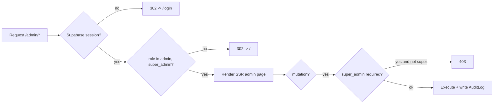
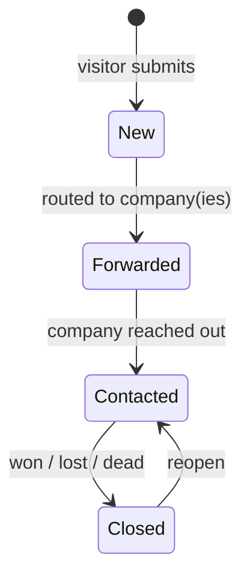
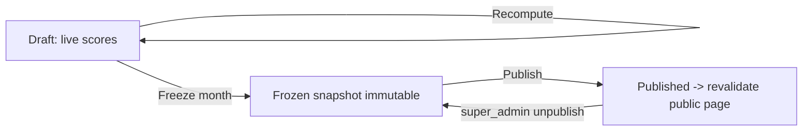

# Admin Panel Specification

> Status: Draft v1 · Last updated 2026-07-07

This document is the implementation-ready specification for the TechFirms operations console at `/admin` — the internal cockpit through which staff run the reputation platform: triaging visitor lead-gen queries, approving business claims against verification evidence, moderating reviews with AI-assisted fraud detection, editing and merging company records, and controlling the deterministic Company Intelligence Score (CIS) and its monthly leaderboard snapshots. Every screen, role gate, KPI, table, filter, bulk action, and audit-log write is fixed here so it can be built without further product decisions. All names, hexes, routes, table names, enums, and score weights conform to [`_canon.md`](research/_canon.md). Stack context: Next.js 14/15 App Router (SSR — admin pages are never statically rendered), Tailwind + shadcn/ui, Supabase Auth, Prisma over Supabase Postgres.

---

## 1. Scope, roles & auth gating

The admin panel lives entirely under `/admin/...` (per canon §3) and is **SSR-only, `noindex`, and behind auth middleware** — it is never crawlable and never appears in a sitemap. It is a distinct surface from the owner-facing [Business Dashboard](13-business-dashboard-spec.md) at `/dashboard`, which serves a single claimed company; admins see and act across *all* companies.

Two roles operate here, both from the locked `Role` enum (`visitor | business_owner | admin | super_admin`):

| Capability | `admin` | `super_admin` |
|---|---|---|
| View dashboard, queries, claims, reviews, companies, leaderboards | ✅ | ✅ |
| Approve/reject claims; moderate reviews; edit/merge companies | ✅ | ✅ |
| Recompute CIS; freeze & publish leaderboard snapshots | ✅ | ✅ |
| Set `Sponsorship`/`tier` overrides (sales) | ✅ | ✅ |
| Manage staff accounts & grant/revoke `admin` | ❌ | ✅ |
| Hard-delete records (bypass `deletedAt` soft-delete) | ❌ | ✅ |
| Edit AI moderation thresholds & scoring `formulaVersion` config | ❌ | ✅ |
| View the full audit log | ✅ (read) | ✅ (read + export) |

**Gating is enforced in three layers:** (1) Next.js middleware on the `/admin` route group reads the Supabase session and redirects any session whose `role` is not `admin`/`super_admin` to `/` with a 302; (2) every admin Server Action / route handler re-checks the role server-side (never trust the client); (3) `super_admin`-only mutations additionally assert `role === "super_admin"` and throw `403` otherwise. Sessions are short-lived; admin actions require a live session (no long-lived API tokens for the console).

---

## 2. Shell layout & shared components

Every admin screen shares one shell: a **fixed 240px left sidebar** (navy-950 `#0A1B2E` surface, teal-400 `#2CC7BD` active item, Lucide icons) + a top bar (global search, environment badge, theme toggle, signed-in staff avatar with role chip) + a fluid content region on the `2xl 1360` container for wide tables. Nav items, in order: **Dashboard** (`layout-dashboard`), **Queries** (`inbox`), **Claims** (`badge-check`), **Reviews** (`message-square-warning`), **Companies** (`building-2`), **Leaderboards** (`trophy`), **Audit Log** (`scroll-text`), and (super_admin only) **Staff** (`users`). Pending-count badges render inline on Queries, Claims, and Reviews.

Shared design-system components (all from [Design System](03-design-system.md)) used across screens: `Table` (§6.6 — sticky header, right-aligned mono `tnum` numerics, `aria-sort`), `Badge`/chips (§6.4) for statuses, `Dialog`/`Sheet` (§6.8) for detail drawers and confirmations, `Toast`/sonner (§6.9) for action feedback, `Button` variants including `destructive` for reject/delete (§6.1), `Select`/`Combobox` (§6.2) for filters, `Tabs` (§6.5), `ScoreBadge` (§6.10), and `Breadcrumb` (§6.9). Tables get a standard toolbar: left = filters, right = search + bulk-action menu (enabled only when ≥1 row is checkbox-selected) + **Export CSV**. Empty states follow the voice rules in §11 of the design system ("No pending claims. You're all caught up.").

---

## 3. Admin Dashboard — `/admin`

The landing screen is a **6-tile KPI row** (3 columns ≥md, `p-5` cards, mono `tnum` figures, Lucide icon top-left, delta vs. prior period bottom) followed by two panels: a 12-week **queries-per-week** bar chart (Recharts, teal-600 bars) with its `<table>` equivalent beneath, and a **"Needs attention" work queue** listing the oldest pending claims and flagged reviews with one-click deep links.

| Tile | Definition (exact query) |
|---|---|
| **Total companies** | `Company` count where `deletedAt IS NULL`. Sub-line: count by `listingStatus` (unclaimed / claimed / verified). |
| **Claimed %** | `count(listingStatus IN (claimed, verified)) / count(all non-deleted) × 100`, one decimal. Trend arrow vs. 30 days ago. |
| **Queries this week** | `Query` count where `createdAt ≥ now - 7d`, `deletedAt IS NULL`. Delta vs. prior 7-day window. |
| **Pending claims** | `Claim` count where `status = pending`. Amber tile when > 0; links to Claims queue. |
| **Pending reviews** | `CustomerReview` count where `verified = false AND flagged = false AND deletedAt IS NULL` (awaiting first-pass moderation). |
| **Flagged content** | `CustomerReview` count where `flagged = true AND deletedAt IS NULL` (AI- or human-flagged, awaiting decision). Danger-tinted count only if the SLA (48h) is breached. |

Deltas are green ▲ (success-600) / red ▼ (danger-600) / grey – per the table-movement convention. All six tiles are single indexed aggregate queries; the page is SSR with a 60-second `revalidate` so counts are near-live without hammering the DB.

---

## 4. Query Management — `/admin/queries`

Every visitor lead-gen submission (`Query`) lands here **and** in the target company's dashboard (see [Query & Lead-Gen Flow](14-query-and-leadgen-flow.md) for capture and AI matching). This screen owns the operational pipeline.

**Table columns:** checkbox · Created (relative + exact on hover) · Contact (name + email) · Project type · Service category · Country · Budget (mono `tnum`, `budgetMin–budgetMax` + `budgetCurrency`) · Target · **Status** · Assignee. The **Target** cell shows either a linked company chip when `directCompanyId` is set (entry point *a*, "direct to one company") — rendered as `→ [Company name]` linking to `/admin/companies/[id]` — or a `Matched (n)` chip when the query produced `QueryMatch` rows (entry point *b*, AI-suggested 3–5 firms), which expands the ranked matches inline.

**Filters:** status (multi), service category, country, target type (direct / matched / unassigned), date range, assignee. **Search:** contact name/email + description full-text. **Bulk actions:** advance status, assign owner, export selected. **Export CSV** streams the filtered set (columns above plus full description + notes) via a server route with an `AuditLog` `query.export` entry recording the row count and filter set.

**Status pipeline (fixed enum `QueryStatus`):** `New → Forwarded → Contacted → Closed`. Transitions are a linear advance with an allowed reopen from `Closed → Contacted`; each transition writes an `AuditLog` row and, on `New → Forwarded`, flips the relevant `QueryMatch.forwarded = true` and notifies the assigned company's dashboard.

**Detail drawer (Sheet):** full contact block (name, email, phone), full `description`, budget/timeline, resolved service + country, the direct target or the ranked `QueryMatch` list (rank, company, `matchScore`), an editable **`adminNotes`** textarea (autosaved, appended with author + timestamp), the status stepper, and the per-query audit trail. Nothing in the query is ever hard-deleted by an `admin`; closing sets status, and removal is soft-delete (`deletedAt`) only.

---

## 5. Claims Queue — `/admin/claims`

Processes `Claim` requests from would-be owners. Each row: company (linked) · claimant (user email) · **verification method** (`work_email_domain` or `dns_txt` chip) · evidence-status chip · submitted date · `status`. Default filter = `status = pending`, newest first.

**The decision drawer surfaces verification evidence explicitly** from `Claim.verificationEvidence (Json)` so an admin never approves blind:

- **`work_email_domain`:** shows the claimant's work email, the company's stored `domain`, and a computed **match verdict** (exact domain match = green "Domain matches"; mismatch = danger banner with the design-system copy "That email domain doesn't match this company's website"). Free-mail domains (gmail/outlook/…) are auto-rejected as non-evidentiary and flagged.
- **`dns_txt`:** shows the issued TXT token, the host to check (`_techfirms-verify.<domain>`), a **"Re-check DNS now"** button that performs a live resolver lookup server-side and renders found vs. expected, and last-checked timestamp.

**Actions:** **Approve** (primary) or **Reject** (destructive, requires a reason from a preset list + optional note). Approving runs one transaction: set `Claim.status = approved`, `reviewedByUserId`, `reviewedAt`; set `Company.ownerId`, `claimed = true`, `listingStatus = claimed`; promote the claimant `User.role` to `business_owner` if still `visitor`; write `AuditLog action="claim.approve"` with before/after. Rejecting sets `status = rejected` + reason and audits it. Verified-badge promotion (`listingStatus = verified`) is a separate explicit admin action on the company record, not automatic on claim approval. Bulk-approve is available only for `work_email_domain` claims with a clean exact match; DNS and all rejects are one-at-a-time.

---

## 6. Review Moderation — `/admin/reviews`

Moderates `CustomerReview` rows with **AI-assisted spam/fake detection surfaced inline**. The moderation-assist model (Haiku 4.5 per canon §8, triage-tier) plus the deterministic fraud heuristics from canon §6 (velocity/burst + co-bursting, near-duplicate embedding similarity, shared-domain/IP reviewer-graph clustering) produce, per review, a **fraud-risk score (0–100)** and a list of **reason codes**. These populate the moderation card; the underlying fraud-detection signals are kept secret from the public per canon §6.

Default view = the moderation queue: reviews where `verified = false` OR `flagged = true`, ordered by fraud-risk desc. **Columns:** company (linked) · reviewer (name/title/company) · overall rating (mono `tnum`, from `ratingOverall`/100) · source (`native | imported` chip) · **fraud risk** (colored meter — green <40, warning 40–70, danger >70) · reasons (chips) · age. Filters: source, risk band, rating, flagged-only, company. Bulk: approve, flag, reject selected.

**Per-review card** shows the four sub-ratings (quality/schedule/cost/willingness-to-refer) as teal bar meters, the regenerated `body` for native reviews (imported reviews carry no verbatim prose — aggregate + attribution only, per canon §9), the invitation provenance if `invitationId` is set (native = higher trust), and the AI panel: **risk score + reason codes** (e.g. `near-duplicate: 0.94 cosine to review#…`, `burst: 6 reviews in 40 min from /24 subnet`, `reviewer-graph: shared IP with 3 flagged accounts`) with a one-line Haiku rationale.

**Three actions** map to fields: **Approve** → `verified = true, flagged = false`; **Flag** → `flagged = true` (holds it out of scoring and public view, keeps it in queue for a second look); **Reject** → soft-delete (`deletedAt`) with a required reason. Every decision writes an `AuditLog` (`review.approve|flag|reject`, before/after, including the fraud score at decision time). Approving or rejecting a review changes the company's review corpus, so the action **enqueues a CIS recompute** for that company.

**Appeals:** an owner disputes a moderation outcome from their dashboard (transparent dispute workflow — the anti-Clutch/G2 differentiator from [user-sentiment research](research/user-sentiment.md)). Appeals surface here as a distinct **Appeals** tab: the original review, the owner's stated reason, the prior decision + its audit entry, and **Uphold / Overturn** actions with a mandatory note and a **72-hour SLA** counter. Overturning restores or re-flags accordingly and audits the reversal.

---

## 7. Company CRUD — `/admin/companies`

A master table of all `Company` rows (search by name/domain/slug; filter by listing status, country, service, has-owner). Row click → the full editor at `/admin/companies/[id]`.

- **Edit any profile:** every `Company` field plus relations — services & `focusPct` on `CompanyService`, `OfficeLocation[]`, HQ country/city, `hourlyRate*`/`rateCurrency`, `employeeRange*`, tagline, and the AI-regenerated `description`. A **"Regenerate description"** action re-runs the neutral-description generation (canon §8 use-case 1). Admin edits to owner-editable fields are audited and visible to the owner.
- **Merge duplicates:** pick a **survivor** and one or more **losers**; a diff view previews the merged result field-by-field (survivor wins, gaps backfilled from losers). Merge reparents all children — `CustomerReview`, `EmployeeSentiment`, `TrustSignal`, `CompanyService`, `OfficeLocation`, `Query.directCompanyId`, `QueryMatch`, `Claim`, `Sponsorship`, `RawScrapeRecord` — onto the survivor, dedupes `CompanyService` by `serviceId`, soft-deletes the losers, records their slugs for **301 redirects** to the survivor, writes an `AuditLog` `company.merge` with the full before/after set, and enqueues a survivor CIS recompute. Merge is transactional; a `super_admin` can hard-delete a merged loser afterward.
- **Trigger re-scrape / re-score:** **Re-scrape** enqueues a `ScrapeJob` (`jobType="refresh"`) for the company's `source`/`sourceId` on the worker (never on Vercel — canon §7/§9); the button shows the last `ScrapeJob` status. **Re-score** enqueues an immediate CIS recompute (out-of-band from the weekly cadence) that rewrites `IntelligenceScore` and, on the next monthly freeze, `ScoreSnapshot`. Both are audited (`company.rescrape`, `company.rescore`).

---

## 8. Leaderboard Controls — `/admin/leaderboards`

Manages the country-scoped `Leaderboard` boards and their monthly `LeaderboardSnapshot` publication lifecycle. Table of boards: title, country, service (or "all services"), current publish state, last snapshot period, member count. The scoring math itself is specified in [Scoring & Leaderboards](08-scoring-and-leaderboards.md) — this screen only *operates* it.

- **Recompute scores:** runs the deterministic CIS pipeline (`0.40·R + 0.25·E + 0.20·T + 0.15·M`, cohort median splits, eligibility gate ≥5 verified AND ≥3 recent) across a board's cohort and refreshes each member's live `IntelligenceScore` (`marketPresence`, `clientSatisfaction`, `quadrant`, `tier`). This is a preview-of-record: it updates live scores but does **not** freeze a public snapshot. Audited `leaderboard.recompute`.
- **Freeze monthly snapshot:** writes a `LeaderboardSnapshot` for `(periodYear, periodMonth)` capturing the ordered `rankings` JSON (`companyId, rank, cis, quadrant, movement`) — immutable once frozen (`@@unique([leaderboardId, periodYear, periodMonth])`). Freezing also stamps each member's `ScoreSnapshot` for the month so month-over-month movement is computable. State: **Draft → Frozen**.
- **Publish:** sets `LeaderboardSnapshot.publishedAt`, regenerates the GEO `answerBlock`, and triggers `revalidateTag` for the public `/leaderboard/[country]` route (ISR — canon §7). State: **Frozen → Published**. Unpublish is `super_admin`-only and audited.

Recompute cadence is weekly and freezes are monthly per canon §6; this screen exposes the manual overrides for both, plus a "next scheduled run" indicator driven by the worker's pg-boss schedule.

---

## 9. Audit Log — `/admin/audit`

**Every admin mutation across all screens writes an `AuditLog` row** (canon §12): who (`actorId`), what (`action` string, e.g. `claim.approve`, `review.reject`, `company.merge`), the target (`entityType` + `entityId`), a **before/after diff** (`metadata Json`), `ipAddress`, and `createdAt`. This is non-negotiable and the platform's transparency backbone — it directly answers the "opaque moderation" grievance from the [user-sentiment research](research/user-sentiment.md) by making every decision reconstructable.

The screen is a filterable, **append-only, read-only** table (actor, action type, entity type, date range; full-text over action + entityId). Row expand shows the diff as a two-column before/after JSON view. Export is `super_admin`-only. The write is emitted inside the same DB transaction as the mutation via a shared `audit(actorId, action, entityType, entityId, before, after)` helper so an action and its audit entry commit or roll back together — no un-audited writes are possible.

---

## 10. Wireframe summary per screen

| Screen | Nav / layout | Primary table columns | Filters | Bulk actions | Key components |
|---|---|---|---|---|---|
| Dashboard | Shell + 6 KPI tiles + trend chart + work queue | — | Period toggle (7/30/90d) | — | KPI `Card`, Recharts bar + `<table>`, `Badge` |
| Queries | Shell + toolbar | Created, Contact, Type, Service, Country, Budget, Target, Status, Assignee | status, service, country, target type, date, assignee | advance status, assign, export CSV | `Table`, status `stateDiagram` stepper, `Sheet`, `Badge` |
| Claims | Shell + toolbar | Company, Claimant, Method, Evidence, Date, Status | status, method | approve (email-match only) | `Sheet` evidence drawer, DNS re-check `Button`, `Badge` |
| Reviews | Shell + Queue/Appeals tabs | Company, Reviewer, Rating, Source, Fraud risk, Reasons, Age | source, risk band, rating, flagged-only, company | approve, flag, reject | risk meter, `StarRating`, sub-rating bars, `Tabs`, `Dialog` |
| Companies | Shell + toolbar | Name, Domain, Status, Country, Owner, CIS | status, country, service, has-owner | — (merge is explicit) | editor form, merge diff `Dialog`, `ScoreBadge` |
| Leaderboards | Shell + board table | Title, Country, Service, State, Last period, Members | country, service, state | — | recompute/freeze/publish `Button`s, `QuadrantChart` preview |
| Audit Log | Shell + read-only table | Actor, Action, Entity, Date | actor, action, entity, date | export (super_admin) | before/after JSON diff, `Badge` |

---

## 11. Open questions / decisions needed

1. **Fraud-signal storage.** `CustomerReview.flagged` is a single boolean; the moderation card wants *why*. Add a `fraudSignals Json` + `fraudScore Int` column (mirrors data-model open question #6) so reasons persist rather than being recomputed at view time.
2. **Assignee model.** Query "Assignee" implies staff ownership, but `Query` has no `assigneeId`. Add one (FK → `User`) or drive assignment purely through `AuditLog`? Recommend a real column for filterable ownership.
3. **Appeal entity.** Appeals are described as a review sub-flow but have no table. Add a lightweight `ReviewAppeal` (reviewId, ownerId, reason, status, decidedBy, SLA) or overload `AuditLog`? Recommend a dedicated table for SLA tracking.
4. **Verified promotion trigger.** Confirm `listingStatus = verified` is always a manual admin step post-claim, or auto-promote on strong evidence (DNS TXT) to reduce queue load.
5. **Bulk CSV of PII.** Query export contains contact PII; confirm whether `admin` may export freely or only `super_admin`, and whether exports should be watermarked/rate-limited for compliance.
