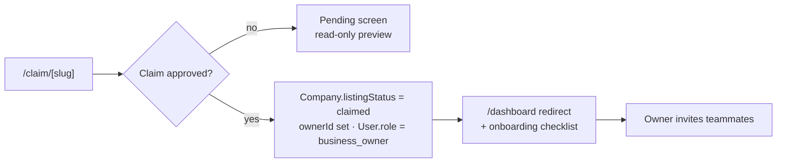
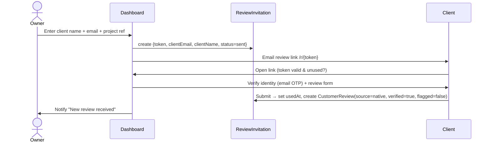

# Business (Claimed Company) Dashboard Spec

> Status: Draft v1 · Last updated 2026-07-07

This document specifies the authenticated workspace a `business_owner` (and their invited teammates) sees after successfully claiming a company profile — the profile editor, review-response tools, incoming-query inbox, verified-review invitation system, analytics, monetization/upgrade surfaces, and owner notifications. It is the supply-side counterpart to the [Admin Panel](12-admin-panel-spec.md). Every route, table, enum, hex, and price here conforms to [`_canon.md`](research/_canon.md); the claim state machine lives in [User Flows §3.3](05-user-flows-and-journeys.md), the schema in [Data Model](06-data-model-and-schema.md), pricing detail in [Monetization & Pricing](15-monetization-and-pricing.md), and query mechanics in [Query & Lead-Gen Flow](14-query-and-leadgen-flow.md).

---

## 1. Access path & roles

The dashboard is unreachable until a `Claim` is `approved`. The full request → verify → approve machine is owned by [User Flows §3.3](05-user-flows-and-journeys.md); the dashboard picks up at the hand-off:



On approval the admin action sets `Company.claimed = true`, `Company.listingStatus = claimed`, `Company.ownerId = <User.id>`, and promotes `User.role` from `visitor` to `business_owner` (canon §1 enum). `verified` remains `false` until the company earns the trust badge (≥5 verified reviews or a Verified-Plus purchase — see §8). Access is enforced in Next.js middleware and re-checked in every server action: a user may only load `/dashboard/*` for a company where they hold an active membership.

### Roles inside the dashboard

Canon's `Role` enum (`visitor | business_owner | admin | super_admin`) is a **platform** role and does not model multiple people per company. To support "invited teammates" we add one join table (flagged in Open Questions as a schema addition to reconcile with [Data Model](06-data-model-and-schema.md)):

```prisma
model CompanyMembership {
  id        String         @id @default(cuid())
  companyId String
  company   Company        @relation(fields: [companyId], references: [id], onDelete: Cascade)
  userId    String
  user      User           @relation(fields: [userId], references: [id])
  seatRole  CompanySeatRole @default(manager)
  invitedByUserId String?
  invitedAt DateTime       @default(now())
  acceptedAt DateTime?
  createdAt DateTime       @default(now())
  updatedAt DateTime       @updatedAt
  @@unique([companyId, userId])
  @@index([companyId])
}

enum CompanySeatRole { owner  manager  viewer }
```

| Seat role | Edit profile | Respond to reviews | View queries | Invite clients | Manage team | Billing / upgrades |
|---|---|---|---|---|---|---|
| `owner` (the claimant) | ✅ | ✅ | ✅ | ✅ | ✅ | ✅ |
| `manager` | ✅ | ✅ | ✅ | ✅ | ❌ | ❌ |
| `viewer` | ❌ | ❌ | ✅ (read-only) | ❌ | ❌ | ❌ |

Every teammate is still a `User` with platform `role = business_owner`; the `CompanySeatRole` gates within the company. Teammate invites are email-token links (7-day expiry, single-use), mechanically identical to admin invites and reusing the same token infrastructure as review invitations (§6). A company has exactly one `owner` seat; ownership transfer is an admin-brokered action (grievance #6 — logged, not self-serve).

---

## 2. Information architecture

Routes sit under `/dashboard` (canon §3). When a user owns multiple companies, a company switcher in the top bar sets the active `companyId`; all routes are relative to it.

| Screen | Route | Purpose |
|---|---|---|
| Overview | `/dashboard` | KPI tiles, onboarding checklist, activity feed |
| Edit Profile | `/dashboard/profile` | Editable facts, moderation-gated fields |
| Reviews | `/dashboard/reviews` | Read + respond to `CustomerReview` |
| Invite Clients | `/dashboard/reviews/invite` | Generate `ReviewInvitation` links |
| Queries | `/dashboard/queries` | Incoming `Query` inbox + status |
| Analytics | `/dashboard/analytics` | Views, query volume, rank trend, review growth |
| Upgrade | `/dashboard/upgrade` | Featured / Sponsored / Verified-Plus |
| Team | `/dashboard/team` | Invite/manage teammates |
| Settings | `/dashboard/settings` | Notification prefs, domain, danger zone |

**Global shell:** left sidebar (Lucide icons, collapsible), top bar with company switcher + `IntelligenceScore` chip (violet-600 `#6D3EF0` per canon §2, the only violet in-product) + notification bell. Built on shadcn/ui `Sidebar`, `Breadcrumb`, `DropdownMenu`. In-product surfaces use the cool-slate neutral scale on `#F8FAFC` (light) / `#0A0F1A` (dark) — never the warm marketing `#F7F5F2`.

```
┌──────────────────────────────────────────────────────────────┐
│ [TechFirms]   ▾ Acme Cloud (KSA)          CIS 82 ◆   🔔 3   ⚙ │  ← top bar
├────────────┬─────────────────────────────────────────────────┤
│ ◻ Overview │                                                  │
│ ◻ Profile  │              < active screen >                   │
│ ◻ Reviews  │                                                  │
│ ◻ Queries  │                                                  │
│ ◻ Analytics│                                                  │
│ ★ Upgrade  │                                                  │
│ ◻ Team     │                                                  │
└────────────┴─────────────────────────────────────────────────┘
```

---

## 3. Overview screen (onboarding + empty states)

For a newly-claimed company the hero is an **onboarding checklist** (shadcn `Card` + `Progress`), which collapses to a thin banner once 100% complete:

- [ ] Confirm your headquarters & services *(pre-filled from scrape — verify)*
- [ ] Add a logo *(scraped logos are often low-res)*
- [ ] Write/approve your tagline & description
- [ ] Invite your first client for a verified review → `/dashboard/reviews/invite`
- [ ] Respond to your first review
- [ ] Explore your leaderboard position

Below it, four KPI tiles (Geist Mono, `tnum`): **Profile views (30d)**, **Open queries**, **Total reviews**, **Leaderboard rank** (with month-over-month delta arrow — success-600 `#16A34A` up, danger-600 `#DC2626` down; danger is reserved for negative-delta and errors only, never decorative). An activity feed lists recent queries, new reviews, and rank changes.

**Empty states** (all use a Lucide icon + one-line explainer + single primary CTA, teal-700 `#0F6E6B` bg / white):
- No reviews → "No reviews yet. Invite a past client to build trust." → **Invite a client**.
- No queries → "Buyers haven't sent a query yet. A complete profile ranks higher." → **Complete your profile**.
- Not yet on a leaderboard → "You need ≥5 verified reviews and ≥3 in the last 18 months to appear on a leaderboard." (states the canon §6 eligibility gate verbatim) → **Invite clients**.

---

## 4. Edit Profile — editable vs. locked, and moderation

The core rule: **owners edit presentation and self-attested facts; they cannot silently overwrite computed or scraped-provenance data.** This protects LLM citability — the moat depends on facts being defensible, not vendor-authored.

| Field(s) | Editable? | Moderation | Rationale |
|---|---|---|---|
| `logoUrl`, `tagline` | ✅ direct | Async AI (Haiku 4.5) safety triage; publish immediately, flag on fail | Low risk, presentational |
| `description` | ✅ with review | Held for AI moderation (canon §8 use-case 5) before publish; owner sees "pending" | Prose is the highest injection/spam surface |
| `website`, `hourlyRateMin/Max`, `rateCurrency`, `minProjectSize`, `employeeRangeMin/Max`, `foundedYear` | ✅ direct | Change logged to `AuditLog`; large deltas flagged for spot-check | Self-attested commercial facts |
| `services` + `focusPct` (`CompanyService`) | ✅ direct | Sum of `focusPct` validated ≤100 | Drives cohort placement |
| `OfficeLocation[]`, `hqCountryId`, `hqCityId` | ✅ direct | Country/city must resolve to seeded `Country`/`City` | Drives country-scoped boards |
| `domain` | 🔒 locked | Change = re-verification via admin | It is the claim anchor; free edit = hijack vector |
| `slug` | 🔒 locked | Admin-only (SEO/canonical stability) | URL is indexed |
| `name` | 🔒 semi | Editable but change queues an admin review | Ranking identity |
| `IntelligenceScore`, `ScoreSnapshot`, `Quadrant`, leaderboard rank | 🔒 computed | Never editable | Deterministic (canon §6); owners narrate nothing |
| `TrustSignal` (domain age, GitHub, SSL) | 🔒 scraped | Read-only; disputes via support | Non-gameable by design |
| `EmployeeSentiment` aggregates | 🔒 imported | Read-only + source link-out | Facts only, uncopyrightable (canon §9) |
| `verified` flag, `CustomerReview.verified` | 🔒 | Admin/system only | Trust integrity |

Fields under moderation render with a "Pending review" `Badge` and keep showing the last-published value publicly until approved. Every accepted edit writes an `AuditLog` row (actor, field, before/after) so the admin panel and disputes have provenance. Certifications (ISO/SOC2/CMMI) are **self-attestation + report upload** (canon §9) surfaced here as an upload widget, but the trust seal only renders after admin/Verified-Plus verification.

```
Profile editor (two-column, sticky Save bar)
┌ Presentation ─────────────┐ ┌ Facts ───────────────────────┐
│ Logo  [ upload ]          │ │ Website  [___________]        │
│ Tagline [____________]    │ │ Founded  [____]  Team [__–__] │
│ Description [   textarea ]│ │ Rate  [__]–[__] USD/hr        │
│  ⓘ pending AI review      │ │ Services  [+ AI 60%][+ Cloud] │
└───────────────────────────┘ │ HQ  [Riyadh, Saudi Arabia ▾] │
🔒 domain acme.com (verified) └──────────────────────────────┘
```

---

## 5. Respond to reviews

`/dashboard/reviews` lists every `CustomerReview` for the company (native and imported), newest first, filterable by rating and `verified`. Each card shows the four sub-ratings (`ratingQuality/Schedule/Cost/WillingToRefer`), derived `ratingOverall`, reviewer identity, project budget/duration, and a `Verified` chip for `source = native` invitation-backed reviews.

Owners **respond** (one public response per review, editable): the response is stored on the review, attributed to the company, and — like `description` — passes AI moderation before publishing. Owners **cannot delete or edit** the review body; a legitimately fraudulent/defamatory review is handled by a free, logged **dispute** action (SLA-backed, per grievance #6) that routes to the admin moderation queue with a reason — never a pay-to-remove wall. Imported reviews (aggregate, no verbatim prose) can be responded to but not disputed as text.

---

## 6. Invite clients — verified reviews via one-time links

The native, invitation-gated review is the trust wedge: **no paid or incentivized reviews, ever** (grievance #2). Each invitation mints a single-use `ReviewInvitation.token`.



**Generation:** owners paste up to 25 client emails per batch (rate-limited). The public review route is `/r/[token]` (short, un-guessable — 128-bit token). One invitation ⇒ at most one `CustomerReview` (schema: `ReviewInvitation.review` is 1:1).

**Expiry:** invitations expire **30 days** after send (`createdAt + 30d`); the flow doc's edge case ("invitation stays `sent` until 30-day expiry") is the source of truth. Expired links show a friendly "This link has expired — ask {company} to resend." Owners see status per invite: `sent → opened → submitted → published` (or `expired`).

**Anti-abuse & reviewer verification** (fraud signals stay secret per canon §6; these are the visible mechanics):
- **Single-use:** `usedAt` is set atomically on submit; a second open is rejected. Forwarded/shared links die after first submission.
- **Reviewer verification:** the invitee confirms via **email OTP** to the invited address before the form unlocks; the review inherits `verified = true` only through this path.
- **Self-review block:** if the invitee email domain equals `Company.domain` (or resolves to the same IP cluster), the review is auto-`flagged` and withheld pending admin review — reviewer-graph clustering (canon §6 fake-review detection).
- **Velocity guard:** batch size cap + per-company daily invitation quota; burst/co-bursting patterns feed the secret fraud model.
- **Eligibility feedback:** a live counter shows progress toward the leaderboard gate (≥5 verified, ≥3 recent) so owners understand *why* to invite.

```
Invite panel
┌───────────────────────────────────────────────┐
│ Emails (one per line, ≤25)                     │
│ [ jane@client.com ]                            │
│ Project reference [ Q2 Data Platform ]         │
│                         [ Send invitations ]   │
├───────────────────────────────────────────────┤
│ Sent  jane@client.com   opened   · exp 12 Aug  │
│ Sent  omar@buyer.io     published ✓            │
│ 3 / 5 verified reviews toward leaderboard ▓▓▓░░│
└───────────────────────────────────────────────┘
```

---

## 7. Analytics

`/dashboard/analytics` uses Recharts themed to the canon tokens (teal series `#11A69E`, violet only for the CIS line), and — per canon §10 — **every chart ships an HTML `<table>` equivalent** for accessibility, LLM parsing, and CSV export. A global date-range picker (`7d · 30d · 90d · 12m · Custom`, default 30d) drives all four panels.

| Panel | Chart | Source |
|---|---|---|
| Profile views | Area chart, daily granularity | profile-view events (page instrumentation) |
| Query volume | Bar chart + funnel `New→Forwarded→Contacted→Closed` | `Query` / `QueryMatch` for this company |
| Leaderboard position trend | Step line (lower = better rank), one series per `country×service` board the firm sits on | `LeaderboardSnapshot.rankings` (monthly) + weekly interim |
| Review growth | Cumulative line, verified vs. total, with avg-rating overlay | `CustomerReview.reviewedAt` |

Sponsored companies additionally see **impression & click counters** (`Sponsorship.impressions`, `Sponsorship.clicks`) with CTR — the ROI proof that justifies renewals (canon §11). Rank-trend and snapshot data are monthly-frozen (canon §6); interim weekly recomputes are shown dashed and labeled "provisional." Empty analytics state: "Charts populate as buyers view your profile — usually within a few days of publishing."

---

## 8. Monetization hooks & entitlement gating

Build the flags now, price later (canon §11). Upsell surfaces live on `/dashboard/upgrade` and as contextual, dismissible prompts (e.g. a "Feature this profile" nudge on the Overview tile). All three products are backed by the `Sponsorship` model (`tier: featured | sponsored | verified_plus`) and `SponsorshipTier` enum — **admin can set any tier manually** so sales can close before self-serve Stripe billing exists.

| Product | Tier flag | Unlocks in dashboard | Price (Global / KSA-UAE / PK) |
|---|---|---|---|
| **Featured badge** | `featured` | Verified checkmark + highlighted card + logo in listings; full profile analytics | $49–99 / $79–149 / $25–49 mo |
| **Sponsored placement** | `sponsored` | Guaranteed top-N slot in one `{countryId, serviceCategory, slotRank, dates}` board, **labeled "Sponsored"**; impression/click analytics | $300–1,500 / $500–2,000 / $150–500 mo |
| **Verified-Plus** | `verified_plus` | Deep verification (funding, certs, references), enhanced CIS *inputs* (not score manipulation), Verified-Plus seal, priority support | $199–399 / $299–599 / $99–199 mo |

**Non-negotiable trust rule (canon §11):** Sponsored is always visually labeled and **never influences the CIS or organic rank**. Verified-Plus improves *input completeness/verification*, not the algorithm's weighting — the dashboard copy must say this explicitly to defuse the pay-to-play grievance (#1). Regional pricing derives from `Country.priceMultiplier`.

Entitlement is resolved server-side from active `Sponsorship` rows and gates every premium surface:

```typescript
type Entitlements = {
  tier: "free" | "featured" | "verified_plus";
  sponsoredBoards: { countryId: string; serviceCategory: string; slotRank: number }[];
  canSeeImpressionAnalytics: boolean;
  hasFeaturedBadge: boolean;
  hasVerifiedPlusSeal: boolean;
};

// active = active && startsAt <= now && (endsAt == null || endsAt > now)
function resolveEntitlements(sponsorships: Sponsorship[]): Entitlements { /* ... */ }
```

Locked features render as a disabled component with an `Upgrade` overlay (never hidden — visible-but-gated drives conversion). Billing (`billing.plan/priceUsd/currency/commitmentMonths/renewalDate`) and Stripe checkout are detailed in [Monetization & Pricing](15-monetization-and-pricing.md); pre-self-serve, entitlements come from admin-created `Sponsorship` rows.

---

## 9. Notifications & owner email

Owners are notified in-app (bell + `/dashboard` feed) and by email (React Email + Resend/SES). Per-event toggles live in `/dashboard/settings`; transactional security emails are non-optional.

| Event | Trigger | Channel | Default |
|---|---|---|---|
| New query received | `Query` direct or `QueryMatch.forwarded` to this company | Email + in-app | On |
| New review published | `CustomerReview` created/approved | Email + in-app | On |
| Review invitation opened/submitted | `ReviewInvitation.usedAt` set | In-app | On |
| Leaderboard position change | Monthly `LeaderboardSnapshot` publish delta | Email + in-app | On |
| Edit approved/rejected | Moderation decision | In-app | On |
| Teammate accepted invite | `CompanyMembership.acceptedAt` | In-app | On |
| Sponsorship expiring | `Sponsorship.endsAt` − 7d | Email | On |
| Weekly digest | Cron | Email | Off |

Emails are batched/debounced (a burst of reviews = one digest email within a 15-min window) to avoid the "harassment" pattern buyers complain about on incumbents (grievance #5). All email is teal-branded, plain-prose, and links straight to the relevant dashboard route.

---

## 10. Data & server actions

The dashboard is SSR (canon §7 — auth-gated pages are SSR, not ISR). Reads are scoped by the authenticated user's `CompanyMembership`; writes go through server actions that re-check seat permission and write `AuditLog`.

```
GET   /dashboard/queries        → Query[] where directCompanyId=? OR matched
POST  /dashboard/reviews/:id/respond   (manager+)  → moderation queue
POST  /dashboard/reviews/invite        (manager+)  → ReviewInvitation[]
PATCH /dashboard/profile               (manager+)  → editable fields only + AuditLog
POST  /dashboard/team/invite           (owner)     → CompanyMembership token
GET   /dashboard/analytics?range=30d   → { views, queries, rankTrend, reviewGrowth }
POST  /dashboard/upgrade/:tier         (owner)     → intent → Stripe / admin
```

---

## Open questions / decisions needed

1. **`CompanyMembership` + `CompanySeatRole`** are not in canon §12's locked model list — confirm adding them to [Data Model](06-data-model-and-schema.md), or model teammates some other way.
2. **Invitation expiry = 30 days** (from the flow doc). Confirm; some directories use 14. Also confirm the review-link route (`/r/[token]` proposed) — canon §3 doesn't lock it.
3. **`name` edits** — hard-locked to admin, or editable-with-review as specced here? Affects ranking-identity stability.
4. **Free-tier analytics depth** — do free claims get full analytics (as onboarding says) or is granular analytics a Featured perk? The monetization table implies the latter; reconcile.
5. **Verified-Plus and CIS** — confirm the exact copy boundary: it enriches *inputs/verification* but must not read as buying score. Legal/trust review recommended.
6. **Ownership transfer** — admin-brokered only (assumed here). Confirm no self-serve path.
