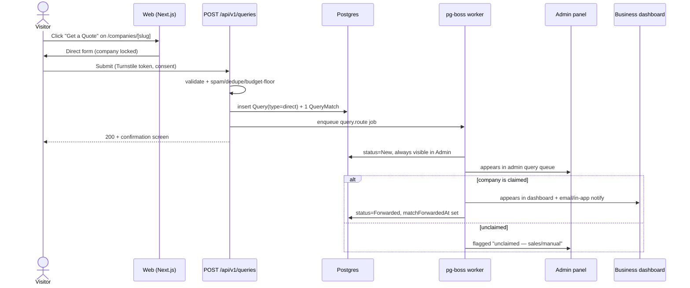
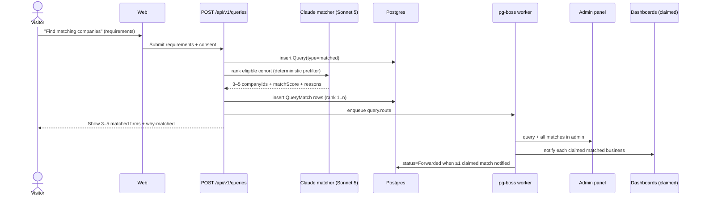
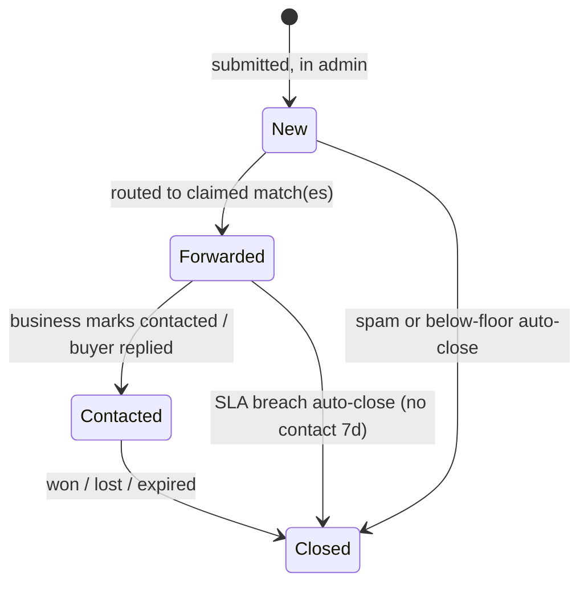

# Query / Lead-Generation Flow Spec

> Status: Draft v1 · Last updated 2026-07-07

This document specifies TechFirms' lead-generation engine: how a visitor's project requirement becomes a routed, qualified `Query` that lands in the admin panel and (when matched to a claimed business) in that business's dashboard. It defines both entry points (Direct and AI-Matched), the submission form and its anti-abuse controls, the AI matching logic, the lead-quality controls that answer the #1 agency grievance ("spammy, low-quality leads"), the `New → Forwarded → Contacted → Closed` status lifecycle with SLAs, and the metrics we hold ourselves to. Adjacent detail lives in [User Flows & Journeys](05-user-flows-and-journeys.md), [AI Features Spec](11-ai-features-spec.md), and [Admin Panel Spec](12-admin-panel-spec.md) — cross-linked, not duplicated, below.

---

## 1. The core lead-gen engine

Techreviewer.co leaves lead-gen on the table (outbound "Visit website" only); Clutch/G2 monetize it but ship "super low-quality leads." TechFirms treats the buyer's requirement as the highest-value object on the platform and brokers it with consent and qualification. Every submission becomes one `Query` row. There are exactly two entry points, decided by **who the buyer is talking to**:

| Entry point | Trigger | Where | `Query.type` | Fan-out |
|---|---|---|---|---|
| **DIRECT** | Sticky "Get a Quote" CTA on a company profile | `/companies/[slug]` | `direct` | Exactly one company (the profile owner) |
| **MATCHED** | "Find matching companies" hero on `/` and directory | `/` , `/companies` | `matched` | AI suggests **3–5** firms |

Both entry points post to the same endpoint (`POST /api/v1/queries`) and produce the same `Query` schema; only `type` and the count of `QueryMatch` rows differ. This keeps admin query management (§6) uniform.

```prisma
model Query {
  id            String      @id @default(cuid())
  type          QueryType                 // direct | matched
  status        QueryStatus @default(New) // New | Forwarded | Contacted | Closed
  serviceSlug   String                    // one of the 10 canonical service slugs
  countryCode   String                    // ISO-3166 alpha-2
  budgetBand    BudgetBand                // enum, see §2
  timeline      Timeline                  // enum, see §2
  description   String      @db.Text
  contactName   String
  contactEmail  String
  contactPhone  String?
  companyName   String?
  consentAt     DateTime                  // GDPR: explicit, timestamped
  consentIp     String
  qualityScore  Int?                      // 0–100, AI + rules, see §5
  qualified     Boolean     @default(false)
  spamScore     Float       @default(0)   // 0–1, see §2
  dedupeHash    String                    // sha256(email|serviceSlug|budgetBand|day)
  createdAt     DateTime    @default(now())
  updatedAt     DateTime    @updatedAt
  matches       QueryMatch[]
}

model QueryMatch {
  id             String    @id @default(cuid())
  queryId        String
  companyId      String
  rank           Int                       // 1..n presentation order
  matchScore     Float                     // 0–1 from matcher, see §4
  isSponsored    Boolean   @default(false) // labeled, excluded from matchScore
  forwardedAt    DateTime?
  contactedAt    DateTime?
  ratingByBiz    Int?                      // 1–5 lead-quality feedback, see §5
  ratingReason   String?
  createdAt      DateTime  @default(now())
  query          Query     @relation(fields: [queryId], references: [id])
  @@unique([queryId, companyId])
}
```

`QueryStatus` is the LOCKED pipeline. `QueryType`, `BudgetBand`, and `Timeline` are new enums introduced here.

---

## 2. Submission form spec

One responsive multi-step form (shadcn/ui + `react-hook-form` + `zod`), styled to the design tokens (primary button `teal-700 #0F6E6B` on white, `Inter` body, `Geist` headings). Direct and Matched share the component; Direct pre-fills and locks the company.

| Field | Type | Required | Validation |
|---|---|---|---|
| Project type | select → `serviceSlug` | Yes | Must be one of the 10 canonical slugs |
| Country | combobox → ISO code | Yes | Valid ISO-3166; drives cohort + regional pricing |
| Budget range | radio → `BudgetBand` | Yes | `lt_5k` \| `5k_15k` \| `15k_50k` \| `50k_150k` \| `gt_150k` |
| Timeline | radio → `Timeline` | Yes | `asap` \| `1_3_months` \| `3_6_months` \| `flexible` |
| Description | textarea | Yes | 40–2000 chars; min word count 12 |
| Full name | text | Yes | 2–80 chars |
| Work email | email | Yes | RFC + MX check; free-mail flagged, not blocked |
| Phone | tel (intl) | No | libphonenumber E.164 if present |
| Company name | text | No | ≤120 chars |
| Consent | checkbox | Yes | Must be checked; stores `consentAt` + `consentIp` |

**Budget floor.** `lt_5k` submissions are accepted but flagged `belowFloor=true` and are **not** forwarded to businesses by default (admin can override). This directly attacks the "tiny/spammy projects" complaint without silently discarding a lead.

**Spam / bot protection (layered, no single point of failure):**
- **Cloudflare Turnstile** (privacy-first, invisible) — token verified server-side; failure ⇒ soft reject.
- **Honeypot** hidden field + **time-to-fill** floor (< 3s ⇒ bot).
- **Rate limits** (Upstash/`pg` counter): ≤ 3 submissions per email/hr, ≤ 5 per IP/hr, ≤ 20 per IP/day.
- **`spamScore`** (0–1): Turnstile result + disposable-domain list + URL-count in description + repetition entropy. `> 0.8` ⇒ auto-quarantine (status stays server-side, never forwarded, surfaced in admin "Flagged" queue).

**Anti-abuse / dedupe.** `dedupeHash = sha256(lowercased_email | serviceSlug | budgetBand | UTC_date)`. A collision within 24h returns the existing `Query` (idempotent) instead of creating a duplicate — this is the same "upsert by stable key, never wipe history" pattern used in the scraping pipeline.

**Consent / GDPR.** Explicit unchecked-by-default consent checkbox with copy: *"I agree TechFirms may share these details with the matched companies so they can contact me."* We store `consentAt`, `consentIp`, and the consent copy version. Buyer data is shared **only** with forwarded companies (consent-scoped), never resold as raw buyer-intent for cold outreach — a deliberate rejection of the G2/DesignRush "STOP / JUST LOOKING" harassment pattern. DSAR erase cascades `Query` + `QueryMatch` via `deletedAt` soft-delete then hard purge at 30 days.

---

## 3. Routing & sequence diagrams

**Invariant:** every `Query` lands in the **admin panel** (single source of truth). Additionally, each `QueryMatch` to a **claimed** business appears in that business's `/dashboard/queries`. Unclaimed matched companies still generate a `QueryMatch` (so admin/sales can broker manually and it powers the "Claim to see your leads" conversion hook) but receive no notification until claimed.





---

## 4. AI matching logic

Full model/prompt detail lives in [AI Features Spec](11-ai-features-spec.md) (use-case #3, query→firm matching, on **Sonnet 5** `claude-sonnet-5`). Summary here:

- **Deterministic prefilter (SQL, no AI):** eligible companies must match `serviceSlug` (via `CompanyService` with `focusPct ≥ 20`), operate in the requested `countryCode` cohort, satisfy the leaderboard eligibility gate (≥5 verified reviews AND ≥3 recent), and have `listingStatus ∈ {claimed, verified}` prioritized. This bounds the candidate set to a country × service cohort — never a global list.
- **AI ranking:** Sonnet 5 receives the prefiltered candidates (facts only: CIS, review stats, budget fit, focus %) plus the buyer's `description`, and returns **3–5** ranked `companyIds`, each with a `matchScore` (0–1) and a one-line human-readable reason. It is injection-hardened and may never invent a company or a fact. If the cohort yields fewer than 3 eligible firms, we return what exists and widen to neighboring cities before relaxing the review gate — we never pad with unqualified firms.
- **Transparency to the user.** Each result card shows a plain-language "**Why matched**" line (e.g. *"Strong AI-Development focus in Saudi Arabia, CIS 84, budget fit for 15k–50k"*). This is the anti-black-box stance the research demands.
- **Preventing pay-to-play bias.** The `matchScore` is computed from objective signals **only**; sponsorship never enters ranking (LOCKED trust rule). Sponsored firms may appear as **at most one** additional, clearly labeled "Sponsored" card **appended after** the organic 3–5, with `isSponsored=true`. It is visually badged and excluded from `matchScore` and from any leaderboard math. Sponsorship buys a labeled slot, never rank.

---

## 5. Lead-quality controls (the #1 agency grievance)

Research is unambiguous: agencies pay and then get "a lot of spammy form submissions" and "super low quality leads." Our differentiator is **qualified-lead economics** — we charge (later) on qualified leads, never per raw click, and give businesses a reject/rate mechanism.

1. **Qualification score (`qualityScore`, 0–100).** Computed at submission: rules (valid MX +25, non-free work email +15, description length/specificity +20, budget ≥ floor +20, phone present +10, timeline not "flexible" +10) blended with a Haiku-4.5 spec-completeness check. `qualified = qualityScore ≥ 60 AND spamScore < 0.5 AND !belowFloor`.
2. **Budget floors.** `lt_5k` is `belowFloor` and withheld from forwarding by default (§2).
3. **Verification.** Turnstile + MX + rate-limit + dedupe (§2) filter automated and duplicate junk before a business ever sees it.
4. **Dedupe.** `dedupeHash` collapses repeat submissions; a buyer blasting the same brief is one lead, not five.
5. **Feedback loop.** Every forwarded `QueryMatch` carries a **1–5 lead-quality rating** (`ratingByBiz` + `ratingReason`) the business sets from `/dashboard/queries`. Ratings ≤ 2 open a **credit/refund** path under pay-per-lead and feed back as training signal to recalibrate `qualityScore` weights and matcher thresholds. Persistent low ratings against a buyer raise that buyer's future `spamScore` prior. This closes the loop incumbents leave open.

---

## 6. Status lifecycle, SLAs & notifications

`New → Forwarded → Contacted → Closed` (LOCKED). Transitions are event-driven and audited (`AuditLog`).



| State | Owner | SLA | Notification |
|---|---|---|---|
| **New** | System/Admin | Route < 2 min | Admin in-app badge |
| **Forwarded** | Business | First response target **< 24h** | Email + in-app to each claimed match; buyer gets "we shared your request with N firms" |
| **Contacted** | Business | Update to Closed < 30d | Buyer optional "did they contact you?" nudge at 48h (fuels time-to-first-response metric) |
| **Closed** | Business/Admin | — | Outcome captured: `won \| lost \| expired \| spam` |

Escalation: a `Forwarded` match with no `contactedAt` at 24h pings the business again; at 7d it auto-closes as `expired` and, under pay-per-lead, is **not billable**. SLA timers run on the pg-boss worker with stale-job reaping.

---

## 7. Metrics

Tracked per country × service cohort, surfaced in [Admin Panel Spec](12-admin-panel-spec.md):

| Metric | Definition | Target (v1) |
|---|---|---|
| **Submission conversion** | queries ÷ profile/directory sessions | ≥ 2.5% profile, ≥ 1% matched |
| **Qualified-lead rate** | `qualified=true` ÷ total queries | ≥ 65% |
| **Spam rate** | `spamScore>0.8` ÷ total | ≤ 8% |
| **Time-to-first-response** | median `contactedAt − forwardedAt` | ≤ 12h; p90 ≤ 24h |
| **Forward rate** | matched to ≥1 claimed firm ÷ matched queries | ≥ 70% (proxy for supply density) |
| **Lead-quality rating** | mean `ratingByBiz` | ≥ 3.8 / 5 |
| **Close-to-won** | `Closed(won)` ÷ Forwarded | instrument, no target v1 |

---

## Open questions / decisions needed

- **Pay-per-lead price band** ($40–150/lead is `validate` in canon) and whether refunds are auto-credited on `ratingByBiz ≤ 2` or admin-reviewed.
- **Free-mail policy:** flag-only vs. lower `qualityScore` weighting — needs a false-positive read on real MENA/Pakistan buyer behavior (many use Gmail).
- **Matched fan-out to unclaimed firms:** show buyer only claimed matches, or include unclaimed with a "not yet on TechFirms" note to drive claims?
- **Buyer identity friction:** optional light email-OTP on Matched submissions to cut spam vs. conversion cost — A/B before locking.
