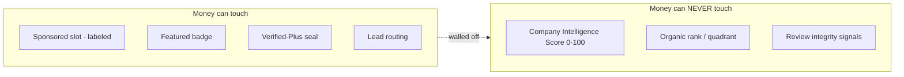
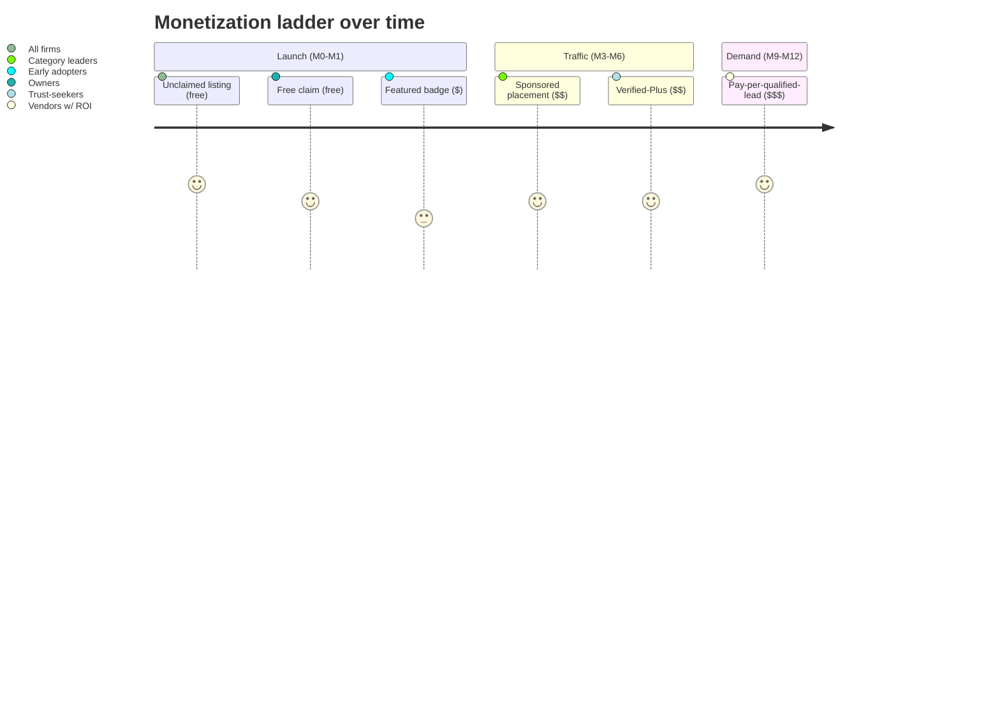

# Monetization & Pricing Strategy

> Status: Draft v1 · Last updated 2026-07-07

This document specifies how TechFirms earns revenue **without corrupting the trust that is the entire product**. It defines the phased monetization ladder (unclaimed → claim → Featured → Sponsored → Verified-Plus → pay-per-lead), decisive price points per launch market, the schema flags to build **now** even though pricing ships later, the guardrails that keep the Company Intelligence Score (CIS) editorially independent, a revenue projection sketch with pay-per-lead unit economics, and the Stripe-plus-regional billing approach. It is a build spec: choices are made, not surveyed. Prices tagged `(validate)` are hypotheses to confirm with 5–10 sales conversations per market before locking.

---

## 1. Philosophy: monetize the visibility, never the rank

User research is unambiguous: the loudest, most repeated grievance across Clutch, G2, DesignRush, and Gartner is **"the ranking is bought."** Buyers distrust leaderboards because the platform sells placement to the same firms it claims to rank objectively; agencies resent paying to appear and complain leads are thin. That distrust is not a side issue for us — it is existential, because our moat is being the **source LLMs cite** for "best [service] companies in [country]." An LLM will not treat a pay-to-win board as ground truth, and neither will a buyer.

So the non-negotiable rule (locked in `_canon.md` §11):

> **"Sponsored" is always visually labeled and never influences the CIS or organic rank. We sell visibility, not objective rank.**

Concretely: money can buy a **labeled slot above or beside** the organic leaderboard, a **badge**, **deeper verification**, or a **routed lead** — but money can **never** change the 0–100 CIS, the quadrant position (X = Market Presence, Y = Client Satisfaction), or the ranked order of organic results. The CIS is computed deterministically from Customer Reviews (40%), Employee Sentiment (25%), Trust Signals (20%), and Market Activity (15%); no monetization input feeds any of those signals. The formula is public at `/methodology`. This is the inversion of the incumbent grievance — and it is a marketing pillar, not just a policy.



---

## 2. The phased monetization ladder

Six phases, climbing from free supply-building products to demand-gated pay-per-lead. Each phase gates on the previous one existing and (from Phase 3) on **provable traffic**. We lead with cheap/free credibility products to build supply density and trust, layer sponsorship once boards get traffic, and add pay-per-lead last — mirroring Clutch's actual evolution.



| Phase | Product | Tier / flag | What it unlocks | Ships |
|---|---|---|---|---|
| 0 | **Unclaimed listing** | `listingStatus=unclaimed` | Auto-generated profile from the scraper; feeds directory, leaderboards, and CIS. Carries a "Claim this profile" CTA. | Launch |
| 1 | **Free claim** | `listingStatus=claimed`, `tier=free` | Owner verifies (work-email domain match OR DNS TXT → admin approval), edits profile, responds to reviews, sends `ReviewInvitation` links, sees basic analytics (profile views, query volume, leaderboard trend). Pure lead-capture play. | Launch |
| 2 | **Featured badge** | `tier=featured` | Verified checkmark + highlighted directory card + logo rendering + full profile analytics. Visibility polish; **no rank effect.** | Launch / M1 |
| 3 | **Sponsored placement** | `Sponsorship{...}` | Guaranteed top-N **labeled** slot in one `country × service` leaderboard, time-boxed and auto-expiring. Rendered in a distinct "Sponsored" rail, excluded from the ranked list. | M3–M6 (traffic-gated) |
| 4 | **Verified-Plus tier** | `tier=verified_plus` | Deep verification (funding docs, cert/report upload, client references), a "Verified-Plus" trust seal, richer profile modules, priority support. **Improves data completeness, not score weight** — see §4. | M3–M6 |
| 5 | **Pay-per-qualified-lead** | `leadRouting.pplEnabled=true` | Vetted, buyer-consented `Query` intros routed to matched vendors, priced by project size, with a reject/refund path. | M9–M12 (demand-gated) |

Design references live in the [Business Dashboard Spec](13-business-dashboard-spec.md) (where owners see tiers, badges, analytics, and the upgrade CTA) and competitive pricing context in the [Market & Competitor Analysis](01-market-and-competitor-analysis.md).

---

## 3. Pricing table (hypotheses to validate)

Anchored **below Clutch, at/above UpCity**. UpCity's $100–$800/mo ladder and Sortlist's €250–€1,400/mo are the realistic ceilings for a new entrant; Clutch sponsorships ($1,500–$7,500+/mo) and G2 ($2,300–$32,000+/yr) are what we undercut. Featured at $49–$99 undercuts everyone and maximizes claim→paid conversion volume — which we need for SEO/GEO social proof (logos, review counts, filled boards).

**Regional price discrimination is essential and locked in shape** (`_canon.md` §11): **KSA/UAE ≈ 1.3–1.5× global; Pakistan ≈ 40–50% of global.** Pakistani agencies bill in PKR and cannot absorb US pricing; KSA/UAE agencies have the highest budgets and the least local competition for an English, AI-cited leaderboard — likely our best gross-margin market.

| Phase | Product | Global | Saudi/UAE (~1.4×) | Pakistan (~45%) | Billing |
|---|---|---|---|---|---|
| 0 | Unclaimed listing | Free | Free | Free | — |
| 1 | Free claim | Free | Free | Free | — |
| 2 | Featured badge | **$49–$99/mo** `(validate)` | $79–$149/mo | $25–$49/mo | monthly, no lock-in |
| 3 | Sponsored placement | **$300–$1,500/mo** `(validate)` by category heat | $500–$2,000/mo | $150–$500/mo | monthly, time-boxed slot |
| 4 | Verified-Plus | **$199–$399/mo** or **$1,999/yr** `(validate)` | $299–$599/mo | $99–$199/mo | monthly or annual |
| 5 | Pay-per-qualified-lead | **$40–$150/lead** `(validate)`, scaled to project size | +25–50% premium | $15–$50/lead | usage, prepaid credits |

Notes: sell in **USD** as the ledger currency; **display** AED/SAR/PKR at the storefront for legibility (`billing.currency` stores the charged currency). Sponsored price scales with **category heat** — AI Development in KSA commands the top of the band; a niche service in a thin market sits at the floor. No annual lock-in on Featured (directly answers the "locked into a contract, no leads, no support" grievance). Confidence: competitor *models* high; exact *dollars* medium (nearly all incumbent pricing is sales-quoted, not rate-carded).

---

## 4. Guardrails: editorial independence of the score

These are enforced in code and rendering, not just policy.

1. **Score isolation.** The `IntelligenceScore` / `ScoreSnapshot` pipeline reads only from `CustomerReview`, `EmployeeSentiment`, `TrustSignal`, and market-activity inputs. It **must not** join `Sponsorship`, `billing`, or `tier`. Enforce with a code-review checklist item and a unit test asserting the scoring module has no import path to monetization tables.
2. **Verified-Plus adds data, not points.** Uploading a funding doc or SOC 2 report lets a firm **populate** a Trust Signal that was previously unknown — the same signal any firm could earn for free by being verifiable. Paying accelerates *evidence capture*; it never adds a multiplier. A free firm with equal evidence scores identically.
3. **Sponsored is visually and functionally distinct.** Sponsored slots render in a separate rail with a persistent "Sponsored" chip (using the `sponsored` badge, styled distinctly from `verified`/`featured` trust chips), sit **outside** the ranked `ItemList`, carry `rel` attributes that exclude them from ranking schema, and are **omitted from the `/api/v1/...` leaderboard payload's ranked array** (or clearly flagged `sponsored:true` and excluded from `position`). LLMs and scrapers consuming the API get the clean organic ranking.
4. **Disclosure everywhere.** Every sponsored unit is labeled on the page, in JSON-LD (never inside `AggregateRating`/`Review`/`ItemList position`), and in the public API. The `/methodology` page states plainly that sponsorship exists and cannot affect rank.
5. **No incentivized/paid reviews, ever.** Reviews are never a purchasable product at any tier. This is a marketing pillar against G2's gift-card model.
6. **Transparent moderation.** Dispute workflow is free with an SLA; decisions are written to `AuditLog`. Firms never pay to remove a defamatory review (the Clutch "extortion perception" grievance).

---

## 5. Build the flags NOW (pricing ships later)

Ship the **data model + feature-gate scaffolding** at launch even though prices arrive in M1–M12. This lets sales close deals manually (admin override) and gives us the impression/click data to justify Phase-3 pricing. Names conform to `_canon.md` §12 (`Sponsorship` model, `SponsorshipTier` enum, `ListingStatus` enum).

```prisma
enum ListingStatus { unclaimed claimed verified }
enum SponsorshipTier { free featured verified_plus }

model Company {
  id            String        @id @default(cuid())
  slug          String        @unique
  listingStatus ListingStatus @default(unclaimed)
  tier          SponsorshipTier @default(free)
  badges        String[]      // "verified" | "featured" | "verified_plus" | "sponsored"
  // billing (dormant until Stripe self-serve; admin-set pre-launch)
  billingPlan       String?
  priceAmount       Int?      // minor units
  billingCurrency   String    @default("USD")
  billingCycle      String?   // "monthly" | "annual"
  commitmentMonths  Int       @default(0)   // 0 = no lock-in
  renewalDate       DateTime?
  // pay-per-lead (Phase 5, dormant)
  pplEnabled        Boolean   @default(false)
  maxLeadsPerMonth  Int?
  leadCategories    String[]
  serviceAreas      String[]
  // ROI proof — populate from day one
  impressionCount   Int       @default(0)
  clickCount        Int       @default(0)
  analyticsOptIn    Boolean   @default(true)
  sponsorships      Sponsorship[]
  createdAt         DateTime  @default(now())
  updatedAt         DateTime  @updatedAt
}

model Sponsorship {
  id          String   @id @default(cuid())
  company     Company  @relation(fields: [companyId], references: [id])
  companyId   String
  country     String   // ISO-3166, e.g. "SA"
  serviceSlug String   // e.g. "ai-development"
  slotRank    Int      // 1..N labeled slot
  startDate   DateTime
  endDate     DateTime // auto-expires
  priceAmount Int
  currency    String   @default("USD")
  createdAt   DateTime @default(now())
  @@index([country, serviceSlug, startDate, endDate])
}
```

Also ship at launch: a **"Claim this profile" CTA** on every unclaimed listing (`/claim/[slug]`); an **admin override** to set any `tier`/`Sponsorship` manually so sales closes deals before self-serve billing exists (every action logged to `AuditLog`); and **impression/click tracking** incrementing `impressionCount`/`clickCount` so we hold ROI data before charging for sponsorship.

---

## 6. Revenue projection sketch & pay-per-lead unit economics

A deliberately conservative Year-1 model. Assumptions (all `(validate)`): seed ~1,000 firms (`claimed=false`); **8% claim rate** in Y1 (~80 claims); of claimed firms, **15% take Featured** and **6% take a paid tier** (Sponsored or Verified-Plus) by year end; blended paid ARPU ≈ **$180/mo** across a mix skewed toward KSA/UAE premium pricing.

| Line | Assumption | Monthly (exit) | Annualized (exit run-rate) |
|---|---|---|---|
| Featured (12 firms @ ~$70) | 15% of ~80 claims | ~$840 | ~$10.1k |
| Sponsored (5 slots @ ~$700) | traffic-gated, M4+ | ~$3,500 | ~$42k |
| Verified-Plus (5 firms @ ~$300) | M4+ | ~$1,500 | ~$18k |
| **Subtotal (subscriptions)** | | **~$5,840/mo** | **~$70k** |
| Pay-per-lead (M9+) | see below | ~$1,200/mo | upside, not in base |

**Pay-per-lead unit economics.** Charge on a **qualified** `Query` (buyer-consented, budget-verified, in service area) — not per click. Template on DesignRush's bid model: a ~$50 charge on a $5–10k project, scaling up.

```
Per lead (global mid-band):
  Price to vendor           $80
  Variable cost:
    - Payment fees (~3%)     $2.40
    - AI qualification        $0.05   (Haiku 4.5 classify: cheap)
    - Human moderation      $3.00   (~2 min amortized)
    - Refund reserve (8%)   $6.40
  Contribution margin      ~$68  (~85%)
```

At 15 qualified leads/mo, that is ~$1,020 contribution/mo from one category — high-margin because qualification is largely automated (Sonnet 5 matches, Haiku 4.5 triages) and there is no COGS beyond payment fees and a refund reserve. The refund reserve directly funds the reject/refund path that answers the "low-quality leads, no refund" grievance. **Do not build lead-vetting ops until leaderboards demonstrably drive buyer traffic** — PPL is demand-gated, upside only in the base plan.

---

## 7. Billing & payments approach

**Stripe is locked** (`_canon.md` §7). Phasing:

- **M0–M3 — manual invoicing.** Admin sets `tier`/`Sponsorship` via override; we invoice monthly/annually. Every incumbent sells this way; self-serve is not a launch blocker.
- **M3+ — Stripe Billing self-serve.** Products/Prices per tier and region; Stripe **Checkout** for sign-up, **Customer Portal** for self-service upgrades/cancels (no-lock-in cancels honored immediately at period end), **webhooks** (`invoice.paid`, `customer.subscription.updated/deleted`) drive `tier`, `renewalDate`, and badge state. `billingCycle` and `commitmentMonths=0` default to no lock-in on Featured.
- **Phase 5 — usage/credits.** Pay-per-lead as prepaid credit balance or Stripe usage-based billing; a lead reject flips a credit back.

**Regional considerations:**

- **KSA/UAE:** Stripe supports AED (UAE) directly; SAR acceptance is thinner. Display AED/SAR, **charge in USD** as the ledger currency to avoid FX/settlement gaps, and support **card + bank transfer** for enterprise-sized annual Sponsored deals (invoicing flow already exists from M0). Consider **Tap Payments / HyperPay** as a regional fallback if SAR card acceptance blocks conversion.
- **Pakistan:** Stripe does **not** operate for Pakistani-domiciled payouts, but we are the **merchant of record** collecting from firms, so we can charge Pakistani cards where issuer/3DS allows; expect card-acceptance friction. Provide **manual bank-transfer/invoice** as the default Pakistani path and price in the 40–50% band so amounts are locally viable. Evaluate a local rail (e.g. a PKR gateway) only once volume justifies it.
- **Tax/compliance:** enable **Stripe Tax** for VAT (UAE 5%, KSA 15%); store `billingCurrency` + amount in minor units per the multi-currency convention.

---

## Open questions / decisions needed

1. **Sponsored slot count per board.** How many labeled slots (2? 3?) before it visually overwhelms the organic list and dents trust? Founder call on the visual ratio.
2. **Verified-Plus vs. Featured overlap.** Should Verified-Plus include the Featured badge, or are they independently purchasable? (Recommendation: Verified-Plus **includes** Featured.)
3. **Annual discount depth.** Confirm the Verified-Plus annual ($1,999 vs. $199–$399/mo) discount and whether to extend annual pricing to Sponsored.
4. **PPL trigger threshold.** Define the exact buyer-traffic metric (qualified queries/month per category) that unlocks Phase 5.
5. **Pakistan collection rail.** Accept manual bank transfer only at launch, or integrate a local PKR gateway from day one?
6. **Refund-reserve percentage.** 8% is a placeholder — validate against real lead-dispute rates after the first PPL cohort.
