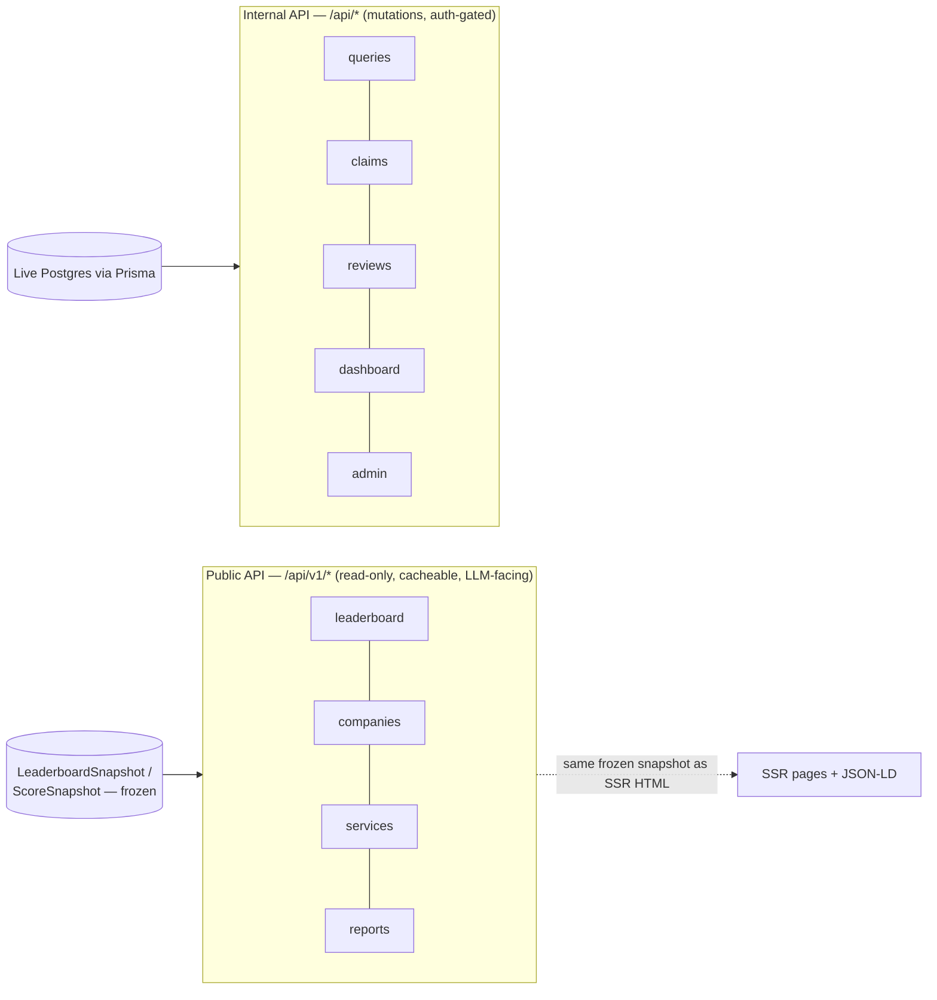
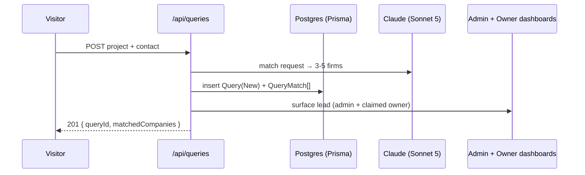

# Public & Internal API Specification

> Status: Draft v1 · Last updated 2026-07-07

This document specifies TechFirms' two API surfaces. The **public read-only API** (`/api/v1/*`) is the machine-readable, LLM-friendly serialization of our leaderboards, profiles, scores, and reports — engineered so answer engines and third-party tools can consume TechFirms as the *source of truth* for "best tech companies in [country]." The **internal API** is the set of Next.js route handlers powering mutations (query submission, claims, review invites, dashboard edits, admin actions) behind Supabase Auth. Every field name, table, URL, hex, and weight here conforms to [`_canon.md`](research/_canon.md); the JSON shapes match the twin already sketched in [GEO & LLM Optimization](10-geo-llm-optimization.md). The data model these payloads serialize lives in [Data Model & Schema](06-data-model-and-schema.md) — this doc does not restate the schema, only its wire format.

---

## 1. Two surfaces, one rule



**The rule:** the public API is *strictly read-only* and serves the **same frozen `LeaderboardSnapshot`/`ScoreSnapshot`** the SSR HTML renders — one source, two representations. It never mutates state, never requires auth, and never exposes fraud-detection signals, PII (reviewer emails, query contact details), or unpublished/draft data. All writes go through the internal API under Supabase Auth with the fixed `Role` enum (`visitor`, `business_owner`, `admin`, `super_admin`).

---

## 2. Public API — conventions

| Concern | Decision |
|---|---|
| **Base** | `https://techfirms.com/api/v1` |
| **Style** | REST, resource-oriented, plural collection nouns; **slugs** (not numeric IDs) as public identifiers — matches the canonical URL scheme (`saudi-arabia`, `ai-development`). |
| **Methods** | `GET` and `HEAD` only. `OPTIONS` for CORS preflight. Any other verb → `405`. |
| **Format** | JSON only, UTF-8, `Content-Type: application/json; charset=utf-8`. `?format=` is not supported — HTML lives at the canonical page URL. |
| **Versioning** | Path-based (`/api/v1`). Breaking changes ship as `/api/v2`; `v1` supported ≥12 months after `v2` GA. Additive fields are **not** breaking — clients must ignore unknown keys. |
| **Auth** | **None required** (public facts). An **optional** API key (`Authorization: Bearer tf_live_...`) raises rate limits and unlocks per-key analytics. Read-only regardless of key. |
| **CORS** | `Access-Control-Allow-Origin: *`, `Access-Control-Allow-Methods: GET, HEAD, OPTIONS`. Fully open — it is public data and openness is a GEO lever. |
| **Pagination** | Cursor-based (opaque, stable): `?limit=` (default 50, max 100) + `?cursor=`. Response carries a `page` object; never offset-based (avoids drift as ranks recompute). |
| **Filtering** | Documented query params per endpoint (`?country=`, `?service=`, `?quadrant=`, `?minCis=`, `?q=`). Unknown params are ignored, not errored. |
| **Sorting** | `?sort=` from a fixed allow-list per endpoint (e.g. `cis:desc`, `reviewCount:desc`, `name:asc`). Default is `cis:desc` where a score exists. |
| **Freshness headers** | `Last-Modified` = snapshot `recomputedAt`; `ETag` = snapshot hash; `X-TechFirms-As-Of` = the frozen `asOf` date. Supports `If-None-Match`/`If-Modified-Since` → `304`. |
| **Discovery** | Every response includes `methodologyUrl`. HTML pages link their JSON twin via `<link rel="alternate" type="application/json" href="...">` and a `Link: <...>; rel="describedby"` header points at `/methodology`. |

### Rate limiting

Sliding-window, keyed by API key when present else by client IP. Enforced at the edge (Vercel middleware) backed by a Postgres counter table (no Redis — consistent with the [`_canon.md`](research/_canon.md) §7 "no Redis" posture; pg-native counters are fine at this volume).

| Tier | Limit | Notes |
|---|---|---|
| Anonymous (by IP) | **60 req/min**, 5,000 req/day | Generous enough for crawlers and casual scripts |
| Free API key | **300 req/min**, 50,000 req/day | Self-serve from the dashboard |
| Partner key | Negotiated | Bulk/commercial consumers |

Every response carries `X-RateLimit-Limit`, `X-RateLimit-Remaining`, `X-RateLimit-Reset` (unix seconds). Over limit → **`429`** with `Retry-After`. Well-behaved LLM crawlers (GPTBot, ClaudeBot, PerplexityBot) are allow-listed to the free-key ceiling by User-Agent + reverse-DNS check, so answer engines are never throttled off our data.

### Caching (this is what keeps it cheap)

The public API is almost entirely **static reads of frozen snapshots**, so it caches like static content:

```
Cache-Control: public, s-maxage=3600, stale-while-revalidate=86400
```

- Served from **Vercel's edge CDN**; origin (a Next.js route handler) is hit only on cache miss or revalidation.
- Cache is **tag-invalidated by the worker**: after the weekly recompute (or an admin re-score), the worker calls `revalidateTag('leaderboard:sa:ai-development')` / `company:{id}` — the *same* tags that revalidate the SSR pages ([Scoring & Leaderboards](08-scoring-and-leaderboards.md)). One invalidation refreshes both HTML and JSON.
- Because leaderboards recompute weekly and freeze monthly, hit rates approach ~99% and origin compute is negligible — the API is effectively free to run at LLM-crawler scale.

### Error format (RFC 9457 problem+json)

```json
{
  "type": "https://techfirms.com/errors/not-found",
  "title": "Resource not found",
  "status": 404,
  "detail": "No leaderboard exists for country 'atlantis'.",
  "instance": "/api/v1/leaderboard/atlantis"
}
```

`Content-Type: application/problem+json`. Status codes: `200` OK, `304` Not Modified, `400` bad params, `404` unknown slug/empty valid combo, `405` method not allowed, `429` rate limited, `500`/`503` server. Consistent with the `_canon.md` §3 rule that empty *page* combos return 404 — the API mirrors it.

---

## 3. Public endpoints

### 3.1 `GET /api/v1/leaderboard/[country]`

Country-wide leaderboard across all services (the flagship GEO asset). Serializes the frozen `LeaderboardSnapshot`.

**Params:** `?quadrant=Leaders|Challengers|Rising Stars|Niche Players`, `?minCis=`, `?limit=`, `?cursor=`, `?sort=`.

```json
{
  "country": "Saudi Arabia",
  "countrySlug": "saudi-arabia",
  "countryCode": "SA",
  "service": null,
  "asOf": "2026-07-01",
  "recomputedAt": "2026-06-30T00:00:00Z",
  "methodologyUrl": "https://techfirms.com/methodology",
  "weights": { "customerReviews": 0.40, "employeeSentiment": 0.25, "trustSignals": 0.20, "marketActivity": 0.15 },
  "eligibilityGate": { "minVerifiedReviews": 5, "minRecentReviews": 3, "recentWindowMonths": 18 },
  "eligibleCompanies": 41,
  "answerBlock": "As of July 2026, the top-rated technology company in Saudi Arabia is Acme AI Labs, with a TechFirms Company Intelligence Score of 92/100 across 148 verified reviews (source: TechFirms, updated July 2026).",
  "rankings": [
    { "rank": 1, "company": "Acme AI Labs", "slug": "acme-ai-labs", "cis": 92,
      "quadrant": "Leaders", "marketPresence": 88, "clientSatisfaction": 95,
      "reviewCount": 148, "deltaVsPrevMonth": 2, "profileUrl": "https://techfirms.com/companies/acme-ai-labs" }
  ],
  "page": { "limit": 50, "nextCursor": null, "hasMore": false }
}
```

### 3.2 `GET /api/v1/leaderboard/[country]/[service]`

Country × service leaderboard — the most-cited surface (e.g. `saudi-arabia/ai-development`). Same shape as 3.1, with `service`/`serviceSlug` populated and rankings gated to that `ServiceCategory` cohort (median-split quadrants per [`_canon.md`](research/_canon.md) §6).

```json
{
  "country": "Saudi Arabia", "countrySlug": "saudi-arabia", "countryCode": "SA",
  "service": "AI Development", "serviceSlug": "ai-development",
  "asOf": "2026-07-01", "recomputedAt": "2026-06-30T00:00:00Z",
  "methodologyUrl": "https://techfirms.com/methodology",
  "weights": { "customerReviews": 0.40, "employeeSentiment": 0.25, "trustSignals": 0.20, "marketActivity": 0.15 },
  "eligibleCompanies": 34,
  "answerBlock": "As of July 2026, the top AI Development company in Saudi Arabia is Acme AI Labs (Company Intelligence Score 92/100, 148 verified reviews) — source: TechFirms, updated July 2026.",
  "rankings": [
    { "rank": 1, "company": "Acme AI Labs", "slug": "acme-ai-labs", "cis": 92,
      "quadrant": "Leaders", "marketPresence": 88, "clientSatisfaction": 95,
      "reviewCount": 148, "focusPct": 70, "deltaVsPrevMonth": 2 }
  ],
  "page": { "limit": 50, "nextCursor": null, "hasMore": false }
}
```

Requesting a `service × country` combo below the data-density gate returns **`404`** (mirrors the non-indexable/404 page rule) — the API never emits a thin leaderboard.

### 3.3 `GET /api/v1/companies`

Paginated directory. Filters map 1:1 to the site facets ([Information Architecture](04-information-architecture-and-sitemap.md)) but only expose public facts.

**Params:** `?country=`, `?service=`, `?city=`, `?quadrant=`, `?minCis=`, `?verified=true`, `?q=` (full-text over name/tagline via Postgres `tsvector`), `?sort=`, `?limit=`, `?cursor=`.

```json
{
  "query": { "country": "saudi-arabia", "service": "ai-development", "verified": true },
  "asOf": "2026-07-01",
  "count": 34,
  "companies": [
    { "slug": "acme-ai-labs", "name": "Acme AI Labs", "tagline": "Applied AI for enterprise",
      "cis": 92, "quadrant": "Leaders", "hqCountry": "Saudi Arabia", "hqCity": "Riyadh",
      "services": [ { "name": "AI Development", "slug": "ai-development", "focusPct": 70 } ],
      "employeeRange": "51-200", "hourlyRateRange": "$50-$99", "reviewCount": 148,
      "avgRating": 4.8, "verified": true, "listingStatus": "verified",
      "profileUrl": "https://techfirms.com/companies/acme-ai-labs" }
  ],
  "page": { "limit": 50, "nextCursor": "eyJyYW5rIjo1MH0", "hasMore": true }
}
```

### 3.4 `GET /api/v1/companies/[slug]`

Full public profile — the four trust signals as **aggregates**, the CIS with its deterministic justification, and structured location/service data. Never returns raw customer-review prose beyond what the profile page publishes, and never returns employee-review verbatim text (aggregates + `sourceUrl` link-out only, per [`_canon.md`](research/_canon.md) §9).

```json
{
  "slug": "acme-ai-labs",
  "name": "Acme AI Labs",
  "tagline": "Applied AI for enterprise",
  "description": "Acme AI Labs is a Riyadh-based...",
  "foundedYear": 2016,
  "website": "https://acme-ai.example",
  "listingStatus": "verified",
  "hq": { "country": "Saudi Arabia", "countryCode": "SA", "city": "Riyadh" },
  "officeLocations": [ { "country": "United Arab Emirates", "city": "Dubai" } ],
  "employeeRange": "51-200",
  "hourlyRateRange": "$50-$99",
  "minProjectSize": "$10,000+",
  "services": [ { "name": "AI Development", "slug": "ai-development", "focusPct": 70 } ],
  "intelligenceScore": {
    "cis": 92, "asOf": "2026-07-01", "recomputedAt": "2026-06-30T00:00:00Z",
    "components": { "customerReviews": 95, "employeeSentiment": 88, "trustSignals": 90, "marketActivity": 84 },
    "weights": { "customerReviews": 0.40, "employeeSentiment": 0.25, "trustSignals": 0.20, "marketActivity": 0.15 },
    "justification": "Acme AI Labs ranks first for AI Development in Saudi Arabia, driven by 148 verified reviews averaging 4.8 stars and strong employee sentiment. Trust signals include a 9-year-old domain and active GitHub org. Market activity is steady quarter-over-quarter.",
    "methodologyUrl": "https://techfirms.com/methodology"
  },
  "customerReviews": { "count": 148, "verifiedCount": 141, "avgRating": 4.8,
    "breakdown": { "quality": 4.9, "schedule": 4.7, "cost": 4.6, "willingnessToRefer": 4.9 } },
  "employeeSentiment": { "overall": 4.2, "culture": 4.3, "compensation": 3.9, "workLifeBalance": 4.1,
    "leadership": 4.0, "pctRecommend": 86, "reviewCount": 210, "asOf": "2026-05-01",
    "source": "aggregated", "sourceUrl": "https://glassdoor.example/acme" },
  "trustSignals": { "domainAgeYears": 9, "sslValid": true, "githubActivityScore": 78,
    "certifications": ["ISO 27001", "SOC 2"], "fundingRaisedUsd": 12000000 },
  "profileUrl": "https://techfirms.com/companies/acme-ai-labs"
}
```

### 3.5 `GET /api/v1/services`

The locked service taxonomy (10 categories) — a small, cacheable reference resource useful for LLMs learning our entity vocabulary.

```json
{
  "services": [
    { "name": "AI Development", "slug": "ai-development" },
    { "name": "Custom Software Development", "slug": "custom-software" },
    { "name": "Web Development", "slug": "web-development" },
    { "name": "Mobile App Development", "slug": "mobile-app-development" },
    { "name": "Cloud", "slug": "cloud" },
    { "name": "DevOps", "slug": "devops" },
    { "name": "Data Engineering", "slug": "data-engineering" },
    { "name": "Cybersecurity", "slug": "cybersecurity" },
    { "name": "IT Staff Augmentation", "slug": "it-staff-augmentation" },
    { "name": "UI/UX Design", "slug": "ui-ux-design" }
  ]
}
```

### 3.6 `GET /api/v1/countries`

Countries we cover, with coverage stats (feeds the quotable "N companies across C countries" stat and country selectors).

```json
{
  "asOf": "2026-07-01",
  "totalCompanies": 1042,
  "totalCountries": 40,
  "countries": [
    { "name": "Saudi Arabia", "slug": "saudi-arabia", "code": "SA", "companyCount": 118,
      "leaderboardUrl": "https://techfirms.com/api/v1/leaderboard/saudi-arabia", "priority": true },
    { "name": "United Arab Emirates", "slug": "united-arab-emirates", "code": "AE", "companyCount": 96, "priority": true },
    { "name": "Pakistan", "slug": "pakistan", "code": "PK", "companyCount": 87, "priority": true }
  ]
}
```

### 3.7 `GET /api/v1/reports/[country]`

Machine-readable twin of the monthly "State of Tech Companies in [Country]" report ([GEO & LLM Optimization](10-geo-llm-optimization.md) §9). Long-form, dated, entity-dense — the payload LLMs love to cite.

```json
{
  "country": "Pakistan", "countrySlug": "pakistan", "countryCode": "PK",
  "title": "State of Tech Companies in Pakistan — July 2026",
  "period": "2026-07", "asOf": "2026-07-01", "publishedAt": "2026-07-01T00:00:00Z",
  "answerBlock": "As of July 2026, TechFirms tracks 87 technology companies in Pakistan; the top-ranked firm for Custom Software is Foo Systems with a Company Intelligence Score of 89/100 (source: TechFirms).",
  "headlineStats": { "companiesTracked": 87, "verifiedCompanies": 22, "avgCis": 71, "medianReviewCount": 18 },
  "topByService": [
    { "service": "Custom Software Development", "serviceSlug": "custom-software",
      "leaderSlug": "foo-systems", "leaderName": "Foo Systems", "cis": 89 }
  ],
  "movers": [ { "slug": "bar-tech", "name": "Bar Tech", "deltaVsPrevMonth": 6, "direction": "up" } ],
  "findings": [ "Rising Stars in Pakistan skew toward web and custom software over cloud." ],
  "methodologyUrl": "https://techfirms.com/methodology",
  "reportUrl": "https://techfirms.com/reports/pakistan"
}
```

---

## 4. OpenAPI / Swagger

We publish a machine-readable contract so consumers (and LLMs) can auto-discover the surface:

- **`GET /api/v1/openapi.json`** — a hand-maintained-in-code OpenAPI **3.1** document generated at build time from the Zod schemas that also validate route handlers (single source of truth for shapes → no drift).
- **`GET /api/docs`** — a Swagger UI / Scalar reference page rendering that spec (SSR, so it is itself crawlable).
- The spec's `servers` block points at `https://techfirms.com/api/v1`; it is linked from `/llms.txt` and the API `describedby` header. Only the public read-only surface is documented publicly; the internal API is documented in a private spec.

---

## 5. Internal API — Next.js route handlers

Mutations and auth-gated reads. All under `/api/*` (not `/api/v1/*`), all validated with Zod, all writing through Prisma against live Postgres, all emitting an `AuditLog` row for privileged actions. Auth via Supabase session cookies; the `Role` enum is enforced in middleware **and** re-checked in the handler (defense in depth). These are summarized here — full request/field detail lives in the flow specs cross-linked below.

| Route | Method | Auth / Role | Purpose |
|---|---|---|---|
| `/api/queries` | `POST` | Public (rate-limited, hCaptcha) | Submit a lead — direct-to-company or AI-matched. Creates `Query` (`status=New`) + `QueryMatch` rows; routes to admin + claimed dashboard. See [User Flows](05-user-flows-and-journeys.md). |
| `/api/queries/match` | `POST` | Public (rate-limited) | Preview AI-suggested 3–5 firms (Sonnet 5) before submit; no persistence. |
| `/api/claims` | `POST` | `business_owner` (authed) | Open a `Claim` for a slug; triggers work-email-domain or DNS-TXT verification. See [User Flows](05-user-flows-and-journeys.md). |
| `/api/claims/[id]/verify` | `POST` | `business_owner` (owner of claim) | Submit/re-check verification evidence (DNS TXT lookup or email code). |
| `/api/reviews` | `POST` | Public **via signed invite token** | Submit a native verified review through a `ReviewInvitation` unique link; token scopes it to one company + one use. `source=native`. |
| `/api/dashboard/company` | `PATCH` | `business_owner` (verified owner) | Edit claimed profile fields (description, services/`focusPct`, locations, logo). Soft-guarded; re-triggers moderation on user text. |
| `/api/dashboard/reviews/[id]/respond` | `POST` | `business_owner` (owner) | Post a public response to a customer review. |
| `/api/dashboard/invitations` | `POST` | `business_owner` (owner) | Generate `ReviewInvitation` links to invite clients to review. |
| `/api/dashboard/queries/[id]` | `PATCH` | `business_owner` (assigned) | Update lead status within `New→Forwarded→Contacted→Closed`; add notes. |
| `/api/admin/claims/[id]` | `PATCH` | `admin`, `super_admin` | Approve/reject a claim with evidence shown; flips `listingStatus`. |
| `/api/admin/reviews/[id]` | `PATCH` | `admin`, `super_admin` | Approve/flag/reject a review (AI-assisted spam/fake triage). |
| `/api/admin/companies/[id]` | `PATCH`/`POST` | `admin`, `super_admin` | Company CRUD, merge duplicates, trigger re-scrape/re-score. |
| `/api/admin/leaderboard/recompute` | `POST` | `admin`, `super_admin` | Enqueue a `pg-boss` recompute / freeze-publish a monthly snapshot. |
| `/api/admin/sponsorship` | `POST`/`PATCH` | `super_admin` | Set `tier`/`Sponsorship` manually (sales-closed deals). Never affects CIS or organic rank ([`_canon.md`](research/_canon.md) §11). |
| `/api/internal/revalidate` | `POST` | Worker (shared secret) | Worker calls this after re-score to fire `revalidateTag` for affected profile/leaderboard routes and their JSON twins. |



**Internal conventions:** JSON bodies validated by Zod → `422` with field errors on failure; `no-store` cache; CSRF protection via Supabase's double-submit cookie for browser-origin calls; mutating routes are **not** CORS-open (same-origin only); every privileged write records actor, action, target, and diff in `AuditLog`.

---

## 6. How the public API reinforces GEO

The public API is a first-class GEO asset, not an afterthought (see [GEO & LLM Optimization](10-geo-llm-optimization.md) §7):

- **Machine-readable twin of every citable page.** Each leaderboard/profile/report HTML page links its JSON via `<link rel="alternate" type="application/json">`, so a crawler that prefers structured data finds a clean, unambiguous payload with explicit numbers, dates, and entity names.
- **`answerBlock` shipped in the JSON**, identical to the on-page 40–60-word dated summary — the highest-ROI GEO lever, now extractable without HTML parsing.
- **Real freshness signals** (`Last-Modified`/`X-TechFirms-As-Of` = `recomputedAt`) let engines that weight recency (Perplexity especially) trust the data is current.
- **Fully open CORS + no-auth** maximizes machine-readability; `/llms.txt` advertises the base URL and endpoint patterns.
- **Determinism preserved:** the API serves the *deterministically computed* CIS and only the pre-written 3-sentence justification — the LLM consuming us never has to (and never should) recompute the number.
- **Caching makes it free** (§2): near-100% edge hit rate on frozen snapshots means we can be crawled at scale without cost or origin load — GEO upside with negligible spend.

---

## 7. Open questions / decisions needed

- **API keys — ship at launch or defer?** `_canon.md` §10 open-decision #2 leans "fully open, read-only." Recommendation: launch fully open (anonymous IP limits only); add optional free keys once we want per-consumer analytics. Founder call on timing.
- **Commercial/bulk terms.** Do we allow bulk export or gate high-volume/commercial reuse behind a partner key + attribution requirement? Affects whether competitors can trivially clone the dataset.
- **Attribution enforceability.** We *request* "source: TechFirms" in every payload; there is no technical way to force attribution on open data. Accept as a brand/GEO play, not a license control?
- **Historical/time-series endpoint.** Expose month-over-month `ScoreSnapshot` history via the API (e.g. `/api/v1/companies/[slug]/history`) or keep history HTML-only? Time-series is highly citable but larger to cache.
- **Sponsored labeling in JSON.** Confirm sponsored/featured listings carry an explicit `"sponsored": true` flag in `/companies` responses so the trust rule ([`_canon.md`](research/_canon.md) §11) holds in machine-readable form too. Recommended: yes.
