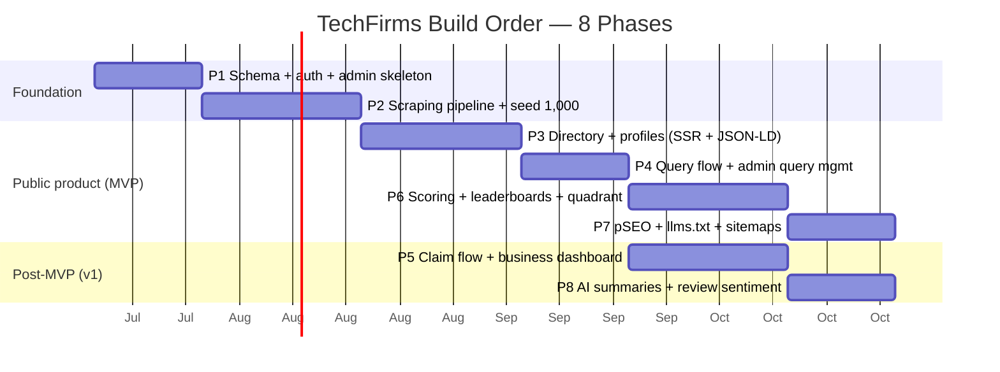

# Roadmap & Phased Build Plan

> Status: Draft v1 · Last updated 2026-07-07

This document is the sequencing spine for building TechFirms — the AI-first reputation layer for technology companies. It fixes the **8-phase build order** from the master build prompt into dated milestones with goals, deliverables, dependencies, and hard "done when…" acceptance criteria; defines **MVP vs. v1 vs. v2**; names the cross-cutting workstreams that run in parallel; carries a **risk register** and a **launch checklist**; and ties each phase back to the north-star, **Monthly Verified-Answer Sessions** ([Overview & Vision](00-overview-and-vision.md)). Every locked name, hex, route, weight, and table here conforms to [`_canon.md`](research/_canon.md). It does **not** re-specify architecture or the design system — see [Tech Architecture & Infra](17-tech-architecture-and-infra.md) and [Design System](03-design-system.md).

---

## Operating principles

1. **Deliver each phase as a working deployment.** Every phase ends on Vercel Pro, publicly reachable, behind a preview URL at minimum. No phase is "internal only."
2. **Mobile-responsive throughout.** No phase ships desktop-only; the shadcn/Tailwind breakpoints are honored from Phase 1.
3. **SSR everything public.** AI crawlers do not run JS — public pages are server-rendered from the first profile onward (Phase 3).
4. **Ship the monetization flags now, ship pricing later.** `listingStatus`, `tier`, `Sponsorship`, `badges[]` exist in the schema from Phase 1 even though billing is dormant until v1.
5. **Small team assumption:** one founder-engineer + one part-time contractor (design/frontend) + Claude as a build accelerator. Effort estimates below assume ~1.5 FTE.

---

## Phase timeline (rough effort, small team)



> **Note on ordering:** the canonical build order is 1→8. In practice **Phase 5 (Claim/Dashboard)** and **Phase 8 (AI summaries/sentiment)** run *concurrently* with the SEO/leaderboard track once Phase 4 lands, because they touch different surfaces. The Gantt reflects that parallelism; the numbered milestones below keep the canonical numbering. Total to a lovable public launch (MVP = P1–P4 + P6 + P7): **~14–16 weeks.** To v1 (adds P5 + P8): **~20 weeks.**

---

## Phase 1 — Schema + auth + admin skeleton

- **Goal:** a deployable monorepo with the full data model migrated and role-gated admin access.
- **Specifies from:** [Data Model & Schema](06-data-model-and-schema.md), [Tech Architecture & Infra](17-tech-architecture-and-infra.md).
- **Scope & deliverables:**
  - Monorepo scaffold: `apps/web`, `apps/worker`, `packages/db`, `packages/ui` (per `_canon.md` §7).
  - Full Prisma schema — all 24 canonical models (`User`, `Company`, `Service`, `CompanyService`, `OfficeLocation`, `Country`, `City`, `CustomerReview`, `EmployeeSentiment`, `TrustSignal`, `IntelligenceScore`, `ScoreSnapshot`, `Query`, `QueryMatch`, `Claim`, `ReviewInvitation`, `Leaderboard`, `LeaderboardSnapshot`, `Sponsorship`, `AuditLog`, `ScrapeSource`, `ScrapeJob`, `RawScrapeRecord`) and 9 enums (`Role`, `ListingStatus`, `ReviewSource`, `ClaimStatus`, `QueryStatus`, `VerificationMethod`, `Quadrant`, `ServiceCategory`, `SponsorshipTier`) — migrated to Supabase Postgres.
  - Supabase Auth wired; `Role` enum (`visitor | business_owner | admin | super_admin`) enforced in Next.js middleware **and** Prisma.
  - Admin shell at `/admin` — layout, nav, empty dashboard tiles, `AuditLog` write-through on every mutating action.
  - Seed the ten locked services and the three launch `Country` rows (KSA, UAE, Pakistan).

```prisma
enum ListingStatus { unclaimed  claimed  verified }
enum Role          { visitor  business_owner  admin  super_admin }

model Company {
  id            String        @id @default(cuid())
  name          String
  slug          String        @unique
  listingStatus ListingStatus @default(unclaimed)
  claimed       Boolean       @default(false)
  verified      Boolean       @default(false)
  source        String?
  sourceId      String?
  createdAt     DateTime      @default(now())
  updatedAt     DateTime      @updatedAt
  deletedAt     DateTime?
  @@unique([source, sourceId])
}
```

- **Dependencies:** none (start here).
- **Done when:** migrations apply cleanly to a fresh DB; an `admin` user can log in and reach `/admin` while a `visitor` is redirected; every admin mutation writes an `AuditLog` row; `pnpm build` passes in CI with the WCAG-AA color-contrast lint green.
- **Success metric:** foundational — schema coverage 100% of canon §12; CI green. (Feeds *Supply & Data Quality* branch of the KPI tree.)

---

## Phase 2 — Scraping pipeline + seed 1,000

- **Goal:** ~1,000 real tech firms in the DB as `unclaimed`, legally sourced, AI-described.
- **Specifies from:** [Scraping & Seeding Pipeline](07-scraping-and-seeding-pipeline.md), `_canon.md` §9.
- **Scope & deliverables:**
  - Dedicated **Railway** worker (Docker), never on Vercel: Playwright + Cheerio + axios, honest User-Agent with bot-info URL, **≥1 req/2s**, `robots.txt` + `Crawl-delay` honored, every request logged.
  - `pg-boss` job queue (Postgres-native, no Redis) with poll interval, `MAX_JOBS_PER_TICK`, draining guard, `WORKER_ID`, and **stale-job reaping**.
  - `ScrapeSource` → `ScrapeJob` → `RawScrapeRecord` flow; upsert by `(source, sourceId)`; **never wipe history**.
  - Extract **facts only** (name, location, services, team size, hourly rate, founded year, website, aggregate rating, review count). **Never copy review or editorial prose.**
  - Enrichment: RDAP domain age (free), crt.sh/WhoisJSON SSL, **GitHub REST API** org activity (5k/hr free) → populate `TrustSignal`.
  - Claude (**Haiku 4.5**, `claude-haiku-4-5-20251001`) generates a neutral ~100-word description from the firm's *own* website content, injection-hardened.
  - Insert every firm as `claimed=false, verified=false`, `listingStatus=unclaimed`.
- **Dependencies:** Phase 1 schema.
- **Done when:** ≥1,000 `Company` rows exist with populated `source`/`sourceId`, ≥3 of 4 trust signals filled where discoverable, a Claude-generated description, and ≥1 `Service` mapping each; a re-run **diffs and upserts** without duplicating; a Cloudflare/DataDome challenge is treated as a stop (logged, skipped) — no spoofing.
- **Success metric:** ≥1,000 firms seeded; ≥60% with ≥3 trust signals; scraper error rate <5% of jobs. (*Supply & Data Quality*.)

---

## Phase 3 — Directory + company profiles (SSR + JSON-LD)

- **Goal:** the public read surface — browsable directory and profile pages, fully crawlable.
- **Specifies from:** [Information Architecture](04-information-architecture-and-sitemap.md), [Design System](03-design-system.md), [SEO Playbook](09-seo-playbook.md).
- **Scope & deliverables:**
  - `/companies?service=&country=&city=&size=&rate=&rating=` directory — SSR, Clutch-style cards (logo, stars, review count, tagline, location, rate, Visit Website + View Profile). Filter params stay in querystring, **not indexable**; empty combos → **HTTP 404**.
  - `/companies/[slug]` profile — score-badge header (placeholder until Phase 6), tabs: Overview / Customer Reviews / Employee Sentiment / Trust Signals / AI Intelligence Summary; sticky **Get a Quote** CTA; **Claim this profile** CTA on every `unclaimed` listing.
  - JSON-LD: `Organization` + `AggregateRating` + `Review` on profiles, `ItemList` (with `position`) on the directory, `BreadcrumbList` site-wide — with visible-content parity.
  - Postgres `tsvector` + GIN search; `next/og` `ImageResponse` OG cards (1200×630) per profile.
  - Design tokens live: Signal Teal `#11A69E` core / `#0F6E6B` buttons+links, Ink Navy `#0A1B2E` anchors, Intelligence Violet reserved for the (still-empty) CIS chip; Geist / Inter / Geist Mono via `next/font`; dark + light from day one.
- **Dependencies:** Phase 2 data.
- **Done when:** any seeded firm renders at `/companies/[slug]` server-side (JS disabled → full content); Rich Results Test validates `Organization`+`AggregateRating`; directory filters work and empty combos 404; Core Web Vitals p75 within budget (LCP ≤ 2.5s, INP ≤ 200ms, CLS ≤ 0.1) on a seeded profile.
- **Success metric:** 1,000 profiles indexable; first organic impressions in Search Console; CWV green. (*LLM/GEO Reach* + *Demand*.)

---

## Phase 4 — Query flow + admin query management

- **Goal:** capture demand — the lead-gen loop that produces trust actions.
- **Specifies from:** [Query & Lead-gen Flow](14-query-and-leadgen-flow.md).
- **Scope & deliverables:**
  - Visitor Query form (project type, budget, timeline, description, contact) with two entry points: (a) **direct** from a profile, (b) **matched** — Claude (**Sonnet 5**) suggests 3–5 firms → `QueryMatch` rows.
  - Every `Query` lands in `/admin` with the fixed status pipeline **New → Forwarded → Contacted → Closed**, assigned company, full contact details, notes, CSV export.
  - Spam/rate-limit guard on the public endpoint.
- **Dependencies:** Phase 3 profiles.
- **Done when:** a visitor submits from a profile → a `Query` appears in `/admin` as `New`; the matched flow returns 3–5 relevant firms and writes `QueryMatch`; admin can advance status and export CSV.
- **Success metric:** first **Queries submitted** (a core north-star trust action); match relevance spot-check ≥80% acceptable. (*Demand & Trust Actions*.)

---

## Phase 5 — Claim flow + business dashboard *(v1, runs parallel after P4)*

- **Goal:** convert `unclaimed` firms into engaged, claimed owners.
- **Specifies from:** [User Flows & Journeys](05-user-flows-and-journeys.md), [Data Model & Schema](06-data-model-and-schema.md).
- **Scope & deliverables:**
  - `/claim/[slug]` flow: request → verify via **work-email domain match OR DNS TXT record** → admin approval; `Claim` + `ClaimStatus` lifecycle; `listingStatus` advances `unclaimed → claimed → verified`.
  - `/dashboard`: edit profile, respond to reviews, view incoming Queries with full detail, invite clients to leave verified reviews (`ReviewInvitation` unique links), analytics (profile views, query volume, leaderboard-position trend).
  - Admin **Claims queue** with verification evidence shown; admin override to set `tier`/`Sponsorship` manually.
- **Dependencies:** Phases 3–4; leaderboard-trend widget needs Phase 6.
- **Done when:** an owner claims a firm via email-domain or DNS TXT, admin approves, `listingStatus=claimed`, and the owner edits their profile + sees their Queries in `/dashboard`.
- **Success metric:** **% of firms claimed** climbing; first verified reviews via `ReviewInvitation`. (*Supply & Data Quality*.)

---

## Phase 6 — Scoring engine + country leaderboards + quadrant chart

- **Goal:** the flagship product — deterministic CIS and Gartner-style country×service boards.
- **Specifies from:** [Scoring & Leaderboards](08-scoring-and-leaderboards.md), `_canon.md` §6.
- **Scope & deliverables:**
  - **Deterministic** CIS (0–100): Customer Reviews **40%**, Employee Sentiment **25%**, Trust Signals **20%**, Market Activity **15%**; renormalize on missing signal. Bayesian shrinkage (prior m≈8 @ C≈3.5★), recency half-life ≈12 months. Store to `IntelligenceScore`; freeze monthly to `ScoreSnapshot`.
  - Cohort scoring within **country × service** using **median splits**; eligibility gate **≥5 verified reviews AND ≥3 recent (≤18 mo)**.
  - `/leaderboard/[country]` and `/leaderboard/[country]/[service]`: Recharts **quadrant** (X = Market Presence, Y = Client Satisfaction; quadrants **Leaders / Challengers / Rising Stars / Niche Players**) + rank table with month-over-month movement. **Every chart ships an HTML `<table>` equivalent.**
  - Claude (**Sonnet 5**) *narrates* a 3-sentence CIS justification only — **never emits the number**. Recompute weekly; worker fires `revalidateTag` after re-score (ISR).
  - Public `/methodology` page (formula + weights); fraud signals kept secret.
- **Dependencies:** Phases 2, 3, 5 (reviews/sentiment/trust data).
- **Done when:** the three GTM boards render with populated quadrants + tables; the CIS is reproducible byte-for-byte from stored inputs; a re-score changes only after inputs change; `/methodology` matches the live weights; each chart has a parity `<table>`.
- **Success metric:** 3 live leaderboards; first **Verified-Answer Sessions** (CIS-backed page + trust action) — the north-star begins reading. (*All three KPI branches.*)

---

## Phase 7 — Programmatic SEO + llms.txt + sitemaps

- **Goal:** scale citable, indexable surface area for search **and** LLMs.
- **Specifies from:** [SEO Playbook](09-seo-playbook.md), [GEO/LLM Optimization](10-geo-llm-optimization.md).
- **Scope & deliverables:**
  - `/best-[service]-companies-in-[country]` and `-[city]` pages — **data-density gated** (min-data threshold before auto-publish), each carrying the 4 trust signals + CIS, a top-10 table, FAQ (`FAQPage`), and a **40–60 word dated answer block** near the top. Month-stamped titles (`Top AI Development Companies in Saudi Arabia — July 2026`).
  - `/llms.txt` (ship as free insurance; **not the moat**), `/reports/[country]` "State of Tech Companies in…" long-form.
  - Sharded sitemaps (50k URLs / 50MB) via `generateSitemaps()` under an index, regenerated daily with real `lastmod`; self-referencing canonicals; `robots.txt` disallows filter params.
  - Public read-only `/api/v1/leaderboard/[country]` JSON.
  - Instrument **AI-citation tracking** (measure, don't assume).
- **Dependencies:** Phase 6 (pages need CIS + leaderboard data).
- **Done when:** curated `service×country` pSEO pages publish only above the data threshold; sitemap index validates and regenerates daily; `/llms.txt` and `/api/v1/leaderboard/[country]` return valid output; every pSEO page has an answer block + FAQ schema.
- **Success metric:** indexed pSEO pages growing; **first tracked LLM citation** of a TechFirms URL. (*LLM/GEO Reach*.)

---

## Phase 8 — AI summaries + review sentiment *(v1, runs parallel after P6)*

- **Goal:** enrich profiles/scores with the AI intelligence layer.
- **Specifies from:** [AI Features Spec](11-ai-features-spec.md), `_canon.md` §8.
- **Scope & deliverables:**
  - Review **sentiment analysis** (Claude **Haiku 4.5**) feeding the Customer-Reviews sub-signal; per-review + aggregate.
  - AI Intelligence Summary tab content per profile (injection-hardened, no fabricated facts).
  - Review/claim **moderation assist** + the three cheap fake-review detectors: velocity/burst + co-bursting, near-duplicate via embedding similarity, shared-domain/IP reviewer-graph clustering.
- **Dependencies:** Phases 3 & 6.
- **Done when:** each review carries a sentiment label; the profile AI-summary renders and cites only on-record facts; the moderation queue surfaces flagged reviews before publish.
- **Success metric:** sentiment coverage ≥95% of reviews; fake-review false-negative rate low in manual audit. (*Supply & Data Quality*.)

---

## MVP vs. v1 vs. v2

| Release | Contains | Rationale |
|---|---|---|
| **MVP (smallest lovable launch, ~14–16 wk)** | P1, P2, P3, P4, **P6**, P7 | The lovable core is *the leaderboard*, not the directory. Ship seeded firms → SSR profiles → the three flagship country boards with a public methodology → pSEO/llms.txt so LLMs can find them → Query capture so demand is measurable. This alone delivers Verified-Answer Sessions. |
| **v1 (~20 wk)** | + P5 (claim/dashboard) + P8 (AI summaries/sentiment) + **Stripe billing live** (Featured badge, Sponsored placement, Verified-Plus) | Turns on supply engagement and monetization once there's an audience to sell to. Sponsored is always labeled and **never touches CIS/organic rank**. |
| **v2 (moat)** | **Native anonymous, email-verified employee reviews**; Meilisearch (past ~5k firms); pay-per-qualified-lead; expansion beyond KSA/UAE/PK | Native employee reviews are the defensible differentiator no incumbent has; deferred until legally/operationally ready per `_canon.md` §9. |

---

## Cross-cutting workstreams (run across all phases)

- **Design system** — Tailwind + shadcn/ui tokenized to `_canon.md` §2 from Phase 1; WCAG 2.2 AA contrast enforced in CI; dark + light shipped together. See [Design System](03-design-system.md).
- **SEO/GEO** — SSR + JSON-LD discipline from Phase 3; answer blocks, freshness/year-token rolling, HTML-table chart parity, and third-party-mention growth (the real citation lever) treated as an ongoing KPI, not a phase.
- **Analytics & observability** — Sentry (errors) + Axiom (logs) from Phase 1; north-star and KPI-tree instrumentation added as each surface ships; AI-citation tracking from Phase 7.
- **Legal/compliance** — scraping posture (`_canon.md` §9) audited each time a new source is added; `/methodology` kept in sync with live weights.

---

## Risk register

| Risk | Likelihood | Impact | Mitigation |
|---|---|---|---|
| **Data quality** — sparse/stale seed data flattens leaderboards | High | High | Data-density auto-publish gate; eligibility gate (≥5 verified, ≥3 recent); Bayesian shrinkage stops thin firms topping boards; manual QA on the 3 GTM cohorts. |
| **Legal / scraping** — ToS or Cloudflare escalation | Med | High | Logged-off public **facts only**, never copy prose, honor robots.txt, ≥1 req/2s, treat challenges as stop. No login, no click-wrap. Regenerate all copy via Claude. |
| **Trust / pay-to-play perception** | Med | High | Firewall Sponsored from CIS/organic rank; label all paid placement; public `/methodology`; "you can't buy rank" stated loudly. |
| **LLM-citation uncertainty** — GEO may return ~0 | High | Med | Treat `llms.txt` as free insurance, not the moat; invest in third-party mentions (~3× stronger signal) + answer blocks + freshness; **instrument** citations to measure, not assume. |
| **Single-founder bandwidth** | High | High | MVP scope is ruthlessly P1–P4+P6+P7; P5/P8 deferred to v1; Claude accelerates scraping/copy/moderation; reuse proven CapitalForAll worker patterns. |
| **Emerging-market cold start** — too few firms clear the gate | Med | Med | Optional provisional "emerging" board with visible caveat (founder decision, see Open questions); prioritize seeding depth in the 3 GTM cohorts. |

---

## Launch checklist (MVP go-live)

- [ ] ≥1,000 firms seeded; the 3 GTM cohorts each have enough firms clearing the eligibility gate.
- [ ] 3 flagship leaderboards live with quadrant + table + HTML-table parity + answer block.
- [ ] `/methodology` published and matching live weights.
- [ ] JSON-LD validates on profiles, directory, leaderboards (Rich Results Test green).
- [ ] CWV p75 within budget on representative pages; dark + light verified; mobile responsive.
- [ ] `/llms.txt`, sitemaps (daily regen), `robots.txt` (filter params disallowed), `/api/v1/leaderboard/[country]` all live.
- [ ] Query flow submits → lands in `/admin`; CSV export works.
- [ ] Sentry + Axiom capturing; north-star + Query/citation instrumentation firing.
- [ ] Monetization flags present but billing dormant; "Claim this profile" CTA on every unclaimed listing.

### First 3 country × service leaderboards to seed (focused GTM)

1. **AI Development in Saudi Arabia** — `/leaderboard/saudi-arabia/ai-development`
2. **Custom Software in UAE** — `/leaderboard/united-arab-emirates/custom-software`
3. **Web / Custom Software in Pakistan** — `/leaderboard/pakistan/web-development`

Rationale (`_canon.md` §5): high-intent, under-served by US/EU-centric incumbents; no dedicated KSA/Pakistan boards exist — an open SEO/GEO lane.

---

## Open questions / decisions needed

- **Provisional boards in cold-start markets:** if too few KSA/PK firms clear the ≥5-verified gate at launch, publish a caveated "emerging" board or hold? (Mirrors the Overview open question.)
- **P5/P8 parallelization vs. strict serial:** confirm the contractor has bandwidth to run claim/dashboard concurrently with the SEO track, or slip v1 by ~3 weeks.
- **Billing trigger:** switch Stripe on at MVP+audience or wait for a target claimed-% threshold before selling Featured/Sponsored?
- **Employee-sentiment source for launch markets:** which licensed/aggregate feed covers KSA/UAE/PK firms well enough to make the 25% signal non-trivial pre-v2? (Feeds the native-reviews timing decision.)
